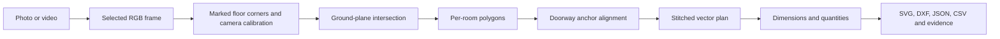

# Personal design notes — Cozmo take-home

## 2026-10-05 V3 decision record

Updated context, 2026-10-06: the exact brief supersedes the earlier assumed scope.
See [compliance audit](docs/ASSIGNMENT_COMPLIANCE.md) and
[implementation/test plan](docs/ASSIGNMENT_UPDATE_PLAN.md). In particular, mandatory
manual scale references are not confirmed as acceptable for the examiner's RGB path;
the sparse-photo, restoration, uncertainty and physical-benchmark requirements remain.

The RGB blocker was upstream pose aliasing plus unsupported dense points. The V2
fixture repeated texture at 6.39 m on a 7 m wall, producing a 6.17 m camera jump even
though every image registered and reprojection error looked excellent. Registration
fraction is therefore insufficient as a quality gate. V3 adds ordered-path jump
screening and preserves the failing capture as regression evidence.

The replacement dense backend is pinned OpenMVS 2.4.0 CPU, invoked externally and
followed by its visibility-intersection filter. On the corrected controlled capture,
photo pose ATE is 0.508 cm RMS and all three tiers pass the complete evaluator. The
evaluator now includes opening width. Fixed intrinsics alone did not improve the bad
trajectory, which supports the texture-aliasing diagnosis.

For RGB-D, low-contrast SIFT plus bounded retry tracks the full held-out 194-frame ICL
subset, up from 33 frames. Layout remains incomplete because observed wall segments
do not close; no boundary is fabricated. Real-phone field accuracy remains the main
open requirement. See `docs/V3_IMPLEMENTATION.md` and `docs/V3_RESULTS.md`.

## Problem and honest result

**Latest implementation:** read [V3 implementation and decisions](docs/V3_IMPLEMENTATION.md)
and [V3 measured results](docs/V3_RESULTS.md) first. They supersede the baseline
status below. The current work includes real ARKitScenes ingestion, pose graphs,
weighted fusion, concave polygons, verified capture stitching, metric RGB multi-view stereo,
and an evaluator that penalizes missing rooms. RGB completeness and broad field
validation remain unresolved. The paragraphs below retain the original research
and baseline reasoning for interview reference.

**Benchmark update, 2026-10-05:** the project now includes an automatic RGB-D branch, not only the original marked-corner demo. The public ICL-NUIM sequence produced a rectangular room plan from 177 RGB/depth pairs without supplied poses or corners. Maximum side-length error was 5.07 cm; this fails the proposed 3 cm target. Photo/video SfM experiments registered 43/45 and 89/89 views respectively, but metric RGB plan extraction and automatic multi-room stitching remain missing. See the [visual architecture](docs/ARCHITECTURE.md), [dataset research](docs/DATASETS.md), and [benchmark report](docs/BENCHMARK_RESULTS.md) for the current state. The original assisted baseline described below remains available for comparison.

Restoration teams in property and casualty insurance need plans and quantities they can explain and correct. A useful result includes room boundaries, openings, dimensions, floor area, perimeter, wall area when height is known, and links from geometry to source frames. The original baseline is a **measurement-guided demonstration**; the new RGB-D branch adds a constrained automatic path. Together they provide inspectable reconstruction, stitching, quantity, and export components. They do not prove the full three-tier requirement or centimetre accuracy on arbitrary phone media.

The original three input tiers are photos, ordinary video, and LiDAR/RGB-D. The assisted example demonstrates photos and a video frame using marked floor corners and camera calibration. The new RGB-D branch estimates geometry from calibrated depth/image pairs. Native mobile LiDAR import and field validation remain next steps; neither the TUM RGB movie nor ICL synthetic depth is a phone LiDAR validation set.

## What the output must mean for restoration

A restoration estimator needs room-facing surface quantities and a defensible link to evidence. At minimum, store each room polygon, dimensioned edges, floor area, ceiling height when known, openings and their supporting observations, the source frame, measurement method, and a confidence or review status. Damage extent and estimating line items are separate inputs; a whole-room wall area must never silently become a damaged-wall quantity. Shared partitions can have two room-facing surfaces, while floor area must not be double-counted.

Treat a floor plan as a metric graph of rooms and openings, not merely a visually pleasing image. A stitch needs common geometry (such as two doorway jambs), a pose estimate, and a residual. A disconnected room is a separate component. Quantity export should carry units and provenance and withhold values that lack verified scale. A reviewer must be able to correct an edge without rerunning the entire inference chain.

## Architecture

The eventual automated system adds stages before the marked-corner baseline: frame quality filtering and camera calibration, visual/visual-inertial pose estimation, depth or RGB-D fusion, floor and wall plane extraction, occlusion-aware room polygon proposals, opening detection, and constrained multi-room optimization. The proposal stays editable. A geometry engine then computes dimensions and quantities, and a validator compares measurements against held-out references. Every inferred edge should retain its source frame IDs and uncertainty.

### Tier-by-tier input strategy

| Tier | Useful observations | Metric scale | Main failure modes | Sensible first deliverable |
| --- | --- | --- | --- | --- |
| Still photos | Wall-floor junctions, vanishing lines, objects, overlapping viewpoints | A measured distance, calibrated camera height, marker, or external depth; monocular SfM alone is scale ambiguous | Occlusion, no overlap, unknown focal length, wide-angle distortion, weak texture | Annotated polygon baseline with one measured reference and evidence overlay |
| Ordinary video | Dense temporal overlap, possible phone motion/IMU if captured later | Same scale requirement as photos unless trustworthy visual-inertial or known-size reference is supplied | Motion blur, rolling shutter, repeated texture, pure rotation, exposure changes, SfM drift | Sample frames, quality gate, SfM/SLAM pose coverage report, then structural extraction |
| LiDAR/RGB-D | Metric depth samples, camera poses, gravity on supported devices | Usually supplied by depth/AR tracking, but must be independently checked | Reflective/glass surfaces, missing depth, drift, sparse/noisy edges, incompatible devices | Align scans, fit planes, infer wall intersections, inspect/adjust polygons |

These tiers should converge on the same `Room`, `Opening`, `Evidence`, `MetricReference`, and `PoseConstraint` data concepts. An `Observation` may be a clicked pixel, detected corner with score, depth point, or measured control point. Keeping observation type and uncertainty lets the optimizer combine sources without pretending they are equally reliable. Raw captures and coordinate conventions should remain immutable; derived geometry can be regenerated.

### Geometry and optimization path

For a calibrated camera, an image point defines a ray. Intersecting it with a known ground plane yields a floor coordinate. In this demo the camera's lens-centre height supplies the plane offset, and yaw/pitch orient the ray. A reference wall length can instead set a uniform scale. Lens distortion should be removed *before* applying the pinhole ray model; the current marked-corner path assumes the supplied pixels/intrinsics are already consistent with that model. This is a major source of real-data error and should be stated in any demo.

For video, reconstruct camera poses and sparse 3D points first, inspect registration coverage, and then estimate gravity, floor, and wall planes. Sparse points alone do not trace all walls. Dense depth or learned depth can propose surfaces, but a metric reference still determines scale. Intersections of adjacent wall planes give candidate corners; infer only visible or well-supported continuations and mark occluded ones for review. Merge room fragments in a pose graph using shared doors, wall lines, or overlapping scan geometry; optimize global residuals instead of sequentially compounding pairwise transforms. Current two-point rigid stitching is a deliberately small baseline for that graph.

For LiDAR, transform depth into a shared metric coordinate frame, reject outliers and moving objects, fit dominant floor/wall planes with robust estimation, and derive a top-down wall map. Open3D provides registration and pose-graph building blocks. Apple's RoomPlan can provide a strong device-specific structured baseline if native iOS capture later becomes in scope; it should be evaluated on the same held-out room measurements as the custom pipeline.

The manifest records camera intrinsics (`fx`, `fy`, `cx`, `cy`), lens-centre height, yaw and pitch, source media, and ordered pixel coordinates. Each image pixel defines a viewing ray. The ray's intersection with `z=0` gives a local floor point. This assumes a level floor and an accurate camera model. A measured edge can scale all local coordinates; one edge fixes global scale but does not fix perspective distortion from incorrect intrinsics or pitch. The two doorway anchor correspondences define a proper 2D rotation and translation. The code rejects a high anchor residual and does not scale one room to hide inconsistent measurements.

Quantities come from the polygon in metres. Perimeter times known ceiling height gives **gross interior wall-face area** for the room; observed opening areas are deducted for net area. A shared partition is counted once per room because these are room-facing surfaces. This is not damaged area, material quantity, or an estimating line item.

## Decisions and tradeoffs

1. **Code-first prototype.** There is no phone or web UI. A JSON manifest and CLI make every measurement assumption visible during evaluation.
2. **Manual structural annotations for v1.** A floor polygon detector trained on unrelated data might produce impressive but unsupported dimensions. Corner annotation makes the geometry path testable and provides a clear baseline for automating structural extraction later.
3. **Known scale required for metric quantities.** Ordinary monocular images cannot determine absolute scene scale geometrically. Learned metric depth can estimate it, but that needs independent validation before quantity use.
4. **Rigid stitching.** Adjacent metric room scans are aligned by shared anchors without arbitrary per-room scale adjustment. A disconnected room stays independent.
5. **Synthetic truth is a software check.** Generated images reuse known camera and room geometry, so zero error says nothing about field accuracy. Real held-out tape/laser measurements and phone captures are required for an accuracy claim.
6. **Local artifacts.** Input property media and intermediate outputs remain local by default. For an interview demonstration, a single command generates evidence and CAD output.
7. **Separate visual reconstruction branch.** PyCOLMAP is available as an optional CPU dependency. It estimates camera poses and sparse points from overlapping RGB media. The current plan exporter does not consume those points, because that would require trustworthy scale, gravity, floor/wall separation, and camera-to-plan alignment.
8. **No silent room placement.** Independent room components are shown in separate SVG panels and exported as separate DXF files. A combined CAD plan is emitted only after a shared placement is established.

## Accuracy contract and evaluation design

The proposed target is **P95 absolute error <=3 cm for annotated room edge lengths and <=5 cm for stitched corner positions**, conditional on a declared capture/measurement protocol. This is a project target, not a capability of the current code. Report results separately for photos, video, and LiDAR, and stratify by room size, clutter, lighting, wall visibility, device, and whether a scale reference was supplied. A reported average without a tail metric would hide the failures most likely to harm an estimate.

Create ground truth by measuring independent corner coordinates or enough laser distances to solve a room polygon, plus doorway widths and known wall lengths. A tape or laser measurement supplied to scale an input **cannot also serve as held-out accuracy truth**. Set aside other edges, corners, and openings for validation. For global corner error, align only the permitted reference controls and compare all other corners in a common metric frame. Evaluate edge lengths without alignment because rigid transforms cannot change them. Record median, P95, maximum, signed bias, and the fraction above 3/5/10 cm, along with missing/extra walls and openings, plan topology errors, registration coverage, and the fraction of outputs withheld for insufficient evidence. Report confidence interval across properties, not only across many correlated edges in one room.

Use an explicit review gate: flag inconsistent reference measurements, large doorway residuals, unregistered video portions, visually unsupported corners, missing camera calibration, and LiDAR holes near boundaries. The product should prefer an incomplete, clearly marked plan over a plausible-looking but unsupported dimension. For a take-home demonstration, the synthetic test checks mathematical plumbing; a small manually measured phone capture is the first meaningful field check once the supplied media and independent measurements arrive.

## Research and build sequence

1. **Baseline and data contract (current).** Reproducible synthetic photo/video example, manual corner/scale input, stitching, quantities, editable artifacts, and unit tests. Define the evidence and failure vocabulary before introducing learned models.
2. **Real RGB feasibility.** Inspect supplied photos/videos, extract sharp overlapping frames, calibrate/undistort the camera, estimate poses with COLMAP, and report registered fraction. Annotate a few frames to establish the achievable baseline; do not convert sparse points directly to a dimensioned plan.
3. **Automatic structural proposals.** Fit floor/wall geometry from reliable depth or multi-view reconstruction; compare proposed corners against annotations and held-out measurements. Evaluate a learned layout/depth model only where its training domain and model-weight license are suitable.
4. **LiDAR adapter and stitching.** Add RGB-D/LiDAR import, registration, plane extraction, and a room pose graph. Use the same output schema and accuracy evaluation so the three tiers are comparable.
5. **Restoration workflow.** Add editable openings, selective damaged-surface polygons, per-measurement provenance, and review/export checks. Only after field validation should the result be described as centimetre accurate.

## Research references and candidate extensions

- [COLMAP](https://colmap.github.io/tutorial.html): established photo/video Structure from Motion and multi-view stereo baseline. High overlap, motion between views, and texture matter. The COLMAP library has a BSD license, while dependencies have their own terms.
- [Apple RoomPlan](https://developer.apple.com/documentation/roomplan): LiDAR-enabled Apple devices can produce walls, openings, dimensions, and room structures. [Apple's multi-room workflow](https://developer.apple.com/videos/play/wwdc2023/10192/) relies on a shared ARSession or relocalization before merging.
- [Depth Anything 3](https://github.com/ByteDance-Seed/Depth-Anything-3): learned pose/depth and separate metric-depth variants. Model weights have different licenses; Base, Small and Metric-Large are Apache-2.0. Metric predictions are not proof of centimetre accuracy.
- [Open3D](https://www.open3d.org/docs/release/tutorial/pipelines/multiway_registration.html): point-cloud filtering, registration, and pose graph optimization for an RGB-D adapter.
- [RoomFormer](https://github.com/ywyue/RoomFormer): produces room polygons from bird's-eye density maps of 3D scans. It requires reconstructed scene geometry, not just raw photos.
- [GTSAM](https://github.com/borglab/gtsam): factor graph optimization for multiroom constraints as the graph becomes more complex.
- [SALVe](https://github.com/zillow/salve): semantic alignment of room views and pose graph stitching. Its repository says key layout model weights are unavailable, so it is a research reference rather than a drop-in pipeline.
- [ScanNet++](https://scannetpp.mlsg.cit.tum.de/scannetpp/): iPhone RGB-D streams, DSLR images, and laser scans suitable for later cross-tier geometry work; access and usage terms require review.
- [TUM RGB-D](https://cvg.cit.tum.de/data/datasets/rgbd-dataset): the included RGB movie tests real video ingestion. The complete sequence can test visual tracking against trajectory ground truth, not floor-plan dimensions.
- [LiDAR accuracy study](https://www.tandfonline.com/doi/full/10.1080/16874048.2024.2408839): reported substantial difference between moving and static scans. It motivates an explicit capture protocol and independent field evaluation.

## Validation needed before an accuracy claim

Collect the same properties as photos, ordinary phone videos, and LiDAR recordings. Measure withheld wall lengths and corner locations independently with a laser distance meter or survey-grade reference. Evaluate per-tier median, P95, and maximum dimension error, global corner error after rigid alignment, missing/false openings, and the percentage of dimensions accepted or withheld. The candidate target is P95 absolute room-dimension error at most 3 cm and stitched corner error at most 5 cm, across diverse rooms. These are targets, not reported results.

### Local experiment, 2026-10-05

- The synthetic two-room photo/video run recovered 8 known corners to floating-point precision, with 12 m² and 9 m² floor areas. This validates code geometry, stitching, and exports only.
- A 640×480 frame at five seconds was decoded from the real TUM `freiburg1_room` RGB video.
- An optional PyCOLMAP 4.2.1 CPU run at 2 frames per second extracted 91 frames from that video. The largest reconstructed model registered 10 of them and contained 602 sparse 3D points. It is a **partial reconstruction**. Its scale is unknown, and the data did not support an automatic floor-plan claim. The early subset of 30 frames registered only 4. This supports the decision to report reconstruction coverage explicitly.
- A second run used [TUM Freiburg 1 RGB intrinsics](https://cvg.cit.tum.de/data/datasets/rgbd-dataset/file_formats) with PyCOLMAP's eight-parameter `OPENCV` model. Its largest model still registered 10 of 91 frames, with 641 sparse points. Correcting this calibration approximation alone did not recover room coverage. The published TUM calibration has an additional radial term omitted from this model.

## Next engineering steps after the demo

Use the public benchmarks and measured failures in [BENCHMARK_RESULTS.md](docs/BENCHMARK_RESULTS.md) to guide the next implementation. Add global pose/plane constraints, connect RGB reconstruction to metric structural extraction, extend the rectangle model, and validate a native phone LiDAR adapter. Keep software shape tests, synthetic development results and independent field measurement claims separate.
