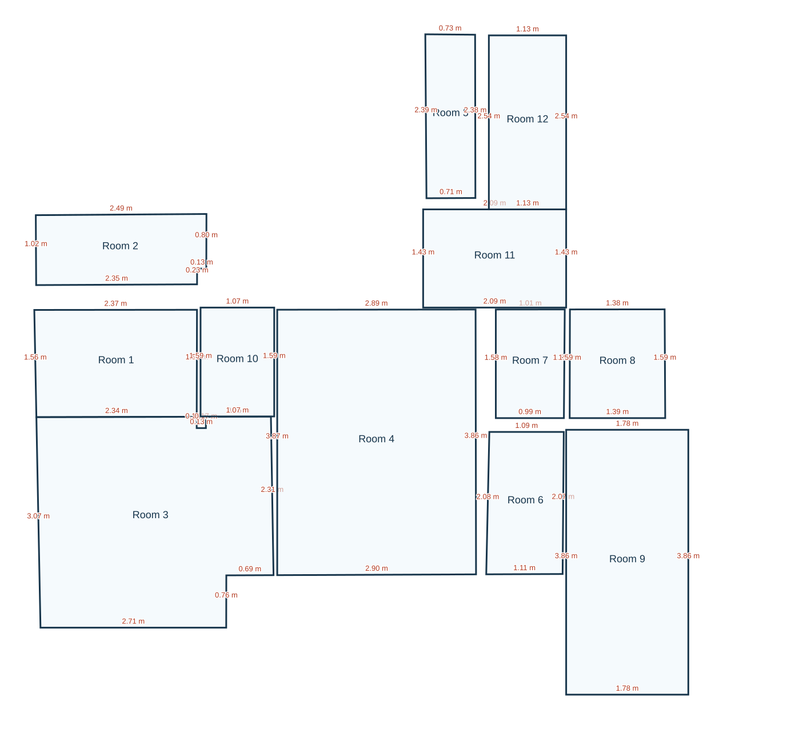
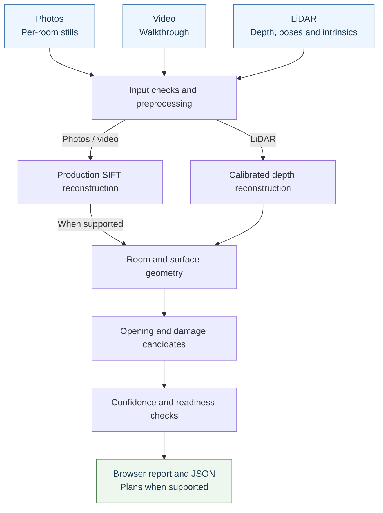

# Phone to Floorplan

A Python command-line prototype for reviewing phone captures as floor plans and
property-restoration evidence. It accepts photos, walkthrough videos and LiDAR
scans, reconstructs supported geometry, and writes a browser report with
measurements, opening/damage candidates and missing-evidence warnings.

**Current status: partial.** The supplied LiDAR example runs and produces a report
and a partial plan. Complete whole-property reconstruction and independently
measured centimetre accuracy have **not been demonstrated**. Missing measurements
remain unavailable; a drawing alone does not pass the assessment.

**Start here:** [Run the supplied demo](#run-the-supplied-demo-windows-powershell)
then [inspect the output](#inspect-the-output).
For results without running anything, read [validation](docs/validation.md)
or the [five-page technical report](docs/technical_report.pdf).

## Run the supplied demo (Windows PowerShell)

You do **not** need a phone to run this example. You need:

| Prerequisite | Check / source |
|---|---|
| Windows with PowerShell | Open PowerShell; paste the blocks below in order. This is the tested platform. |
| Git | `git --version` should print a version. |
| Python 3.12 with the Windows launcher | `py -3.12 --version` should print Python 3.12. |
| Original assignment data | The supplied `Given_dataset` folder, placed as described in step 3. |
| Package-download access | Needed for installation unless an offline wheelhouse is provided. |

The baseline runs on CPU. No GPU, model download, API key or environment variable
is required. Run subsequent commands from the `phone-to-floorplan` folder.

### 1. Download the code

```powershell
git clone --branch main https://github.com/Tarun11112003/phone-to-floorplan.git
cd phone-to-floorplan
```

If you already have the repository, open PowerShell in its root folder instead.

### 2. Install dependencies

```powershell
& .\scripts\bootstrap_windows.ps1
```

Wait for `CPU environment ready`. The script creates or reuses an isolated Python
environment in `.venv`, installs the pinned dependencies and checks the command
interface. You do not need to activate that environment: the commands below
invoke its Python directly. Setup took about four minutes in the recorded
network/cache-assisted check; your download time may differ.

If PowerShell blocks the script, use the manual installation under
[troubleshooting](#troubleshooting). [requirements.txt](requirements.txt) and
[reproduction instructions](docs/reproducibility.md) explain dependencies and
offline installation.

### 3. Place the supplied data

**GitHub contains code, documentation and saved result summaries. It does not
contain the original captures or the handoff ZIPs, and it does not download them.**

Copy the assignment's original **whole `Given_dataset` folder** into `datasets/`
inside the repository. Preserve the original files and export IDs:

```text
phone-to-floorplan/
  datasets/Given_dataset/
    single_room/c00a170fe1/
    single_scan_floor_only/1a8384c3f6/
    single_scan_with_ceiling/c7d28f72c6/
      rgb.mp4
      camera_matrix.csv
      imu.csv
      odometry.csv
      depth/
      confidence/
```

The supplied cases share this sensor-file structure. The command below uses the
**export folder** `single_scan_with_ceiling/c7d28f72c6`, not the whole dataset.
Check placement:

```powershell
Test-Path .\datasets\Given_dataset\single_scan_with_ceiling\c7d28f72c6\rgb.mp4
```

This should return `True`; keep the accompanying sensor files together too.
If you received the separate handoff instead, place it in `demo/final_qa/handoff/`
and extract its raw-data ZIP into the repository root:

```powershell
Expand-Archive -LiteralPath .\demo\final_qa\handoff\supplied_raw_dataset.zip -DestinationPath .
```

The ZIP already contains the `datasets/Given_dataset/` prefix; extract it once.

### 4. Process one capture

```powershell
& .\.venv\Scripts\python.exe -m floorplan.cli run-capture --tier lidar --source datasets\Given_dataset\single_scan_with_ceiling\c7d28f72c6 --out runs\ceiling_review --profile assignment --property-id supplied_ceiling
```

This selects up to 300 LiDAR frames, processes the capture, and writes to
`runs/ceiling_review/`. The recorded full command took about **3.5 to 4 minutes**
after installation; this is a measured example, not a runtime guarantee.

**The recorded result is `partial`, with exit code 1.** It produced review files
but failed completeness/acceptance checks. Exit code 1 alone can also indicate
an actual processing error: check the recorded status and files as described below.

For a second run, change `--out` to `runs\ceiling_review_2` and use that folder
when inspecting results. Outputs must be new or empty; the tool will not
silently overwrite an earlier run.

## Inspect the output

Open the browser report; no web server is needed:

```powershell
Start-Process .\runs\ceiling_review\result\report.html
```

You can also double-click that file in File Explorer. Keep the whole `result/`
folder together: the report loads its sibling plan and evidence images.

1. Read **Capture review** for the status and readiness warnings.
2. Inspect the embedded plan, or open `plan.svg` in a browser for the drawing alone.
3. Read **Measurements** and **Assignment output coverage** for available,
   unvalidated and missing outputs.
4. Review **Restoration evidence** and **Remaining requirements**. Damage regions
   are candidates, and unavailable heights/intervals must not be treated as measurements.

| File under `runs/ceiling_review/result/` | What to use it for |
|---|---|
| `report.html` | Main human-readable review: plan, measurements, evidence and blockers. |
| `plan.svg` | Dimensioned drawing when geometry is produced; it can be partial. |
| `assessment.json` | Structured surfaces, measurements, damage candidates and contract blockers. |
| `run.json` | Processing status, frame/point counts, runtime and readiness. |
| `contract_coverage.json` | Which required outputs are present, unvalidated or missing. |
| `plan.json`, `plan.dxf`, `quantities.csv` | Structured geometry, CAD drawing and spreadsheet quantities; conditional on reconstruction support. |
| `layout_diagnostic.svg`, `artifacts/` | Supported fragments and intermediate reconstruction evidence. |

The recorded supplied example processed **300 frames into 202,477 points**.
It proposed **12 room/cell shapes**, with **0 accepted ceiling heights** and
**0 adjacency connections**. These are not 12 independently verified rooms or
a complete property. Source: [workflow QA](benchmarks/manifests/final_qa.json).


<details>
<summary>Preview the recorded partial plan without installing anything</summary>



Unmodified SVG from the saved supplied-capture QA run. It shows 12 proposed
room/cell shapes; physical boundaries and accuracy are unverified, with zero
accepted ceiling heights and adjacency connections. This is an example of the
current partial output, not a completed property benchmark.

</details>

For a machine-readable status check:

```powershell
$reviewRun = Get-Content .\runs\ceiling_review\result\run.json -Raw | ConvertFrom-Json
$reviewRun.result | Select-Object status, input_frames, point_count, floor_plan_ready
$reviewRun | Select-Object assessment_status, contract_complete, accuracy_validated
```

For the recorded example, look for `partial`, `assessment_status: written`,
`floor_plan_ready: false`, `contract_complete: false` and `accuracy_validated: false`.
If the status is `failed`, inspect its reason and any error logs; do not interpret
that as the documented partial result. Internal JSON validation does not establish
physical accuracy; the official assessment schema was not supplied.

## Troubleshooting

| What you see | What to do |
|---|---|
| `git` or `py` is not recognized | Install Git or Python 3.12 with its Windows launcher, then reopen PowerShell and repeat the prerequisite checks. |
| Script execution is blocked | Use the manual installation below; changing machine-wide execution policy is unnecessary. |
| Dependency installation fails | Check package-download access and the Python version. Native wheels are required; see [setup details](docs/reproducibility.md). |
| Input not found / sensor files missing | Check the exact export-folder nesting from step 3 and copy the complete original export. |
| `FileExistsError` / output directory not empty | Choose a new `--out`, such as `runs\ceiling_review_2`; update inspection paths too. |
| `partial` with exit 1 and a written report | Processing produced review artifacts, but readiness failed. Read the report's missing requirements. |
| `failed`, missing report, or a traceback | Read the terminal error and `result/run.json` (`result.reason` / `error_type`); inspect `result/error.log` if present. `capture_attempt.json` records the attempted intake. |
| Plan absent or not visible | Geometry may be unsupported. Check report/status first; if `plan.svg` exists, open it separately in a browser. |

Manual installation, from the repository root with Python 3.12 available:

```powershell
py -3.12 -m venv .venv
& .\.venv\Scripts\python.exe -m pip --disable-pip-version-check install -r requirements.txt
& .\.venv\Scripts\python.exe -m floorplan.cli --help
```

## Input tiers and other captures

| Tier | Required input / hardware | Current boundary |
|---|---|---|
| Photos | 2 to 8 original stills **per room**, any iPhone 15+; no depth or poses | Intake and SIFT reconstruction exist; strict metric scale and whole-property stitching remain unresolved. |
| Video | Original handheld walkthrough, any iPhone 15+ | Timestamped sampling and production SIFT; difficult transitions remain incomplete. |
| LiDAR | Pro-class iPhone 15+ with LiDAR; depth, confidence, poses, intrinsics and RGB | Supported Stray Scanner exports and calibrated depth processing; supplied plans remain partial. |

For photos, use `captures/property_photos/<room_id>/` folders. For video, place
one original MOV/MP4 at `captures/walkthrough.mov`. These are your supplied
captures, not files included in Git. The same capture command accepts:

```powershell
& .\.venv\Scripts\python.exe -m floorplan.cli run-capture --tier photos --source captures\property_photos --out runs\photos_review --profile assignment --property-id property_01
& .\.venv\Scripts\python.exe -m floorplan.cli run-capture --tier video --source captures\walkthrough.mov --out runs\video_review --profile assignment --property-id property_01
```

Strict RGB may stop with `scale_unresolved` or incomplete reconstruction.
Every tier is required to produce a stitched, connected and correctly dimensioned
whole-property plan; a single-room output does not satisfy that requirement.
Stock capture tools are described in the [capture protocol](docs/capture_protocol.md)
and [device matrix](docs/device_matrix.md). An unseen-phone/novice capture route
has not been validated. No custom app is included.

## What happens inside the system



Unsupported geometry or metric scale stays unavailable. Whole-property stitching
is a separate explicit operation with verification checks. [Architecture](docs/architecture.md)
details the modules and guards; learned-model alternatives remain experimental
and are unnecessary for this demo.

## Validation and current limits

**399 software tests passed** in the submission-layout check. Earlier fresh-install,
committed-checkout and supplied-capture results are scoped in [QA](docs/submission_qa.md).
No software test count or internal consistency result proves physical accuracy.

<details>
<summary>Recorded engineering comparisons and decisions</summary>

| Engineering result | Recorded comparison | Decision |
|---|---|---|
| Supported floor wall fragments | 67 to 69; camera containment stays 25/176 | Shipped bounded support fix; completeness still partial. |
| Denser video bridge sampling | 139 to 169 / 222 verified pairs | No joint target model; no forced union. |
| SIFT / DISK / XFeat on the same 32 views | 68 / 167 / 236 verified pairs; 11 / 25 / 29 unique registered views | SIFT retained; added matches did not establish safe production geometry. |
| Experimental XFeat fixed-intrinsics mapping | 24-to-27 rotation disagreement: 24.7720 to 4.3191 degrees | Partial improvement; later 6.520814-degree disagreement unresolved. |
| LiDAR stride-4 trial | Camera containment 25 to 79/176, but accepted polygon changed | Rejected; existing geometry and guards preserved. |

These are separate controlled experiments. Camera containment is not surveyed
floor coverage. [Validation](docs/validation.md), [Fix Loop](docs/fix_loop.md) and
[benchmark report](benchmarks/report.md) contain exact evidence and before/after scope.

</details>

- **Experimental:** MoGe, DISK/LightGlue, XFeat/LightGlue and fixed-intrinsics/density controls were not promoted.
- **Unresolved geometry:** floor/property completeness and adjacency remain partial; `room_2` has no accepted local floor/ceiling. The 0.703 m footprint notch is unvalidated, not a measured ceiling-height change.
- **Closed investigation:** RGB registration diagnosis is inconclusive; no proven production solver defect was established.
- **Missing acceptance evidence:** independently measured three-tier wall/opening/ceiling accuracy, calibrated intervals, damage labels, physical repeats, consumer comparison and a qualifying measured Fix Loop.

[Compliance](docs/compliance_matrix.md) and [limitations](docs/limitations.md) map
these gaps to the assessment. To run the existing software checks:

```powershell
& .\.venv\Scripts\python.exe -m pytest -q
```

Report regeneration, offline bundle use and package verification are advanced
reproduction tasks in [reproducibility](docs/reproducibility.md); they are not
needed to view a capture's browser report.

## Repository and further reading

| Path | Purpose |
|---|---|
| `floorplan/` | Production modules; `rgb_metric.py` is opt-in experimental. |
| `scripts/` | Setup/packaging plus grouped dataset, evaluation, diagnostic and experimental tools. |
| `tests/`, `examples/` | Software regressions and controlled fixtures, not physical benchmark truth. |
| `docs/` | Evaluator documentation and linked deeper engineering records. |
| `benchmarks/` | Reports, result JSON, evidence manifests and unfilled ground-truth templates. |
| `datasets/`, `demo/`, `runs/` | Raw/generated assets are Git-excluded; small dataset source records are tracked. |

Start with the [documentation index](docs/README.md), [technical report](docs/technical_report.pdf)
and [validation results](docs/validation.md). The [original assignment](docs/specification/applied_ai.html)
defines acceptance. [Detailed investigations](docs/engineering/README.md) preserve
supporting evidence; superseded next-step suggestions are not active development work.
Personal notes/plans remain under ignored `.local/`; earlier Git history is preserved.

## Licensing and external assets

No project-wide license is currently declared. Dependencies and optional models
have their own terms; see [third-party decisions](docs/third_party.md) and
[retained notices](docs/attribution/README.md). Downloaded model weights and native
research binaries are not bundled, and the raw assessment dataset is transferred
separately rather than redistributed through GitHub.
