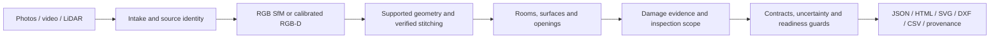

# Phone to Floorplan

## Overview

A Python command-line prototype for turning phone photos, video and LiDAR/depth
captures into dimensioned floor-plan artifacts for property restoration. It
normalizes captures, reconstructs observed geometry, proposes rooms/openings,
links damage evidence to surfaces, and exports plans with validation/provenance.

**Assessment status: partial.** Supplied sensor scans produce partial layouts;
RGB-only property reconstruction remains incomplete. Independent centimetre-level
accuracy, the required physical benchmark and cold walk-in readiness have
**not been demonstrated**. Unknown measurements are withheld.

**Validated:** the latest current-worktree suite has **390 passing tests** and
the retained ceiling layout passes **15/15 exact replay checks**. These verify
software behavior and artifact consistency, not physical accuracy.

## What the system does

- Preserves raw capture identities, metadata and timestamped sensor pairing.
- Reconstructs sparse RGB models or calibrated metric RGB-D clouds.
- Extracts supported walls, partial rooms and observed floor/ceiling measurements.
- Verifies stitching constraints and proposes openings and surface-linked damage.
- Exports review artifacts with explicit metric, completeness and failure status.

## Input tiers

| Tier | Input | Current processing and limitation |
|---|---|---|
| Photos | RGB stills; assessment requires 2–8 per room without depth/poses | Production SIFT sparse reconstruction; opt-in learned metric geometry remains experimental. Strict-photo whole-property acceptance is not demonstrated. |
| Video | Phone MP4/MOV | Timestamped frames and RGB reconstruction. Supplied low-detail transitions remain unresolved; SIFT stays the production baseline. |
| LiDAR/depth | Supported Stray Scanner export: RGB, depth, confidence, intrinsics, odometry | Per-frame calibrated backprojection and weighted fusion. Supplied layouts remain partial; LiDAR needs compatible Pro hardware. |

Route 2 uses stock phone tools and a transfer protocol. There is no custom phone
app. See [capture protocol](docs/CAPTURE_PROTOCOL.md) and
[device matrix](docs/DEVICE_MATRIX.md); a novice/cold-device rehearsal is pending.

## End-to-end pipeline



See [architecture](docs/ARCHITECTURE.md) for actual branches and execution order.
Insufficient support can terminate a branch; a report is not an accepted plan.

## Outputs

`run-capture` writes `intake/` records and a `result/` directory:

| Artifact | Meaning |
|---|---|
| `assessment.json`, `report.html` | Internal surface/room/damage contract and offline review; completeness and unavailable measurements remain visible. |
| `plan.json`, `plan.svg`, `plan.dxf`, `quantities.csv` | Geometry/quantities when supported; may be absent or partial on failed captures. |
| `layout_diagnostic.svg`, `artifacts/` | Supported segments, cloud/trajectory and intermediate evidence where available. |
| `run.json`, `intake.json` | Producer/input hashes, execution results and readiness blockers. |

The published assessment schema and earlier Round 1 definitions are absent from
the supplied HTML. Internal schema validation is not official schema compliance.

## Current status

- **Production:** SIFT baseline, calibrated sensor intake/fusion, conservative
  geometry/stitching, contracts and evaluation tools.
- **Experimental/ablation:** learned RGB geometry, DISK/LightGlue,
  XFeat/LightGlue, fixed-intrinsics/mapping controls and denser LiDAR sampling.
- **Diagnostic/audit:** source-return, boundary, track/pose and acceptance traces.
  The RGB registration investigation is closed as inconclusive.
- **Benchmark/evaluation:** scorers exist; the required independently surveyed,
  same-property three-tier benchmark remains unavailable.

Latest floor audit: accepted pixels in the same 300 frames give **29.2154%
diagnostic occupancy**, versus **14.1246%** after stride-8 sampling. Native fusion
loses no local occupied cells. **Production remains unchanged:** room_2 has no
accepted local floor or ceiling height. The **0.703 m footprint notch remains
unvalidated**. Development is frozen; no further experiment belongs to this handoff.

## Validation / benchmarks

Read [validation results](docs/BENCHMARK_RESULTS.md),
[assignment compliance](docs/ASSIGNMENT_COMPLIANCE.md) and
[fix-loop evidence](docs/FIX_LOOP.md). Historical V2/V3 numbers use other inputs
and evaluators; they do not establish current assessment acceptance.

## Known limitations

Property completeness, strict RGB metric reconstruction, physical opening/ceiling
accuracy, damage validation, calibrated intervals, repeats, consumer comparison
and cold walk-in performance remain open. Supplied data has sensor evidence but
no independent dimensional survey. See [limitations](docs/LIMITATIONS.md).

## Quickstart

Python 3.12 on Windows; CPU execution is the documented baseline. Bootstrap may
require network access. Native binaries and experimental model assets have
separate requirements.

```powershell
& .\scripts\bootstrap_windows.ps1
& .\.venv\Scripts\python.exe -m floorplan.cli --help
& .\.venv\Scripts\python.exe -m pytest -q
```

In an activated Python 3.12 virtual environment, dependencies can also be
installed using `python -m pip install -r requirements.txt`. The root file reuses
the [observed Windows CPU pins](requirements/windows-cpu.txt); experimental
models and OpenMVS remain separate prerequisites.

Supplied sensor-case review, using a **fresh output directory**:

```powershell
& .\.venv\Scripts\python.exe -m floorplan.cli run-capture --tier lidar --source datasets\Given_dataset\single_scan_with_ceiling\c7d28f72c6 --out runs\ceiling_review --profile assignment --property-id supplied_ceiling
```

This command is **not an expected acceptance pass**. Nonzero readiness status
must remain visible. Raw captures and retained `demo/` evidence are excluded from
Git and need a separate handoff. See [reproduction/package instructions](docs/PHASE3_OPERATIONS.md)
for real commands, asset requirements and current snapshot versus Git checkout.
Clean-machine installation time has not been demonstrated.

## Repository structure

| Path | Role |
|---|---|
| `floorplan/` | Intake, reconstruction, geometry, contracts and evaluation |
| `scripts/` | Setup/reproduction tools, explicitly named experiments and audits |
| `tests/`, `examples/` | Software regression and controlled fixtures |
| `docs/` | Assessment, architecture, validation, decisions and evidence records |
| `datasets/`, `demo/` | Local raw data/generated artifacts; generally Git-excluded |

## Documentation

Start with the [index](docs/INDEX.md), [technical report](docs/TECHNICAL_REPORT.md),
[architecture](docs/ARCHITECTURE.md), [validation](docs/BENCHMARK_RESULTS.md) and
[compliance matrix](docs/ASSIGNMENT_COMPLIANCE.md).
[Applied AI.html](docs/Applied%20AI.html) is the requirements source.
Dated `docs/fixes/` and `docs/results/` entries retain negative/inconclusive
evidence; historical next-step suggestions are superseded by the development freeze.
