# Phone to Floorplan

## Overview

A Python command-line prototype that turns phone photos, video and LiDAR/depth
captures into floor-plan and property-restoration review artifacts. It preserves
capture provenance, reconstructs supported geometry, proposes surfaces/openings
and damage regions, and reports missing measurements and acceptance blockers.

**Current assessment status: partial, not acceptance-ready.** The supplied
LiDAR scan runs end to end and writes plans, JSON and HTML. Whole-property
completeness, strict RGB metric reconstruction and independently measured
centimetre accuracy have **not been demonstrated**. Unsupported measurements
remain unavailable; a plausible drawing is not a passed assessment gate.

**Verified in final QA:** 397 tests passed in a fresh environment (390 existing + 7 packaging checks);
the documented supplied-scan
command processed 300 frames into 202,477 points and exited **1 (`partial`)**.
It wrote 12 room/cell hypotheses, with **0 accepted ceiling heights and 0
adjacency connections**. The retained ceiling layout also has 15/15 exact saved
artifact checks. These are software/internal-consistency results, not physical
accuracy or a verified 12-room property. See [QA evidence](docs/FINAL_QA.md).

## Input tiers and hardware

| Tier | Required capture | Production path and current limitation |
|---|---|---|
| Photos | 2?8 original stills **per room**, any iPhone 15+, no depth or poses | Per-room folders, HEIC/EXIF intake, SIFT/COLMAP. Strict RGB metric scale and whole-property stitching remain unresolved. |
| Video | Original handheld walkthrough, any iPhone 15+ | Timestamped sampling and the same SIFT baseline. Difficult RGB transitions remain incomplete. |
| LiDAR | iPhone 15+ with LiDAR (Pro); depth, confidence, poses, intrinsics and RGB | Supported Stray Scanner raw export, calibrated backprojection, verified pose constraints and weighted fusion. Supplied plans remain partial. |

Every tier is required to produce the **same whole-property output contract**:
recognizable, connected, correctly placed and dimensioned rooms with adjacency.
A single-room result does not satisfy that requirement. Intervals may be wider
for photos; the accuracy gates still require independent evidence.

Route 2 uses stock tools; there is no custom app. See the
[capture protocol](docs/CAPTURE_PROTOCOL.md) and [device matrix](docs/DEVICE_MATRIX.md).
The novice/cold-device capture route remains unverified.

## End-to-end pipeline

```mermaid
flowchart LR
  A[Photos / video / LiDAR] --> B[Intake: identity, timing, calibration]
  B --> C[SIFT RGB or calibrated RGB-D]
  C --> D[Supported geometry and explicit verified stitching]
  D --> E[Rooms, surfaces and openings]
  E --> F[Damage candidates and inspection scope]
  F --> G[Uncertainty, contracts and readiness guards]
  G --> H[JSON / HTML / conditional SVG, DXF and CSV]
```



[Architecture](docs/ARCHITECTURE.md) explains the actual branches. Insufficient
support can terminate reconstruction; a report is not an accepted plan.

## Install

Run from the repository root in PowerShell. The tested platform is **Windows,
Python 3.12, CPU**; `py -3.12` must be available. Network/package-index access and
native Python wheels are needed unless an offline wheelhouse is supplied.

Obtain the final Git checkout or extract the supplied `source.zip` into a fresh
`phone-to-floorplan` directory. For offline Git/process review, clone the provided
`repository.bundle`. This QA pass does not upload/push the repository;
use the submitted commit recorded in `package_manifest.json`, not an older remote.

```powershell
cd phone-to-floorplan
& .\scripts\bootstrap_windows.ps1
& .\.venv\Scripts\python.exe -m floorplan.cli --help
```

The root **[requirements.txt](requirements.txt)** installs the project and the
[Windows CPU pins](requirements/windows-cpu.txt). In an activated Python 3.12
environment, the equivalent install is `python -m pip install -r requirements.txt`.
The bootstrap preserves existing environments. See [operations](docs/PHASE3_OPERATIONS.md)
for alternate environments/offline wheels and actual setup-test limitations.

**No model checkpoint, API key or environment variable is required for the
production SIFT/LiDAR baseline.** OpenMVS and learned-model assets are separate,
optional research prerequisites. `--experimental-rgb` is not an accepted default.

## Place inputs and run one capture

Raw assessment data is excluded from Git. Obtain it through the assessment
handoff, then preserve this directory structure:

```text
datasets/Given_dataset/
  single_scan_with_ceiling/c7d28f72c6/
    rgb.mp4
    camera_matrix.csv
    imu.csv
    odometry.csv
    depth/       # original frame files
    confidence/  # matching original frame files
captures/
  property_photos/room_01/*.HEIC   # 2?8 originals per room
  property_photos/hall/*.JPG
  walkthrough.mov
```

**Supplied-data evaluator command** (fresh output directory):

```powershell
& .\.venv\Scripts\python.exe -m floorplan.cli run-capture --tier lidar --source datasets\Given_dataset\single_scan_with_ceiling\c7d28f72c6 --out runs\ceiling_review --profile assignment --property-id supplied_ceiling
```

Other supported intake paths use the same command contract:

```powershell
& .\.venv\Scripts\python.exe -m floorplan.cli run-capture --tier photos --source captures\property_photos --out runs\photos_review --profile assignment --property-id property_01
& .\.venv\Scripts\python.exe -m floorplan.cli run-capture --tier video --source captures\walkthrough.mov --out runs\video_review --profile assignment --property-id property_01
```

**Expect a nonzero readiness exit for the supplied scan.** Final QA recorded exit
1 and `partial`; keep that status visible. Strict RGB may return
`scale_unresolved` or incomplete reconstruction. Neither condition is success.
Existing outputs must not be reused as fresh capture directories.

## Outputs and inspection

Open `runs/ceiling_review/result/report.html` and `plan.svg` locally; inspect
`run.json`, `assessment.json` and `contract_coverage.json` for blockers.

| Artifact under `result/` | Meaning |
|---|---|
| `assessment.json`, `report.html` | Rooms/surfaces, measurements, opening and damage candidates, concealed-rule flags, surface-keyed inspection scope and unavailable intervals |
| `plan.json`, `plan.svg`, `plan.dxf`, `quantities.csv` | Conditional dimensioned geometry/quantities; may be absent or partial |
| `layout_diagnostic.svg`, `artifacts/` | Supported fragments, cloud, trajectory and intermediate evidence |
| `run.json`, `contract_coverage.json` | Input/producer hashes, runtime, readiness and required-output inventory |

`intake/` preserves normalization/source identity. Preflight failures may instead
write `capture_attempt.json`. Internal JSON schema validation is available; the
published assessment schema was not supplied, so official compliance is unverified.

## Validation and reproducibility

```powershell
& .\.venv\Scripts\python.exe -m pytest -q
& .\.venv\Scripts\python.exe scripts/render_assessment_report.py --out demo\report_review
& .\.venv\Scripts\python.exe scripts/package_assessment.py --verify demo\final_qa\handoff
```

The report command reads saved evidence and produces a five-page PDF/editable
SVGs; it does not run reconstruction. The package verification command requires
the separately delivered package at that path. Package generation and benchmark
commands are in [operations](docs/PHASE3_OPERATIONS.md).
The **submitted Git tree contains the frozen implementation**; an uncommitted
source snapshot is no longer required to obtain the code that was tested.

## Status and known limitations

- **Production:** SIFT, calibrated RGB-D intake/fusion, conservative geometry,
  explicit stitching, internal contracts and evaluation tools.
- **Experimental:** MoGe metric RGB, DISK/LightGlue, XFeat/LightGlue,
  fixed-intrinsics/mapping controls and denser sampling. None was promoted.
- **Diagnostic:** RGB registration investigation is **closed as inconclusive**.
  room_2 has no accepted local floor or ceiling. The **0.703 m footprint notch**
  remains unvalidated; it is not a measured ceiling-height change.
- **Acceptance missing:** complete property/adjacency, physical wall/opening/
  ceiling accuracy, field damage labels, calibrated intervals, same-property
  three-tier benchmark, repeats, consumer exports, prospective measured Fix Loop
  and an unseen-phone walk-in. Installation/runnability does not close these gates.

See [results](docs/BENCHMARK_RESULTS.md), [compliance](docs/ASSIGNMENT_COMPLIANCE.md),
[fix loops](docs/FIX_LOOP.md) and [limitations](docs/LIMITATIONS.md).

## Repository and documentation

| Path | Role |
|---|---|
| `floorplan/` | Production modules; `rgb_metric.py` is opt-in experimental |
| `scripts/` | Setup, packaging, evaluation and explicitly catalogued diagnostic/experimental tools |
| `tests/`, `examples/` | Regression tests and controlled fixtures, not physical benchmark truth |
| `docs/` | Canonical handoff, report, evidence and historical engineering records |
| `datasets/`, `demo/`, `runs/` | Local input/generated assets; excluded from Git |

Start with the [documentation index](docs/INDEX.md), [technical report](docs/TECHNICAL_REPORT.pdf)
and [final QA](docs/FINAL_QA.md). The [original brief](docs/Applied%20AI.html) defines
success. Older plans are historical; their next-step suggestions are superseded.
No further algorithm investigation belongs to this final handoff.
