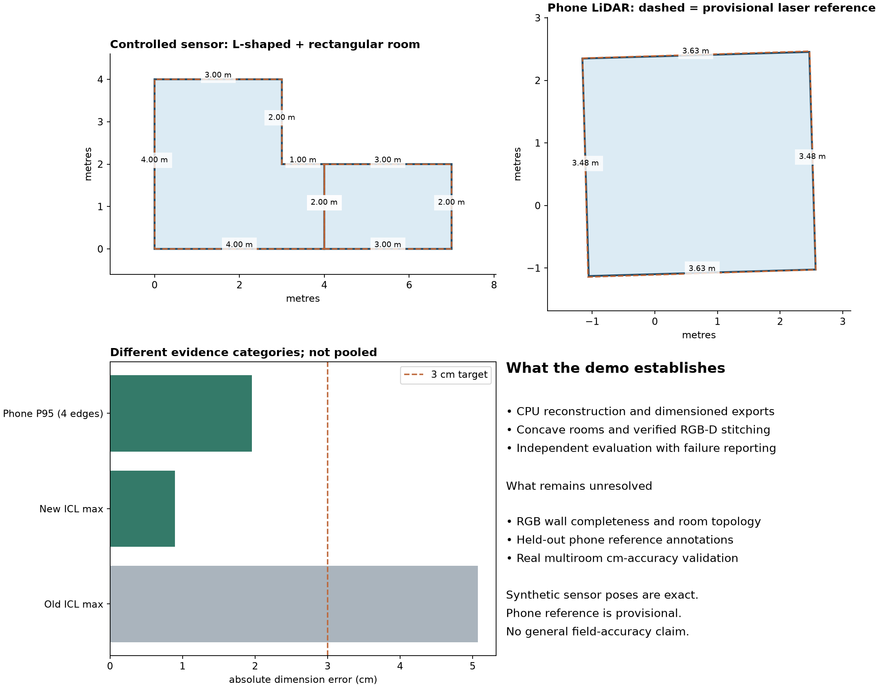

# RGB-D component benchmark report

Recorded  CPU execution on the local Windows machine.

**The complete three-tier cm-accuracy requirement is not achieved.** Depth-based multiroom geometry and verified capture stitching work on a controlled fixture. RGB completeness/topology remains unresolved.

| Case | Pipeline status | Measurement / limitation | Seconds |
|---|---|---|---|
| icl_development | proposal_requires_review | 0.89 cm max; dimensions only | 28.4 |
| icl_heldout_trajectory | incomplete_geometry | Insufficient supported vertical walls | 7.7 |
| arkit_development | proposal_requires_review | 1.96 cm P95; nominal pass | 6.8 |
| arkit_heldout_1 | proposal_requires_review | Reference polygon annotation unavailable | 7.7 |
| arkit_heldout_2 | proposal_requires_review | Reference polygon annotation unavailable | 8.4 |
| photos | incomplete_geometry | No closed room supported by observed walls and camera coverage | 12.1 |
| video | partial | 2 missing / 1 unmatched rooms; fails | 13.6 |

Controlled two-room sensor fixture: P95 dimension error **0.043 cm**, P95 corner error **0.031 cm**, correct two-room topology and full reference boundary coverage. These tiny errors reflect ideal synthetic data and exact simulated sensor poses; they do not measure phone accuracy.

Separate synthetic captures, with independently rotated/translated coordinate frames: verified visual overlap plus ICP recovers one connected component. P95 dimension error **0.013 cm**; topology target passed. No manual doorway anchors were supplied to stitching.

Tests: **16 executed, 0 failures, 0 errors, 0 skipped**. See `demo/v2_tests.xml` for the actual test record.

## How to interpret the evidence

- ICL development maximum side error improved from 5.07 cm to 0.89 cm. The unseen trajectory still fails geometry coverage. These trajectories share a synthetic room.
- The phone development reference was prepared from an independent FARO scan using manually inspected wall regions and robust line fits. Its assumed 1 cm annotation uncertainty floor and lack of independent review make the nominal pass provisional. Only four correlated wall edges are evaluated.
- Two other phone venues produce geometry but lack reviewed structural reference polygons. Their FARO data and inspection plots are downloaded; they are not counted as accuracy passes.
- RGB photos and video registered all 97 controlled-fixture views. A weak initial scale control was correctly rejected; a revised control passed triangulation. The final photo cloud has no closed plan; the video proposal has incorrect topology and is not a success.
- RGB times in the table measure the calibrated dense/layout stage using validated cached SfM. Initial photo SfM took about 317 seconds; include feature reconstruction time when budgeting a fresh demo. The cache is disclosed in each run ledger.
- Additional public ICL photo/video stereo experiments also produced metric clouds but incomplete wall boundaries. Their independent scale-control preparation uses only two depth patches to simulate a measured distance; RGB inference receives no depth maps.
- Partial plans preserve evidence and do not imply complete property coverage. There is no app, field certification, learned depth model, or GPU requirement.

## Reproduction and source evidence

- [Implementation and manifest guide](../../docs/engineering/history/rgbd_baseline.md)
- [Machine-readable complete snapshot](../results/rgbd_component_results.json)
- [Public-case suite](../../examples/public_benchmark.json)
- Local immutable runs: `demo/v2_public_verified`, `demo/v2_rgb_verified`, `demo/v2_controlled_verified`, `demo/v2_stitched_verified`.
- Regenerate this page and plot with `python scripts/evaluation/snapshot_rgbd_results.py` after the named runs finish.

## Remaining priority

Improve RGB dense wall coverage and reject geometrically inconsistent reconstructions before proposing a room. Then annotate the held-out laser references, test real multiroom phone captures, add tracking recovery/free-space reasoning, and estimate measurement uncertainty. Keep the existing failures as regression cases.
