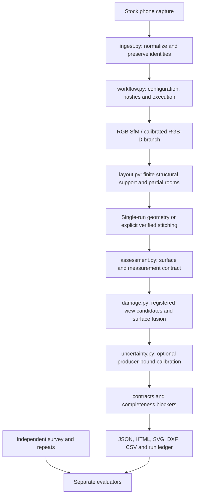
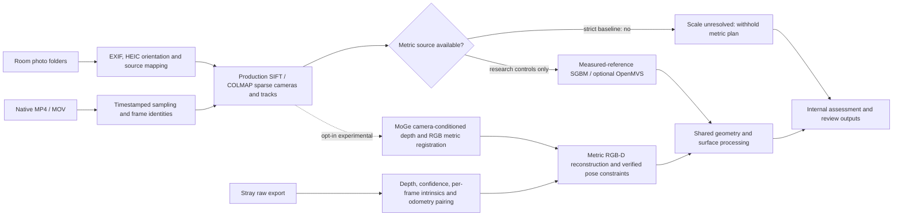

# Implemented architecture

Final development state: 2026-10-08. This describes executable modules, not a
target redesign. [Validation](BENCHMARK_RESULTS.md) and
[limitations](LIMITATIONS.md) bound every capability described here.

## High-level architecture

Stitching is an explicit supported operation; it is not guaranteed or
automatically invoked for every raw capture. Outputs are written even on many
failure paths, with readiness kept false. Evaluators do not provide truth to
strict inference.

## Three input tiers and convergence

Photos are 2–8 stills per room under the assessment, without depth, poses or
manual scale. A generic SfM reconstruction has unresolved metric scale. The
research reference-scaled dense path is deliberately not a strict-photo solution.
The optional learned geometry branch uses model-derived scale and remains
experimental. Video shares the RGB backend after frame extraction; more verified
pairs do not by themselves establish a correct or connected property model.

LiDAR supplies metric depth and poses, but their use is not an accuracy
certificate. The adapter preserves original frame identities and per-frame
intrinsics. Depth/confidence arrays are checked; scanner optical coordinates
are kept consistent rather than applying an unverified extra axis flip.

## Main modules and interfaces

| Stage | Actual implementation | Input → output / guard |
|---|---|---|
| Capture intake | `ingest.prepare_capture`, `prepare_photos`, `prepare_video`, `prepare_stray_scanner`; `capture_sync.py` | Raw media → capture manifest, source mappings, normalized frames/sequence; preserves timing/calibration identity |
| Orchestration | `workflow.run_capture`, `reconstruct`, `run_succeeded`; `cli.main` | Fresh directory, profile and optional calibration → ledger/artifacts; assignment success requires ready geometry, complete contract and accepted backend |
| RGB baseline | `sfm.reconstruct_rgb`; `dense._undistort`, `reconstruct_dense`; `openmvs.reconstruct_openmvs` | SIFT/COLMAP → sparse models; reference-scaled dense research branch needs measured endpoints |
| Experimental RGB | `rgb_metric.reconstruct_metric_rgb`, `calibrated_prediction_grid` | Pinned learned predictions → model_scaled RGB-D; opt-in and never accepted just because a polygon exists |
| RGB-D | `rgbd.reconstruct_rgbd`, `_backproject`, `_relative_pose`, `_fit_planes` | Metric depth/confidence/calibration → registered trajectory, cloud, planes; range/confidence/tracking checks |
| Drift constraints | `mapping.optimize_poses`; `ablation.compare_pose_correction` | Verified geometric/loop evidence → pose corrections; on/off control uses identical inference inputs |
| Structural layout | `layout.weighted_voxels`, `extract_layout`, `_horizontal_support`, `_observed_floor`, `_observed_ceiling`; `supported_cells.py` | Finite planes/segments → observed polygons and explicitly inferred cells; no accepted local floor means no ceiling-height inference |
| Stitching | `stitching.stitch_runs`; `pose_graph.consistent_edges`, `map_room_identities` | Independently reconstructed runs → verified overlap/cycles and mapped room identities; disconnected/partial children cannot imply accepted property closure |
| Openings | `openings.detect_wall_openings`, `augment_room_openings` | Multiview rays and jamb/header/sill evidence → structural candidates; missing height withholds net wall area |
| Surface assessment | `assessment.build_assessment`, `write_assessment`; `damage.assess_rgbd_damage` | Geometry → stable physical surfaces, candidates, concealed-rule flags and inspection scope; unregistered/unsupported views rejected |
| Confidence | `uncertainty.apply_calibration`; `calibration_records.py` | Compatible producer-bound independent-property calibration → intervals; absent groups stay unavailable |
| Validation | `contracts.py`, `assignment_gates.py`, `repeatability.py`, `benchmark_manifest.py`, `consumer_comparison.py`, `survey.py` | Saved predictions + separately supplied truth → scored reports; output presence and physical acceptance remain separate |

`run-capture` executes intake, reconstruction and assessment. `stitch-captures`,
benchmark scoring, survey import, calibration and consumer comparison are
separate explicit CLI operations; diagrams show their interfaces, not an
unimplemented automatic service.

## Conservative policies and uncertainty

The sensor reconstruction samples confident depths on an 8-pixel lattice and
fuses with confidence/range weighting in 2 cm voxels. Current local floor
support uses a strict 35 mm plane band, a 5 cm room buffer and clipped occupied
20 cm cells. The 100-point minimum and 25% coverage guard remain unchanged.
These are development observation guards, not assessment error tolerances.

An observed ceiling requires an accepted local floor and local camera evidence;
global floor availability is not substituted for a local observation. Resolved
slope and missing openings remain explicit rather than producing a convenient
constant ceiling or quantity. Room hypotheses cannot certify physical adjacency.

Damage output is conservative inspection evidence. Candidate masks are not
validated damage diagnoses; concealed flags describe the rule that fired, not
an observed hidden condition. Surface support/confidence is distinct from an
independently calibrated interval. Assignment calibration targets 90% coverage
and groups independent properties by tier/measurement kind/unit; nine properties
are needed for a finite 90% group. The necessary field calibration/audit set is
not present.

## Tradeoffs selected

| Choice | Benefit | Cost / limit |
|---|---|---|
| CPU CLI, stock capture | Inspectable execution without hosted infrastructure or custom app | Native binaries/model assets still require installation; cold timing unverified |
| Retain SIFT | Mature deterministic baseline and unchanged correctness gates | Weak textured transitions remain disconnected/incomplete |
| Per-frame sensor calibration | Avoids a last-frame K or index-only pairing assumption | Hardware distortion/depth/pose accuracy still needs physical verification |
| Finite raw-supported boundaries | Preserves evidence and limits speculative joins | Partial plans persist when sufficient closure is not observed |
| Fixed stride/frame budget | Bounds routine reconstruction compute | Audit demonstrates lost available local floor support |
| Withhold unsupported values | Prevents fabricated ceiling/opening/net-area measurements | Contract remains incomplete and assignment status fails |
| Separate experimental backends | Allows evaluation without replacing a working baseline | Experimental connectivity/low residuals cannot be advertised as accuracy |
| Hash-bound outputs/cache | Exposes input/producer mismatches | Historical absolute paths and missing raw/truth assets limit portability |

No backend, solver or threshold is changed during finalization. The RGB
registration investigation remains CLOSED as inconclusive; learned matching
and fixed-intrinsics improvements remain experimental. See [fix loops](FIX_LOOP.md)
and [source decisions](OPEN_SOURCE_DECISIONS.md).
