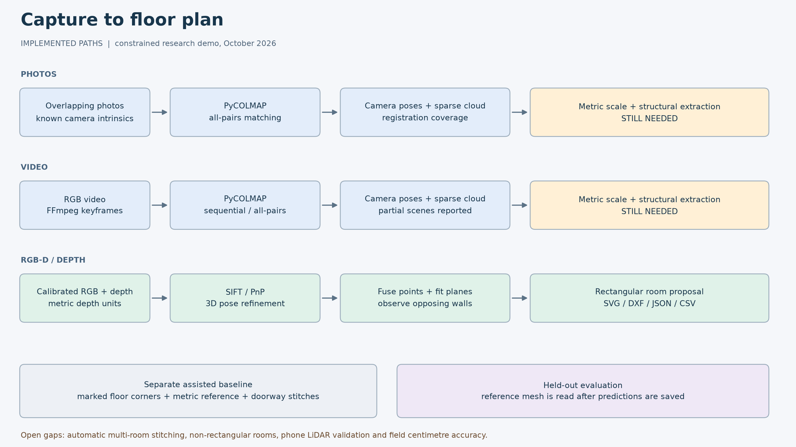
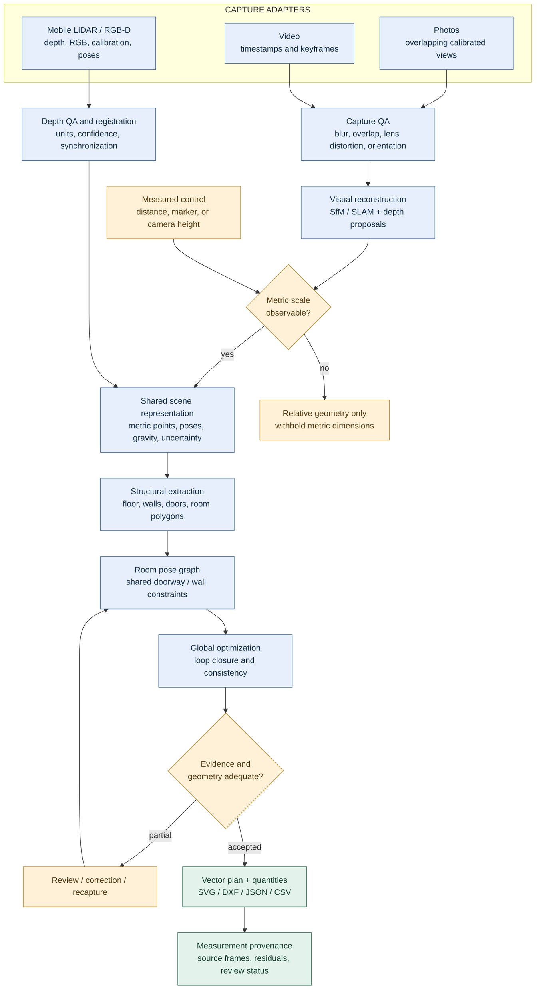
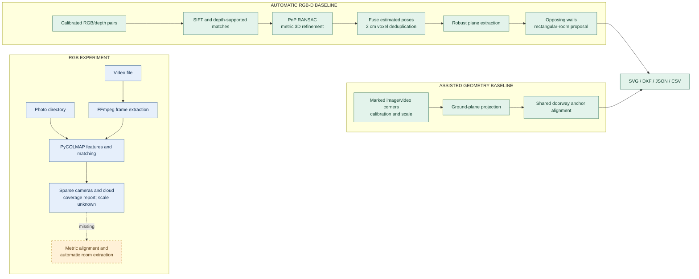
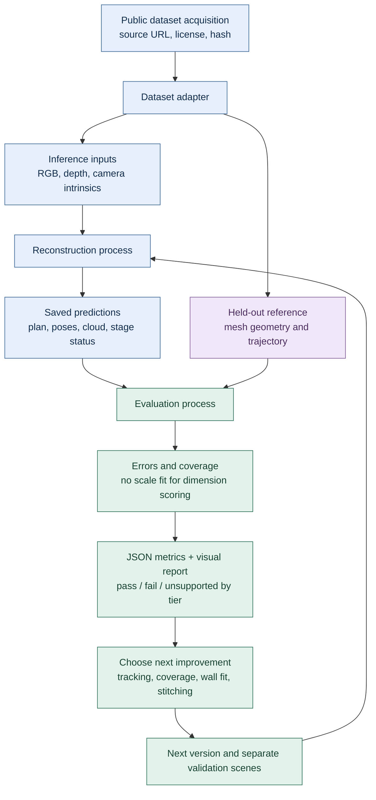
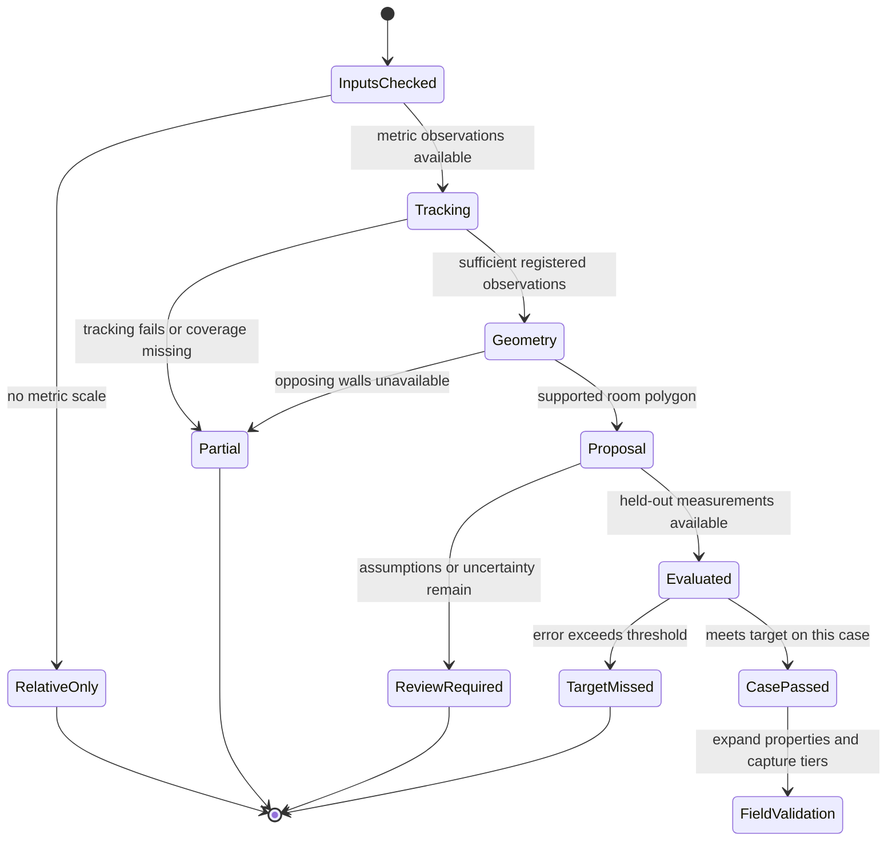

# Architecture and visual flows

Personal engineering reference. Updated 2026-10-05. The target is a code-driven system for restoration estimators: photos, video, and mobile LiDAR observations become editable metric room geometry, stitched plans, dimensions, quantities, and source evidence. **The full three-tier requirement is not yet met.** Current code supports actual mobile LiDAR, concave multiroom layouts and verified RGB-D capture stitching. RGB-only metric clouds remain incomplete as floor plans. See the V2 implementation link below for the current architecture; this page retains the original research diagrams.

## Current implementation update

The implementation has advanced beyond the baseline diagrams on this page.
Use [restoration flow](RESTORATION_FLOW.md) for the current executable flow,
internal assessment contract, uncertainty and damage scope, and explicit remaining
gaps. [Open-source decisions](OPEN_SOURCE_DECISIONS.md) records actual model experiments.
The [V3 implementation](V3_IMPLEMENTATION.md) documents the geometry baseline.
The diagrams below preserve the initial target and baseline for comparison.

## 1. Intended three-tier architecture

Green = shared output contract. Blue = capture/reconstruction. Amber = explicit measurement/review gates. This diagram describes the intended system; the implementation map below distinguishes delivered components.

Photos and ordinary RGB video cannot geometrically determine absolute scale without a metric observation. A learned metric-depth estimate is a hypothesis whose measurement error must be checked. LiDAR supplies metric depth but still has calibration, drift, occlusion, and boundary-estimation error. The architecture therefore records scale provenance explicitly for every tier.

## 2. Historical baseline implementation

`floorplan/rgbd.py` reads only `sequence.json`, RGB images, and depth images. It estimates every relative pose. It never reads ground-truth trajectories, floor polygons, semantic masks, or the reference scene mesh. It currently assumes a single rectangular Manhattan room, an approximately level initial camera, and observable opposing walls. It does not estimate doors, room count, stairs, slanted walls, or native phone LiDAR formats. Four observed planes are necessary for a proposal; that check is not proof of a complete, correctly segmented room.

`floorplan/pipeline.py` supplies the separate assisted baseline. Its doorway alignment is tested on the two-room synthetic example. There is currently **no demonstrated automatic stitch from two independently reconstructed real rooms**. A diagram arrow must not be read as evidence that this missing integration is complete.

## 3. Benchmark isolation and feedback

The mesh-sampled `benchmark-icl` command is deliberately a different experiment: it samples known wall surfaces and adds noise. Its semantic wall selection and complete coverage make it an **oracle component test**. Its sub-centimetre result cannot be substituted for the raw RGB-D experiment's error.

## 4. Measurement and acceptance contract

Candidate field target: P95 edge-length error <=3 cm and stitched corner error <=5 cm, with accepted-output coverage reported. Current single-room evaluation has only two independent side lengths, so it reports both errors and their maximum. It does not produce a statistically meaningful population P95 or a stitched-corner score. Quantity errors are reported separately in square metres. Camera-trajectory error is a tracking diagnostic and cannot replace dimension error.

## 5. Decisions to explain in the take-home

| Decision | Reason | Evidence or limit |
| --- | --- | --- |
| Separate inference and evaluation processes | Prevent accidental use of answer geometry | RGB-D module has no ground-truth input |
| Start with classical geometry | Obtain a measurable baseline on the available CPU | SIFT/PnP/depth refinement runs locally; no model training |
| Preserve incomplete states | Missing observations should remain visible | First RGB-D version stopped at incomplete geometry |
| Keep a constrained rectangle model | Demonstrate a small automated vertical slice | Cannot represent L-shaped or multi-room layouts |
| Compare metric dimensions without fitted scale | Preserve real scale error | Evaluator only permutes the two rectangle axes |
| Treat frames/photos from one sequence as one scene | Avoid inflating evidence | RGB/photo/video tests are correlated views of ICL trajectory 2 |
| Use global constraints next | Pairwise pose errors accumulate | Refined RGB-D tracking and dimensions still miss target |

See [dataset research](DATASETS.md), [measured results](BENCHMARK_RESULTS.md), and [personal design notes](../DESIGN_NOTES.md).
