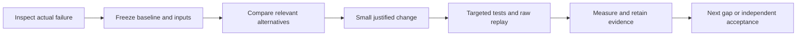

# Assessment completion roadmap from the current Phase 3 state

**Historical engineering record. Development is closed. Current requirements/status and evaluator commands are in [compliance](ASSIGNMENT_COMPLIANCE.md) and [README](../README.md).

**Historical engineering ledger — superseded by the development freeze.**
See [index](INDEX.md), [architecture](ARCHITECTURE.md), [validation](BENCHMARK_RESULTS.md)
and [compliance](ASSIGNMENT_COMPLIANCE.md) for the final handoff. Recorded results
remain historical evidence; further experiment suggestions are not active work.

**Latest local-floor source audit:** [batch032](fixes/032_ROOM_FLOOR_SOURCE_SUPPORT_AUDIT.md)
traces all 6,899 original ceiling-scan depth/confidence pairs for fixed room_2 /
plane 1. The retained 300 frames contain 9,818 accepted local pixels in 92 cells:
29.2154% diagnostic coverage. Stride-8 retains 150 returns in 43 cells: 14.1246%.
Native fusion reproduces the 202,477-point cloud and weights bit-for-bit and
retains all 148 local support voxels/cells. Extraction/calibration/timing match
the originals. All-source accepted coverage is 44.0880% under raw poses;
confidence-2 alone gives 34.9107%. Frame selection and spatial sampling lose
available observations; original absence and fusion loss are not the main cause.
Selected dense confidence-2 coverage is only 20.6258%; pixel unions are not native
fused acceptance or physical accuracy. No production defect or safe adoption is
proven. Keep the 25% guard, production and geometry unchanged; no commit/push.
15/15 exact geometry checks, 82 focused and 390 full tests pass. Local floor/
ceiling remain unavailable; 0.702677 m footprint notch remains unvalidated;
floor-only stays 25/176. RGB registration stays CLOSED and XFeat experimental.
REQ-07/08/25 remain partial; REQ-42 gains source-to-cloud trace evidence.
Next run an isolated full-pixel 2 cm native-fusion floor-support control on the
same 300 frozen frames/poses/planes/polygon, without refitting walls/layout or
changing guards; inspect confidence/repeated-view support before adoption.
[Evidence](results/phase3_room_floor_support_summary.json). Earlier notices are historical.

**Latest observed-ceiling decision trace:** [batch031](fixes/031_OBSERVED_CEILING_DECISION_TRACE.md)
reproduces room_2's native floor/ceiling decisions on the fixed cloud, planes and
cameras. observed_ceiling exits at the missing-local-floor guard and visits zero
ceiling planes. Floor plane 1 has 148 local points in 43 occupied cells: 14.1246%
clipped coverage, below the unchanged 25% guard. 44 planes fail horizontal
alignment, six fail floor camera-height clearance and three fail reference-level
agreement. An above-camera plane already has 3,178 points /89.8986% coverage;
this supplementary inventory does not infer a ceiling height or bypass any guard.
Correct policy rejection; physical floor-support loss remains evidence-limited.
No reproducible production defect or justified parameter change is proven.
Two final native traces repeat byte-for-byte; 15/15 geometry checks, 74 targeted
and 374 full tests pass. Production, geometry and thresholds remain unchanged.
No commit or push. The 0.702677 m footprint notch remains unvalidated; area
stays 9.945719535 m² and ceiling height/evidence stay unavailable. Floor stays
25/176; RGB registration remains CLOSED and XFeat experimental.
REQ-07/08/25 remain partial; no physical or final acceptance is claimed.
Next trace original selected depth/confidence returns for plane 1 in room_2,
comparing the retained stride-8 lattice with other accepted pixels under fixed
calibration/poses to distinguish insufficient observations from sampling loss.
Do not rerun the rejected global stride-4 trial or alter the notch.
[Evidence](results/phase3_observed_ceiling_summary.json). Earlier notices are historical.

**Latest ceiling-boundary sensor audit:** [batch030](fixes/030_CEILING_BOUNDARY_SENSOR_AUDIT.md)
identifies the 0.702677 m change as a floor-plan notch in the ceiling-scan case,
not a ceiling-height change: area 10.477367 -> 9.945720 m². The added residual
horizontal plane joins an existing inner finite segment. Original selected PNGs,
per-frame calibration/raw poses and stride-8 fusion reproduce exactly; current
ceiling layout passes 15/15 exact checks. Local notch returns concentrate below
1.5 m; high-confidence crossing rays above them persist under raw/refined poses.
This supports local surfaces but cannot establish a full-height room perimeter
or validate either footprint without semantic/survey evidence. No reproducible
production defect or safe correction is proven. Keep production/geometry/guards
unchanged and retain the 0.702677 m accuracy warning; ceiling height stays null.
60 targeted /360 full tests pass. No production fix, commit or push.
Floor stays 25/176; RGB registration stays CLOSED and XFeat experimental.
REQ-07/08/10/25 remain partial; no physical or final acceptance is claimed.
Next trace _observed_ceiling rejection reasons for current room_2 with existing
cloud/planes/cameras, keeping geometry and thresholds fixed.
[Evidence](results/phase3_ceiling_boundary_summary.json). Earlier notices are historical.

**Latest LiDAR floor result:** [batch029](fixes/029_LIDAR_FLOOR_SAMPLING_CONTROL.md)
reproduces the supplied floor baseline exactly (15/15 checks), then evaluates
stride-4 depth sampling with identical 176 frames and frozen sensor poses.
Fused points increase from 116,480 to 360,845; camera coverage rises from 25/176
to 79/176, with one observed polygon and three inferred cells. The accepted
baseline polygon is not preserved in the known common coordinate frame.
Reject a production density change: more inferred coverage does not justify
changed boundaries. Production floor coverage remains 25/176; no new connecting
wall is introduced. 69 targeted /343 full tests pass. No production change,
commit or push; prior evidence and unrelated work are preserved.
REQ-07/10 remain partial. RGB registration is CLOSED and XFeat experimental.
The 0.702677 m ceiling-boundary shift and physical acceptance remain unvalidated.
Next audit original versus shifted ceiling-scan boundary against confident depth
surface/ray evidence; do not reopen registration or infer independent cm accuracy.
[Evidence](results/phase3_lidar_sampling_summary.json). Earlier notices are historical.

**Final registration-chain status: CLOSED, inconclusive.**
[Batch028](fixes/028_FINAL_FRAME31_REPLAY.md) replays frame31 once from snapshot26.
The input model state reproduces exactly, with unchanged RGB/frontend rows and
fixed intrinsics, but the control ends30 views/6045 points versus snapshot27's
30/6055 and emits37 solver warnings versus0 in the original frame31 interval.
Exact output reproduction fails; intermediate geometry must not be interpreted.
The34/37 landmarks remain first observable in trusted snapshot27 after frame31
registration/refinement. The new run cannot localize their original substage.
Prior inherited-model-bias evidence remains a hypothesis, not a proven defect.
Do not replay earlier frames or extend this diagnostic chain. Keep XFeat
experimental, production SIFT/guards unchanged.144 targeted /326 full tests pass;
1329 prior pinned entries remain intact. No production fix, commit or push.
REQ-03/05/10/27/29 remain partial; floor25/176, ceiling0.702677m shift and physical
acceptance remain unresolved. [Evidence](results/phase3_frame31_final_summary.json).
Earlier next-step notices below are historical and are superseded by this closure.

**Latest registration-support evidence:** [batch027](fixes/027_REGISTRATION_SUPPORT_AUDIT.md)
audits83 visible features /87 distinct candidate rows /37 accepted associations
without running a pose solver. Only1 accepted feature has competing landmark IDs;
accepted source tracks have no repeated-image identities. Their hull covers3.40%
of the target image;28 landmarks have only2 prior views. A systematic1.194292x
native/sensor-reference depth discrepancy persists outside flagged identities;
27->31 input motion already disagrees by4.206027deg and1.318052x normalized length.
Most rejected support is sensor-inconsistent, but two unambiguous rejected wall
observations have3.150/9.808px held-out sensor predictions versus81.737/64.738px
native residuals. Evidence favors inherited geometry bias plus concentrated
support; no concrete solver defect or deterministic production change is proven.
Keep XFeat experimental and SIFT/guards unchanged.129 targeted /311 full tests
pass; both read-only audits repeat exactly and1301 prior entries remain unchanged.
No new commit/push. Floor25/176, ceiling0.702677m shift and physical acceptance
remain unresolved; REQ-03/05/10/27/29 stay partial. [Evidence](results/phase3_registration_support_summary.json).
34 of37 accepted landmarks first appear at frame31's snapshot27. Next replay
frame31 from29-view snapshot26, capturing registration/triangulation before local
and global refinement and requiring snapshot27 reproduction. Sensor poses remain
post-hoc only. Earlier notices are historical checkpoints.

**Latest pre-local-refinement evidence:** [batch026](fixes/026_NATIVE_REGISTRATION_STAGE.md)
resumes frame34 from the saved30-view state twice, without sensor poses or any
frontend/guard changes. Accepted registration already disagrees with odometry
by7.842073deg; triangulation preserves poses; local refinement reduces disagreement
to6.590696deg and reproduces the retained31-view model state exactly. Four native
binaries match; every image record byte matches with output order alone different.
All five stage binaries and audited metrics repeat exactly between controls.
No concrete software defect or production fix is established; keep XFeat
experimental and SIFT unchanged.116 targeted /298 full tests pass;1147 prior
pinned entries remain unchanged. No new commit/push. Floor25/176 and ceiling
0.702677m shift remain unresolved; REQ-03/05/10/27/29 and physical acceptance stay
partial. [Evidence](results/phase3_registration_stage_summary.json). Next audit
83 visible frame34 registration candidates /37 accepted observations against
saved30-view landmark geometry, retaining the native solver and post-hoc sensors.
Earlier notices are historical checkpoints.

**Current completed stage replay:** [batch025](fixes/025_NATIVE_REGISTRATION_SNAPSHOTS.md)
reproduces the final baseline and30 native snapshot models exactly in two runs.
The late disagreement is present at the first post-registration/local-refinement
joint pose:6.590696deg, versus final6.520814deg. Final global adjustment is not its
origin; registration versus immediate local refinement is unresolved. Keep SIFT,
XFeat experimental, fixed guards and the floor/ceiling holds.99 targeted /281 full
tests pass. Next replay frame34 registration from snapshot27, capture the pre-local
pose, and require post-refinement reproduction of snapshot28. No speculative fix.
Three prior completed production scopes were committed separately; no push.

**Current completed audit:** [batch024](fixes/024_LATE_LANDMARK_SUPPORT_AUDIT.md)
finds that31->34's97 shared landmarks are short, thin and weakly anchored to
earlier views, despite positive depth and adequate parallax. Neither native
identity collisions nor fixed-focal drift is found; seven raw local conflicts
do not isolate the6.520814deg disagreement. Do not prune or change mapping yet.
The missing evidence is stage history: next capture native per-registration
snapshots in an otherwise identical mapping-only replay, audit first joint31/34
versus final poses, and prove final baseline invariance. This is a new diagnostic
question, not another matcher/control repeat.88 targeted /270 full tests pass;
no production change or commit. Floor, ceiling and physical acceptance holds remain.

**Current executed step:** [batch 023](fixes/023_MAPPING_ONLY_FIXED_INTRINSICS.md)
finishes the mapping-only fixed-calibration ablation with original verified
rows held exact. It reproduces 32-view joint membership and improves target
pose metrics without re-verification, showing a mapping calibration contribution.
Residual late orientation, worsened direction tail and solver warnings prevent
production adoption. SIFT, architecture and guards are unchanged; 81 targeted /
263 full tests pass. Next audit saved **31->34** landmark identity conflicts and
triangulation angles to localize its 6.520814 deg disagreement before a new fix.
Do not repeat completed matcher/intrinsic controls. Physical, floor and ceiling
holds remain. Earlier next-step notices below describe historical checkpoints.

**Latest executed control:** [batch 022](fixes/022_FIXED_INTRINSICS_CONTROL.md)
supports calibration as a contributor to the XFeat bridge failure: fixed supplied
intrinsics reduce endpoint pose disagreement and recover all 32 views, exactly
twice, without sensor poses. Residual rotation drift, raw conflicts and solver
warnings remain; no production adoption. 249 full tests pass. Next run a narrow
mapping-only fixed-intrinsics ablation preserving original verified inlier rows:
the completed control changed 60 such rows through calibrated verification,
so causal attribution to mapping alone remains untested. Preserve SIFT and
all thresholds, avoid matching reruns, and retain physical/floor/ceiling holds.

**Latest executed validation:** [batch 021](fixes/021_TRANSITION_ODOMETRY_AUDIT.md)
closes the withheld-odometry audit, with exact pixel/timing evidence and no
reconstruction changes. Joint XFeat camera membership fails sensor consistency:
24->27 rotation/direction errors are 24.77/34.60 deg; cumulative drift worsens
at frame 28. Reject production adoption; preserve SIFT. Late focal collapse
justifies a narrow calibration-control experiment before another matcher/backend.
Next run one isolated fixed-intrinsics remapping control on the frozen 32-view
XFeat database, using only available camera calibration and withholding sensor
poses. Evaluate using the same auditor and unchanged verification/mapping
thresholds. This is a proposed causal investigation, not a demonstrated fix.
232 full tests pass. Physical and unresolved floor/ceiling holds are unchanged.
Earlier next-step notices below describe historical checkpoints.

**Latest executed experiment:** [batch 020](fixes/020_XFEAT_LIGHTERGLUE_CONTEXT.md)
produces an exactly repeatable 29-view joint camera model with pinned
XFeat/LighterGlue, but not demonstrated safe cross-group geometry. Track/cycle
contradictions and solver warnings prevent production adoption. Production guards
and SIFT remain unchanged; 44 targeted tests pass. Do not repeat completed matcher
trials. Next audit the joint model's relative poses against supplied odometry using
verified RGB/sensor timing, with sensor poses withheld from inference. Sensor
agreement will not substitute for independent dimensional survey acceptance.
Physical and floor/ceiling holds remain unchanged.

**Latest executed experiment:** [batch 019](fixes/019_RGB_TRANSITION_CONTEXT.md)
completes the matched 32-view context comparison. Local registration improves
(SIFT 11 views; learned 25 unique views across two models), but no joint group
model is recovered. Both repeats are exact; production remains unchanged.
205 regression tests pass. Next evaluate pinned XFeat + LighterGlue on this
fixture under identical downstream guards; do not revisit denser sampling or
merge models with unsupported overlap. Physical and floor/ceiling holds remain.

**Previous safety evidence:** [batch 018](fixes/018_TRANSITION_TRACK_SAFETY.md) finds
no clean endpoint-spanning feature track and no joint sparse model. LightGlue's
pairwise graph gain is not sufficient for production adoption. Frozen repeats are
reverified; 198 regression tests pass. Keep production and physical/geometry holds
unchanged. Next execute the 32-view context comparison described below, including
track consistency in its evaluation.

**Previous matcher checkpoint:** [batch 017](fixes/017_DISK_LIGHTGLUE_TRANSITION.md)
measures 39 → 109 verified pairs and reproducible endpoint graph connectivity on
24 retained RGBs, but no joint endpoint model. Native initialization accepts one
SIFT pair and zero learned pairs. Production remains unchanged; 192 tests pass.
Next extend the same bounded comparison to 32 RGBs with original registered
anchors 16/19/22/23/28/31/34/37; retain all 24 transition views and use no old poses.
This next experiment is proposed, not implemented. Phase 2 and physical acceptance
remain incomplete. [Current evidence](results/phase3_transition_matcher_summary.json).
Earlier next-step declarations below are historical checkpoints.

Implementation authorized . The assessment in `Applied AI.html` defines
success; the existing working tree is the baseline. No commits or pushes are
part of this pass. Preserve existing code and independently evaluate alternatives.

## Sequential phases and acceptance

| Phase | Work | Requirements | Completion evidence |
|---|---|---|---|
| 0 | Full scanner RGB/depth/pose synchronization | 04,17,35,42 | Encoded-frame identities, complete timestamp audit, omitted-frame accounting, regressions |
| 1 | Supported boundary closure | 07,10,42 | Stage diagnostics, complete observed network or precise missing-support explanation; no fabricated walls |
| 2 | RGB video registration | 03,05,07,27,29 | Frozen 24/48/72-view trials, source registration and coverage, native video validation |
| 3 | Strict 2/4/8-photo reconstruction | 02,05,28,29 | Native room models without depth/poses/survey scale/manual adjacency |
| 4 | Whole-property graph and drift | 10,19,21,27,28 | Automatic placement and adjacency; identical-input correction on/off and survey errors |
| 5 | Floor/ceiling measurements | 07,08,25,26 | Independent per-room height errors and repeat spread; slope scoring unresolved until defined |
| 6 | Opening detection and widths | 09,24 | Every eligible opening, misses/phantoms, closed doors, width/height errors |
| 7 | Damage and surface scope | 11,12,13,20,40 | Two staged classes, clean controls, measured extents and fired rules |
| 8 | Frozen-producer calibration | 14,15,28,29 | Independent property grouping and untouched audit; insufficient groups unavailable |
| 9 | Physical benchmark and prospective Fix Loop | 19-29,31,35,36,38 | Own measured worst gate declared before chosen fix; prediction, shipped delta, regenerable before/after |
| 10 | Consumer comparison | 30 | Two same-property rooms, original app export/version, all shared dimensions, >=70% beat/tie |
| 11 | Cold release/rehearsal | 01,06,16-18,32-41 | Literal Route 2 protocol, official compatibility, clean-machine <15 min, all-tier unseen rehearsal, <=6-page report |

Physical collection and official-schema/Round-1 retrieval begin alongside local
work. The Fix Loop declaration checkpoint activates as soon as own-property truth
exists and **before** its selected fix; it is not postponed until all defects have
been repaired. Local development fixes are not retrospective qualified Fix Loops.

After each logical change run targeted tests, a relevant raw-input replay and
record hashes/results. Run full regressions after significant changes. Native
CPU reconstruction and regression workloads run serially on this workstation.

## Evidence boundaries

- Sensor depth/odometry are inference inputs, not independent truth.
- Supplied scans validate pairing, constraints, support and internal consistency.
- Extracted frames exercise RGB development; native photos/video still need proof.
- Provided case names do not prove room identity, same-property identity or repeats.
- Nominal 90% and nine independent calibration properties per finite group are our
  statistical design, not explicit assessment numbers. Do not replace properties
  with dependent walls to obtain a finite calibration artifact.
- Required physical benchmark: >=3 rooms plus connector, same spaces all tiers,
  independent repeat, furnished two-class staged damage, laser/tape truth and
  original consumer exports. No real-world cm accuracy from synthetic tests.
- Published schema, earlier Round 1 rules and unresolved scoring definitions
  remain external holds; do not invent acceptance rules.

## Operating flow

Current executed results are recorded in `fixes/016_RGB_VIDEO_BRIDGE_TRIAL.md`
and `results/phase3_video_bridge_summary.json`. Phase 2 remains incomplete:
8/16 Hz bridge sampling creates 30/83 new verified pairs but no verified
cross-group path or joint model. Both same-input trials reproduce database
contents, components and binary models exactly; native replay measures sub-15
correspondence support across the failed transition. Full suite passes 182 tests.
No matching/verification/acceptance guard or production policy changes.
Next compare the existing pinned DISK+LightGlue option on the 24 retained
transition views, requiring endpoint connectivity and a joint sparse model.

Prior executed results are recorded in `fixes/015_LOWER_ADJOINING_SPAN_TRACE.md`
and `results/phase3_adjoining_span_summary.json`. The lower query has insufficient
continuous wall support and positive pose-conditional free-space/traversal
evidence. No connecting boundary or production edit is justified. Exact frozen
floor/ceiling geometry and the bounded seed fix are preserved; regression passes
179 tests. Phase 1 is still incomplete, with floor coverage 25/176. The historical
0.702677 m ceiling boundary shift remains unvalidated.

Phase 2's initial cached audit finds eight nontrivial verified-pair components
plus eight isolated views. Two disjoint sparse models contain nine and ten views;
selected registration stays 10/68. Next run a bounded RGB-only bridge-view trial
at source times 11.55-13.066667 s with existing SIFT/verification guards. Do not
concatenate disconnected models or borrow depth/odometry from sensor sidecars.

Previous batch results remain in `fixes/014_EXTERIOR_STRIP_SENSOR_TRACE.md`
and `results/phase3_exterior_strip_summary.json`. Phase 1 remains incomplete:
the sensor-to-seed trace rules out selected-input extraction loss, and bounded
original outer-mode replay recovers one supported plane/two finite fragments.
All 151 floor samples remain uncovered; no cell or connection changes on frozen
inputs. Ceiling geometry is preserved, including its unvalidated historical
0.7027 m shift. Next trace the lower adjoining span near z=4.44, x=-2.73 to -0.44,
before changing any junction or connecting boundary.
The previous `fixes/013_FLOOR_SAMPLE_WALL_AUDIT.md` and its hashed summary retain
the preceding producer and numerical results.
Historical results remain in `PHASE3_SYNC_BOUNDARY_PASS.md`, alongside
`fixes/012_PARTIAL_CELL_COMPLETENESS.md` and earlier
`PHASE3_SUPPLIED_DATA_PASS.md`. This roadmap is intended work, not a
claim of completion.
