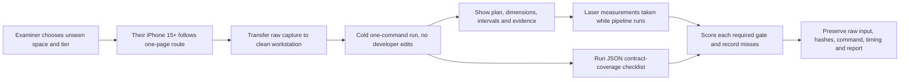

# Exact assignment brief: scoring and walk-in map

Source of truth: the locally supplied [Applied AI.html](Applied%20AI.html),
read on . This map separates required work from the current prototype;
it does not claim that missing data or gates have passed.

Updated against the remaining Phase 3 pass. The detailed implementation
and verification ledgers are [status](PHASE3_IMPLEMENTATION_STATUS.md) and
[remaining work/evidence](PHASE3_REMAINING_PASS.md). Physical acceptance stays open.

## Parts and deliverables

| Brief section | Required outcome | Current implementation/evidence | Status |
|---|---|---|---|
| Part 1: capture route | Route 1 installable iOS app in under 10 min, or Route 2 named stock tools and literal one-page protocol; device matrix | Route 2 candidate: Native Camera plus Stray Scanner; [protocol](CAPTURE_PROTOCOL.md), [device matrix](DEVICE_MATRIX.md) | Candidate only; no non-engineer rehearsal or physical phone export test |
| Part 1: three tiers | Same output contract from photos, video, LiDAR; interval width reflects sensor evidence | `run-capture`, internal assessment v2, camera-conditioned experimental RGB and verified property fusion | Partial. [Latest supplied replays](PHASE3_SUPPLIED_DATA_PASS.md) recover one partial room per sensor scan; supplied RGB video registers 2/24 views and no closed room. Native phone rehearsal and calibrated field outputs untested |
| Part 2: output contract | Room walls, ceiling, area, openings; stitched adjacency; per-surface damage and extent; concealed flags/rules; surface-keyed scope; interval per measurement; one command; published-schema JSON; rendered plan | `assessment.py`, `contracts.py`, `openings.py`, `pose_graph.py`, `damage.py`, `cli.py`, report/render paths | Partial. Internal interfaces and conservative inspection scope implemented; complete measured geometry, damage validation, calibrated intervals and published schema remain open |
| Part 2: benchmark composition | 3+ rooms plus connector; furnished two-class damage room; same spaces in all tiers; independent repeat; laser/tape truth and raw files | Dataset/source inventory and templates | Missing physical benchmark, truth, repeats and consumer export |
| Part 2: gates | Openings <=2 cm on >=85%, detection-aware; ceiling <=1.5 cm and repeated spread <=1 cm; per-wall repeatability <=1 cm or 0.5%; drift ablation; photo stitch/no overlaps/footprint +/-8%; photo walls +/-8%, video walls +/-3%; calibrated intervals | Canonical `assignment_gates.py`, `repeatability.py`, `ablation.py`, independent survey/calibration record builders | Scorers implemented and tested; physical gate passes unverified. Synthetic on/off control has no effective pose correction; external Round 1 and LiDAR wall definitions pending |
| Part 3: incumbent comparison | Two benchmark rooms, same LiDAR scenes, named app/version/export; dimension-by-dimension table; beat/tie >=70% shared dimensions | `consumer_comparison.py`, CLI; export hashes, dimension mappings and exact ties | Software implemented; actual same-room consumer export/version and independent measured comparison missing |
| Part 4: fix loop (25%) | One-page predeclared worst gate, failing value, root cause/evidence, predicted result; shipped fix; regenerable before/after and readable diff | `scripts/fix_evidence.py`, producer snapshots, prediction/error and evaluator/input integrity tests | Software path implemented; own worst measured gate needs prospective declaration and real before/after. Existing fixes cannot receive retrospective declarations |
| Part 5: process | Commits as work proceeds; explain decisions live with tools closed | Current-state repo baseline and dated change docs | Partial; this environment cannot restore earlier history; continue with meaningful incremental history |
| Deliverables | Compliance matrix, route/device matrix, clean setup <15 min, reproduction bundle with deterministic cache and live path, all-tier benchmark/repeats/head-to-head/timing, fix loop, <=6-page report, raw benchmark data | Markdown, per-run JSON/HTML/SVG, bootstrap, verified regeneration and artifact-driven three-page checkpoint PDF | Partial. Development checkpoint exists; surveyed final bundle/report, clean-machine timing and unseen rehearsal still missing |

## Score and current risk

| Weight | Scoring component | Current risk/evidence |
|---:|---|---|
| 30% | Cold walk-in on their unseen iPhone 15+ capture, chosen tier, measured with laser on site | **Critical.** Three cold device paths and successful metric plans are not demonstrated |
| 25% | Fix-loop delta | **Critical.** Recent software fixes improve diagnostics/repeatability; no physical score-moving before/after yet |
| 15% | Verified accuracy across all three tiers | **Critical.** No same-property surveyed three-tier benchmark |
| 10% | Compliance matrix coverage | **Partial.** Matrix exists; many rows remain missing and external schema/gates absent |
| 10% | Head-to-head incumbent comparison | **Missing.** No app export or same-room dimensions |
| 5% | Capture route quality | **Partial.** Route 2 draft exists, but not tested by a novice |
| 5% | Process evidence | **Partial.** Current baseline exists; cannot recreate earlier commit history |

## Walk-in test flow

Walk-in constraints to rehearse literally: route chosen on the day; iPhone 15 or
newer; all three tiers ready; unseen capture; cold run on the operator's machine;
laser measurements collected in parallel; no infrastructure calls; models and
large binaries fetched by script or mounted volume; raw data and command retained.
Photo folders must remain 2–8 RGB stills per room with no depth or poses and must
produce one whole-property plan. A scale marker/measurement may not silently be
made mandatory; it is not stated as a photo-tier allowance in the HTML.

The assignment's published output schema and earlier Round 1 gates are referenced
but absent from this local HTML copy. Keep those rows pending; do not infer their
contents from provisional internal gates.
