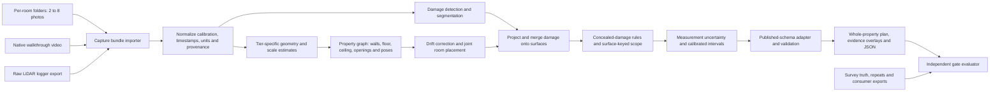
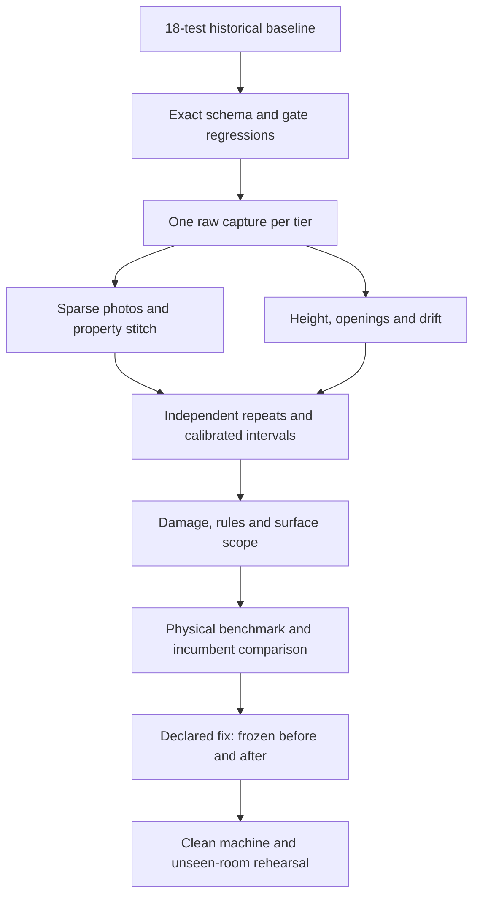

# Assignment update and incremental test plan

Authority: [exact brief](<Applied AI.html>) and [current compliance audit](ASSIGNMENT_COMPLIANCE.md).
This is the implementation plan following the audit, not a claim that these changes
have already shipped. Preserve V3 artifacts as regression evidence.

## Approach

Use Route 2, a stock capture protocol, to retain the code-only desktop deliverable.
Native Camera is the proposed photo/video capture route. Stray Scanner is the
proposed raw LiDAR logger: its [official repository](https://github.com/strayrobots/scanner)
documents RGB-D collection and its [App Store listing](https://apps.apple.com/ca/app/stray-scanner/id1557051662)
lists depth, camera positions, intrinsics and IMU exports. The listing inspected on
2026-10-06 shows version 1.4. This is a candidate until installation, recording,
export and Windows transfer are tested on the actual device and region.

Choose the consumer comparator separately, preferably Polycam or magicplan, after
checking its actual free-tier measurement/export workflow on the benchmark device.
Save the installed version and actual output; do not substitute its floor plan for
our inference. The candidate's [official export documentation](https://learn.poly.cam/hc/en-us/articles/27756102599572-What-File-Types-Can-Polycam-Export)
states that available exports vary with mode and subscription.

## Phase 0 — Freeze the specification and establish honest history

Deliverables: compliance matrix, versioned gate config, input/output contract,
schema fixtures, benchmark inventory and real-data collection checklist.

- Obtain the missing published schema and prior Round 1 gates. Define stable
  property/room/surface/opening/measurement IDs and an explicit unavailable state.
- Introduce planned `schemas/`, `floorplan/contracts.py`, `floorplan/gates.py` and
  `tests/test_assignment_gates.py`; validate common outputs from all tiers.
- Replace the overloaded `targets_met` label with named gate results and an explicit
  evaluator version; keep historical V3 results under their original evaluator.
- Establish a genuine current-state Git baseline and commit future work as it happens.
  Check whether earlier history exists elsewhere. Do not backdate or manufacture it.

**Incremental E2E 0:** retain the existing 18-test baseline; run the new evaluator
on frozen old outputs. Missing ceiling/damage/interval fields must be scored as
missing, never pass by omission. Test accurate walls with missing/phantom openings,
two openings between the same rooms, biased height and noisy repeated height.

Gate arithmetic to implement now: photo wall relative error 8%; video 3%; openings
2 cm with at least 85% detection-aware success; ceiling absolute error 1.5 cm;
height spread 1 cm; wall repeatability absolute and percent; footprint 8%, correct
adjacency and zero room interior overlap. Preserve unknown earlier gates as pending.
Use one-to-one instance matching for openings, including exterior/untraversed ones,
and expose TP/FP/FN and width errors. Provisional success denominator:
`ground-truth openings + phantom openings`; confirm against the published rubric.

## Phase 1 — Make fresh captures enter the system

Modify `workflow.py`, `cli.py`, `sfm.py`; add planned `floorplan/ingest.py`, a stock-app
adapter, `docs/CAPTURE_PROTOCOL.md`, `docs/DEVICE_MATRIX.md` and `scripts/doctor.py`.

- Accept `property/room_id/*` photo folders without flattening away room identities;
  preserve source IDs even when two rooms contain `IMG_0001`.
- Handle iPhone HEIC/JPEG orientation and video MOV/HEVC; preserve timestamps,
  calibration, depth registration, units and camera conventions through conversion.
- Import actual raw LiDAR exports, including per-frame intrinsics and confidence.
- Generate internal manifests automatically. Report bad transfers and missing
  calibration as actionable diagnostics. Do not ask the operator to hand-edit JSON.
- Write one page stating installation, frame count, floor/ceiling/door coverage,
  movement, lighting, reflections, recording duration and transfer steps. Include
  shared doorway views within the 2–8 photo budget. Confirm all steps with a novice.

**Incremental E2E 1:** one actual room from each tier → importer → existing
reconstruction → schema-shaped output/render; audit empty fields as failures. Test
missing depth frame, mismatched timestamps, rotated HEIC, duplicate filenames and
short clip. Operator must transfer data without developer intervention. This is an
integration checkpoint, not the accuracy acceptance gate.

## Phase 2 — Resolve sparse-photo feasibility before broad feature work

Modify `sfm.py`, `dense.py`, `stitching.py`, `workflow.py`; add planned
`floorplan/photo_layout.py` and `floorplan/property_graph.py`.

- Keep COLMAP/OpenMVS where sufficient overlap exists. Removing the five-image
  guard alone does not solve two-view geometry, occlusion or absolute scale.
- Evaluate pretrained indoor layout / metric-depth proposals for sparse input with
  disclosed model and training priors, CPU memory/runtime, and independently measured
  scale error. Select a model only after a bounded 2/4/8-image feasibility experiment.
- Associate doorway and shared-wall evidence across room folders; optimize a room
  graph jointly for scale, placement, adjacency and non-overlap. No hidden manual
  corners, camera poses or manually placed rooms in the claimed automatic path.
- Return estimated/inferred/unobserved distinctions and uncertainty. Disconnected
  evidence is a required-gate failure, not permission to draw arbitrary room positions.
- Keep optional measured-scale assistance as a separately labeled mode until the
  assignment permits requiring it. Do not feed evaluator wall lengths to inference.

**Incremental E2E 2A:** one surveyed room with exactly 2, 4 and 8 photos; no depth or
poses; walls within ±8%, intervals reported, missing geometry visible. Include a
feature-poor furnished room. Record failures rather than choosing only successful views.

**Incremental E2E 2B:** three rooms plus connector as separate photo folders → one
plan with all rooms, correct adjacency, no overlaps, footprint within ±8%. Shuffle
folder/image order, duplicate filenames and remove a linking doorway view. Cache-off
test is mandatory. If the sparse tier remains infeasible on available hardware,
record the blocker before promising live readiness; do not silently increase counts.

## Phase 3 — Complete geometry, openings and drift correction

Modify `layout.py`, `rgbd.py`, `mapping.py`, `stitching.py` and rendering in `pipeline.py`.

- Fit supported floor and ceiling planes per room and propagate their covariance;
  reject table/cabinet tops as ceilings. Do not fill heights with a fixed prior and
  report them as measured. Support sloped/occluded ceilings as explicit limitations.
- Detect doors and windows even if not traversed. Give each opening an ID and parent
  surface; estimate width/height and remove duplicate cross-view detections.
- Correct sensor poses rather than assuming they are exact. Add verified historical
  matches to the sensor-pose path; room planes can constrain drift with robust checks.
- Expose on/off correction settings, raw/corrected trajectories and before/after
  property footprints for the same raw multi-room capture.

**Incremental E2E 3A:** surveyed room with at least a door and window → walls, area,
height and opening instances; apply ceiling/opening gates and phantom/miss penalties.
**E2E 3B:** real three-room loop → correction off/on, identical inputs → overlay,
loop residual, footprint/wall errors and runtime. Synthetic drift injection is a
regression test only. A correction that has no meaningful effect must be explained.

## Phase 4 — Add calibrated intervals and repeatability

Add planned `floorplan/uncertainty.py` and `floorplan/repeatability.py`; extend contracts
and evaluator. Build uncertainty alongside earlier geometry work, then calibrate here.

- Propagate calibration, scale, poses, planes, occlusion and room placement uncertainty
  to every reported measurement, including area, height, openings and damage extent.
- Record estimate, units, interval, nominal coverage, method and evidence IDs. A
  heuristic sensor confidence is not an interval. Clearly label uncalibrated intervals.
- Calibrate on independent development properties; hold out final properties and
  devices. Never calibrate and claim coverage on the same room captures.
- Report interval coverage, width and calibration by tier. A proposed 95% interval is
  provisional until the missing rubric defines its confidence level; wide intervals
  do not erase a missed point-accuracy gate.
- Match identical physical walls across separate captures. Report absolute bias and
  repeat spread separately, including ceiling bias and max-minus-min height spread.

**Incremental E2E 4:** two independent captures of the same surveyed room at one tier
(minimum), preferably repeated for all tiers. Assert absolute and repeatability gates
separately: consistent wrong heights must fail. For software nondeterminism, also
rerun the same files, but keep that distinct from physical repeatability. Record
small-sample uncertainty in empirical coverage rather than asserting calibration.

## Phase 5 — Complete restoration outputs

Add planned `floorplan/surfaces.py`, `damage.py`, `concealed_rules.py`, `scope.py`;
extend `pipeline.py`, contracts and tests. Damage taxonomy and scope definitions
must be reconciled with the missing schema/Round 1 specification.

- Segment at least the two safely staged damage classes in the benchmark using a
  disclosed local model; evaluate visual predictions independently of geometry.
- Project masks onto identified surfaces with occlusion checks; deduplicate repeated
  views and produce metric polygons/extents with propagated intervals.
- Emit concealed-damage risk flags from explicit versioned rules with fired rule IDs,
  source evidence and review status. Do not describe unseen damage as observed fact.
- Generate surface-keyed scope items with action, class, quantity, units and evidence;
  maintain separate deductions for openings and avoid counting repeated views twice.
- Render damage overlays and clickable evidence references beside the whole-property
  plan in an offline report; a new app is not required for the assignment.

**Incremental E2E 5:** furnished room with two staged classes → all three tiers →
surface-linked damage, metric extents, concealed flags/rules, scope and rendered
overlays. Independently annotated regions and tape dimensions test extent/class
accuracy. Include no-damage control, duplicate views, occluded region and similar
undamaged material. Do not invent damage thresholds missing from the source spec.

## Phase 6 — Required benchmark and prospective fix loop

Collect these real artifacts early, while Phases 1–5 proceed:

| Capture group | Required material | Evaluation use |
|---|---|---|
| Property A | Three or more rooms plus connector, all three tiers; 2–8 photos in each room folder | Full footprint, adjacency, walls, drift |
| Furnished damage room | Same room at all tiers, two staged classes | Damage, surface extent and scope |
| Repeat | New capture of a room at the same tier, independently restarted | Wall/height repeatability |
| Independent truth | Wall and opening IDs, laser/tape values, ceiling height, room footprint, region dimensions, photos of measurement process | Evaluation only, raw records retained |
| Consumer comparison | Two same benchmark rooms captured by an incumbent app; version and exports | Dimension-by-dimension comparison; ≥70% beat/tie |
| Challenges | Mirrors, glass, wet-look surfaces, low light | Failure/interval behavior |

Choose the single worst measured official gate after running the real baseline.
Write and version the one-page declaration BEFORE shipping the fix: failing number,
hypothesis, evidence, planned change and predicted number. Freeze inputs, evaluator,
baseline source revision and configuration. Run the changed version on identical
inputs; publish the diff, before/after commands and prediction post-mortem. Treat
an adjusted dataset as a new case, not proof of a same-input repair.

**Incremental E2E 6:** one benchmark command produces tier gates, repeatability,
drift ablation, consumer comparison and timing. Match shared physical dimensions
using stable IDs; report missing/unshared dimensions as well as the ≥70% statistic.
Replay the declared fix before/after from clean directories and check both numbers.

## Phase 7 — Clean-machine and walk-in rehearsal

Update `README.md`, `pyproject.toml`, acquisition scripts and cache handling. Add
pinned platform setup, `scripts/setup.ps1`, checksummed model/binary downloads,
relative-path bundle manifests and a deterministic replay mode. Cache keys must cover
inputs, source/configuration versions and model/binary versions; verify corruption
and wrong-capture rejection. Record replay tolerance if byte identity is not realistic.

**Incremental E2E 7A:** clean supported Windows CPU machine → install → run a fresh
capture in <15 minutes as the brief requires. Measure download/setup/capture processing
separately. Validate this timing rather than infer it from cached V3 execution.

**E2E 7B:** another operator follows the single page in an unseen space, selects a
tier on the day, transfers raw inputs and runs one command. No tailored code changes,
hidden annotations or cache reliance. Separately rehearsing every tier is required.
Network/infrastructure dependencies are audited after local assets are installed.

Final package: compliance matrix, one-page capture protocol, device matrix, raw
survey/captures/app exports, portable reproduction and fix bundles, benchmark report,
repo/history and technical report limited to six rendered pages. The report covers
architecture, tier/device design, drift, error budget/calibration, fix and failures.

## Test execution rules

Each phase gets a fresh output directory, input hashes, code revision, gate version,
runtime/memory, schema validation, raw predictions, rendered evidence and a failure
summary. Run unit/integration regressions after related changes; run the smallest
affected end-to-end case next; expand to the property/all-tier suite at milestones.
No expensive full reconstruction is needed merely for a documentation change.

**Completed in this audit:** brief extraction, code/artifact comparison, 18-test
baseline and this staged plan. All E2E checkpoints numbered 0–7 above are future
assignment-specific work unless subsequently accompanied by their own run evidence.

**Progress update, 2026-10-06:** [E2E status](ASSIGNMENT_E2E_STATUS.md) now records
the Phase 0 frozen-plan gate audit, Phase 1 capture-intake experiments and a
preparatory Phase 4 repeatability scorer. The stock capture protocol and device
matrix are written but untested with an operator. The sparse-photo, physical
three-room, damage, scope, drift ablation, calibrated-interval and walk-in gates
remain open. A genuine Git repository starts from the present baseline; prior
work has no recoverable local history.
