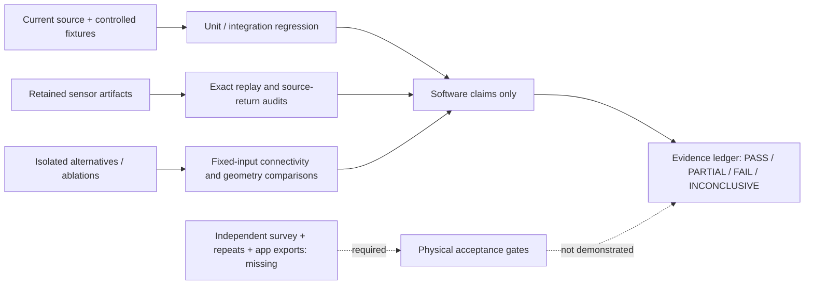

# Final validation and benchmark ledger

Evidence freeze: 2026-10-08. Existing recorded results are reused; no new
reconstruction experiment was run during finalization. Source SHA-256 and JSON
field paths are indexed by [the evidence manifest](evidence/final_state.json).
Full originals and selected artifacts accompany the separate handoff bundle.

Statuses describe the named claim: **PASS** means demonstrated on its stated
scope; **PARTIAL** means incomplete; **FAIL** means a required or tested criterion
was violated; **NOT DEMONSTRATED** means required evidence is absent;
**INCONCLUSIVE** means causality/physical interpretation is unresolved.

## Results by evidence type

| Metric / claim | Result | Evidence | Status | Limitation |
|---|---|---|---|---|
| Software regression | 390 passed, 43.22 s | batch032 validation + retained full test log | PASS | Current worktree/software only; not a clean Git checkout or physical gate |
| Fixed ceiling layout replay | 15/15 exact checks | batch032 geometry verification | PASS | Same saved capture/producer, not independent repeatability |
| Native sensor projection/fusion | 218,873 samples →202,477 points; point/weight arrays bit-identical | batch032 audit | PASS | Consistency with saved pipeline, not survey accuracy |
| Supplied floor-only camera containment | 25/176 =14.2045% | batch029 production_after | PARTIAL | Camera positions inside proposal footprints; not measured floor coverage |
| Supplied ceiling-scan camera containment | 295/300 =98.3333% | batch030/032 retained result | PARTIAL | Includes inferred cells; does not establish physical room count, perimeter or accuracy |
| room_2 accepted floor /ceiling height | Floor unaccepted; height unavailable | batch031 native decision trace +batch032 baseline | PARTIAL | Local floor guard blocks ceiling inference; overhead returns cannot replace a floor-to-ceiling measurement |
| Retained plane-1 local support | 148 points, 43 cells, 14.1246% | batch032 native helper | PARTIAL | Below unchanged 25% support guard |
| Selected dense accepted pixel union | 9,818 returns, 92 cells, 29.2154% | batch032 selected_refined | PASS | Diagnostic occupancy only; native dense fusion/acceptance not tested |
| All-source accepted pixel union | 239,794 returns, 135 cells, 44.0880% | batch032 all_available_raw | PASS | Raw sensor poses, repeated observations, no independent truth |
| Selected confidence-2 pixel union | 9,264 returns, 65 cells, 20.6258% | batch032 selected_refined | PASS | Subset remains below 25%; dense union above it includes confidence-1 support |
| Boundary accuracy | 0.702677028 m footprint discrepancy; 0.531647731 m² removed | batch030 historical_comparison | INCONCLUSIVE | Both physical perimeter interpretations lack independent survey/semantic truth |
| Denser LiDAR sampling control | 25→79/176 containment, but accepted polygon not preserved | batch029 rejected_candidate | FAIL | Candidate rejected for production; coverage increase is not an accuracy gain |
| DISK/LightGlue 32-view context | 167 verified pairs, 1 component, 0 isolates; separate 15/11-view models with 1,931/1,404 points and 1.449190/1.337805 px residuals; no joint target model | batch019 context comparison | FAIL | 25 unique registered views across separate models; more graph connections did not satisfy reconstruction/adoption criterion |
| XFeat mapping-only fixed intrinsics | 32 registered views, 6,187 points, 1.480503 px residual; joint membership | batch023 mapping_only | PARTIAL | Later rotation disagreement ~6.520814° and support/model ambiguity remain; not production |
| Final registration-chain replay | Saved target snapshot not reproduced; causality not localized | batch028 final replay | INCONCLUSIVE | Investigation CLOSED; no demonstrated registration solver defect |
| Physical wall/opening/ceiling accuracy | Required independent measurements absent | compliance matrix /survey templates | NOT DEMONSTRATED | Sensor/internal consistency is not independent ground truth |
| Physical repeated capture gates | No verified same-room independent repeat set | benchmark inventory | NOT DEMONSTRATED | Exact rerun of one model is not a physical repeat |
| Calibrated intervals | Software path exists; adequate field calibration/audit properties absent | uncertainty/calibration modules +tests | NOT DEMONSTRATED | No tier-wide coverage claim |
| Consumer comparison | No qualifying same-room original app export/table | consumer comparator +templates | NOT DEMONSTRATED | No ≥70% beat/tie result |
| Clean setup /cold walk-in runtime | Not measured | setup/protocol and run ledger support | NOT DEMONSTRATED | Test/audit runtime excludes capture, transfer, downloads and installation |

## Validation overview

The supplied cases exercise ingestion, synchronization, camera/depth consistency,
registration, finite geometry, missing-output handling and internal support.
They do not provide a certified dimensional survey, verified property identities,
two-class damage annotations, independent repeats or consumer exports.

## Negative results and timing

The authoritative matched 32-view comparison records two DISK/LightGlue sparse
models. Earlier conversational figures of 1,484 points /1.438 px do not describe
that comparison and are not used as its final evidence. Separate model point
counts cannot be summed into a single reconstructed property.

The RGB chain ended without a trustworthy causal localization; keep it closed.
XFeat/LightGlue and fixed-intrinsics gains remain experimental. Global stride-4
sampling was rejected. Boundary and local-floor audits produced no production
change. [Fix-loop documentation](FIX_LOOP.md) records those decisions.

Batch032 source audit took 423.987 s internally; exact layout verification
took 34.978 s. These are diagnostic runtimes, **not end-to-end capture latency**.
An initial audit JSON serialization test failed, was corrected, and the final
16 diagnostic/82 focused/390 full tests passed. Interrupted/preliminary runs are
retained as superseded records and are not counted as completed experiments.

Historical V2/V3/ICL component figures are retained with their original scenes,
producers and evaluators. Oracle mesh, assisted geometry, provisional sensor
reference and synthetic correlated tiers cannot substitute for the prescribed
three-tier physical benchmark. No current assessment gate is declared passed
from those historical figures.
