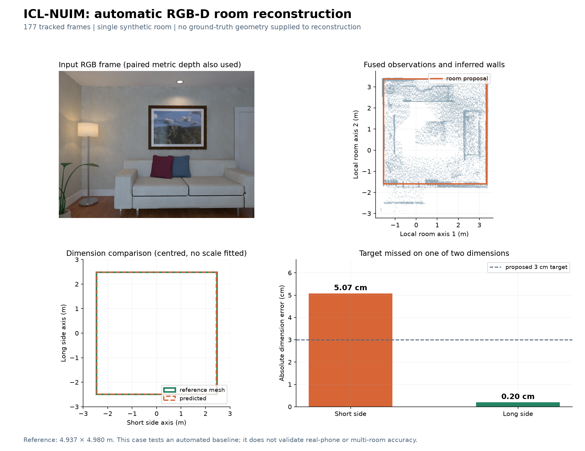

# Benchmark results and remaining gaps

Measured locally on 2026-10-05, Windows, Python 3.12, CPU execution. **The original requirement is only partially implemented.** There is now an automatic RGB-D-to-room-plan path with measured error, plus working photo/video reconstruction experiments. Automatic multi-room plans with verified centimetre accuracy across all tiers are still outstanding.



## Results

| Experiment | Input | Measured result | Interpretation |
| --- | --- | --- | --- |
| Assisted two-room software test | Generated photo + video; supplied corner marks, calibration, scale, doorway anchors | 8 corners recovered to floating-point precision | Geometry/export regression check; no visual inference or real accuracy evidence |
| ICL wall-component test | 30,000 samples from labelled wall mesh; 8 mm Gaussian noise plus 2% isolated outliers | Maximum side-length error **0.82 mm** | Oracle wall semantics and full coverage; deliberately easier than sensor reconstruction |
| ICL RGB-D, first version | 177 RGB/depth pairs, estimated PnP poses | 177 tracked; opposing walls not recovered | Incomplete geometry was reported; no plan emitted |
| ICL RGB-D, refined version | Same pairs; target depth added to pose refinement; stronger plane search | **177/177 tracked**, automatic room proposal; **5.07 cm** maximum side-length error | Full constrained input-to-plan path works; fails proposed 3 cm dimension target |
| ICL photos | 45 RGB images sampled from same sequence, known intrinsics | **43/45 registered**, 2,803 sparse points | Photo ingestion and SfM work; absolute scale and floor geometry still missing |
| ICL video, sequential matching | Encoded RGB video, 89 sampled frames | **55/89 registered**, 3,206 sparse points | Partial coverage; the old 60% status threshold was too permissive |
| ICL video, all-pairs matching | Same video and 89 frames | **89/89 registered**, 5,325 sparse points | Clear coverage improvement; still an unscaled sparse reconstruction |
| TUM real RGB video, earlier run | 91 frames, supplied calibration approximation | **10/91 registered**, 641 sparse points | Real-media failure case remains unresolved |

The SfM status now uses a 90% registration threshold to distinguish `partial` from `reconstructed`. This is a diagnostic policy, not an accuracy guarantee. Earlier stored logs used the previous threshold; the counts above are the authoritative comparison.

## Automatic RGB-D dimensions

| Quantity | Reference | Predicted | Absolute error |
| --- | ---: | ---: | ---: |
| Short room side | 4.936824 m | 4.886113 m | 0.050711 m |
| Long room side | 4.980048 m | 4.978092 m | 0.001956 m |
| Floor area | 24.585621 m² | 24.323522 m² | 0.262099 m² |

The estimator reads only calibrated RGB/depth pairs. The evaluator reads the room-floor mesh afterward and compares the two side lengths without a fitted scale. The two rectangle axes are sorted because the predicted plan has its own local orientation. This is dimension evaluation, **not global corner-position evaluation**. There are only two independent dimensions, so no population-level P95 is claimed.

This run uses the provider's non-noise TUM-compatible archive. The official noisy sequence and actual mobile-sensor depth remain untested. Nine automated tests pass, covering projection/export, stitching, metric pose recovery, scale-preserving evaluation, incomplete wall coverage, and featureless-capture failure reporting.

The trajectory diagnostic uses 176 exact timestamp matches; frame 0 has no matching reference. With the fixed native-y convention conversion and rigid alignment only, trajectory RMSE is **7.01 cm**, median **5.73 cm**, P95 **10.90 cm**, and maximum **13.16 cm**. The RGB-D depth units determine scale; the evaluator does not rescale the estimate. These trajectory errors are consistent with accumulated pose error being worth addressing, but do not isolate it as the only source of dimension error.

## What improved, and why

1. **Depth in both frames:** PnP initializes camera motion robustly from image matches and source depth. Refitting those matches in metric 3D also uses target depth. Combined with a stronger plane search, this produced a room proposal where the first version had incomplete geometry. These two changes were made together, so this is not an isolated ablation of either one.
2. **All-pairs matching for short video:** sequential matching registered 55 frames; exhaustive matching registered all 89. Offline short captures can afford the extra comparisons. Long videos need retrieval/loop candidates rather than unrestricted all-pairs matching.
3. **Honest quality states:** missing scale, incomplete geometry and sparse reconstruction are distinct from a dimensioned plan. A complete-looking rectangle still requires review.

This scene was used during development of the baseline. The numbers are development results, not a held-out multi-property generalization benchmark. The photo and video runs share the same underlying synthetic scene.

## Requirement checklist

| Requirement | Current evidence | Remaining engineering |
| --- | --- | --- |
| Phone photo input | File ingestion + COLMAP works on synthetic perspective images | Real phone testing, scale control, dense/structural extraction and openings |
| Video input | Frame extraction + COLMAP; all sampled frames registered in improved ICL run | Real-media robustness, global poses, metric plan extraction |
| LiDAR tier | Calibrated metric RGB-D adapter and automatic room proposal | Actual mobile sensor adapter, confidence/noise models, phone-data benchmark |
| Dimensioned floor plan | Automatic constrained RGB-D SVG/DXF/JSON/CSV output | Non-rectangular rooms, openings, height/surface quantities and uncertainty |
| Stitched multi-room plan | Assisted synthetic doorway-anchor alignment | Automatic cross-room constraints and global pose graph; real multi-room evaluation |
| Centimetre accuracy | One automatic dimension missed the 3 cm target | Pose/plane refinement, capture controls, held-out properties and coverage reporting |

## Reproduce

Dataset commands and hashes are in [DATASETS.md](DATASETS.md). Run from the repository root after the dataset is prepared. Use a fresh output directory for each reconstruction experiment.

```powershell
& .\.venv\Scripts\python.exe -m pip install -e ".[rgbd,sfm,evaluation,test]"
& .\.venv\Scripts\python.exe -m floorplan.cli reconstruct-rgbd datasets\icl_nuim\trajectory2\sequence.json demo\rgbd_rerun
& .\.venv\Scripts\python.exe scripts\evaluate_icl.py demo\rgbd_rerun\plan.json datasets\icl_nuim\living_room_obj_mtl.tar.gz demo\rgbd_rerun\evaluation.json --trajectory demo\rgbd_rerun\trajectory.json --trajectory-truth datasets\icl_nuim\trajectory2\livingRoom2.gt.freiburg
& .\.venv\Scripts\python.exe -m floorplan.cli reconstruct-rgb datasets\icl_nuim\trajectory2.mp4 demo\video_rerun --fps 3 --max-frames 100 --camera-model PINHOLE --camera-params '481.2,480,319.5,239.5' --matching exhaustive
& .\.venv\Scripts\python.exe -m pytest -q
```

Full local outputs: `demo/icl_rgbd_refined/`, `demo/icl_photo_sfm/`, `demo/icl_video_exhaustive/`, `demo/icl_benchmark/`. The recorded metric snapshot is [results/benchmark_summary.json](results/benchmark_summary.json). Plot generation is reproducible with `scripts/render_reports.py`.

## Next changes with measurable acceptance criteria

1. Add global pose/plane constraints and loop closure; rerun trajectory and dimension scoring without fitting scale. Accept only when both room dimensions improve without reduced frame coverage. Add another sequence before tuning further.
2. Connect RGB reconstruction to dense/structural geometry and a declared metric reference; hold out other measurements. An RGB plan must not be scaled using the same dimensions used to score it.
3. Replace the rectangle assumption with wall segments, room polygons and opening detection; test non-rectangular room topology and missing/extra edges.
4. Evaluate multi-room registration on paired scan/floor-plan data, then test actual phone LiDAR against independent reference geometry. Only then assess the three-tier claim across properties.
