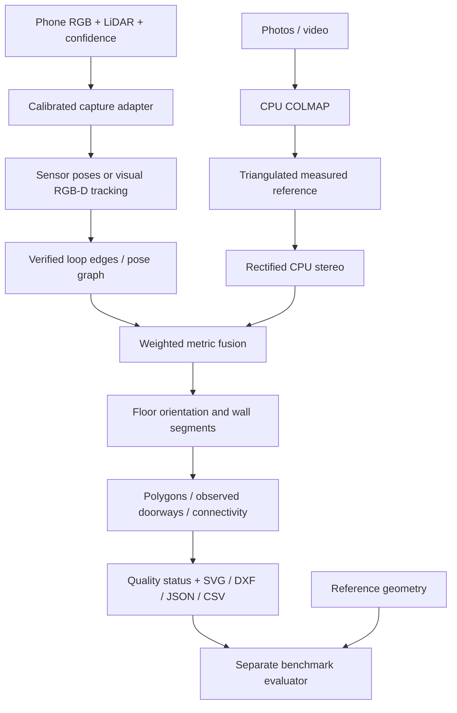

# Implementation roadmap

**Historical roadmap:** the exact assignment received on 2026-10-06 supersedes
this scope. Use the [assignment update plan](ASSIGNMENT_UPDATE_PLAN.md) and
[compliance audit](ASSIGNMENT_COMPLIANCE.md) for remaining implementation and tests.

The accepted objective is a CPU-only, code-first take-home demo converting photos,
video and phone LiDAR into dimensioned, connected floor plans. Metric RGB requires
a measured reference. Accuracy is a measured outcome, never inferred from a
successful export.

## Baseline frozen before implementation

- Assisted annotated photo/video projection and doorway-anchor stitching work.
- RGB COLMAP produces unscaled sparse clouds only.
- RGB-D fits one rectangle; development ICL maximum side error is 5.07 cm.
- Nine existing tests passed before this work. Existing benchmark artifacts remain
  unchanged for comparison.

## Ordered work

1. Common manifest, reproducible run records, clear partial/failure/scale states.
2. Validated RGB-D inputs, keyframe pose graph, loop verification, weighted fusion.
3. Floor alignment, finite wall segments, polygon rooms and observed door connections.
4. RGB measured scale and CPU rectified stereo feeding the common layout backend.
5. ARKitScenes adapter, CAD dimensions/openings, unified benchmark and documentation.
6. Component checks followed by integrated tests; report failures and coverage too.

## Acceptance

Aim for empirical P95 wall dimension error <= 0.03 m and corner error <= 0.05 m,
at least 90% reference boundary coverage and correct room topology. No evaluation
rescaling or per-room alignment. Exclude reference-control edges from scoring.
Synthetic, assisted and real-phone results are separate evidence categories.

## Architecture

Ground-truth laser depth, meshes, and trajectories must never enter normal
reconstruction. Supplied ARKit sensor poses are allowed and disclosed.

## Dataset policy

ICL trajectory 2 remains development data. Other trajectories are held out from
tuning, but their shared room geometry is disclosed. TUM is a difficult tracking
case. ARKitScenes low-resolution mobile depth is input; FARO point clouds and
high-resolution depth are reference-only. Dataset downloads are selective, with
source URLs, hashes, scene IDs and license references retained.

## Demo boundaries

One floor, straight walls, two or three connected rooms, including concave rooms.
Unknown boundaries and disconnected captures remain partial. No GPU, app, model
training, curved walls, stairs, or insurer integrations are required. GPU methods
and guided capture belong in the advancement proposal.

## Implementation outcome

See [V3 implementation decisions](V3_IMPLEMENTATION.md) and [V3 measured results](V3_RESULTS.md).
The common workflow, phone adapter, keyframe mapping, weighted fusion, multiroom
polygons, RGB metric bridge, verified RGB-D capture stitching, CAD dimensions,
dataset acquisition, and independent evaluation are implemented and exercised.

V3 resolves the controlled RGB completeness/topology failure with CPU OpenMVS and
visibility filtering. Photos, video, and simulated LiDAR pass the complete controlled
two-room benchmark, including doorway width. This is not full completion of the
original field-accuracy goal: only one real-phone room has a provisional laser-based
dimension result, and held-out phone polygons remain unreviewed. Tracking
relocalization, explicit uncertainty, and multi-property field validation remain.
