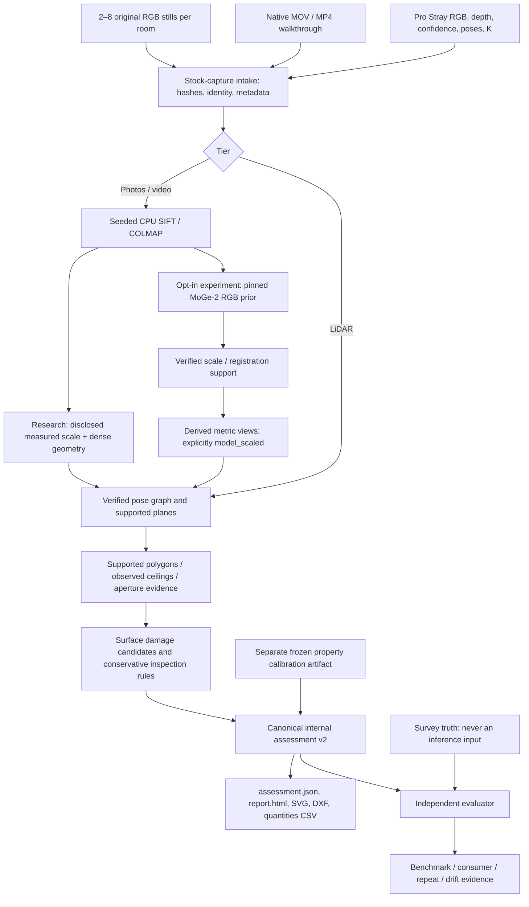
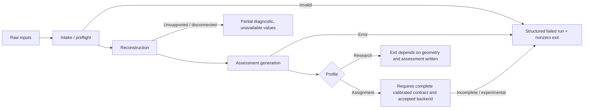
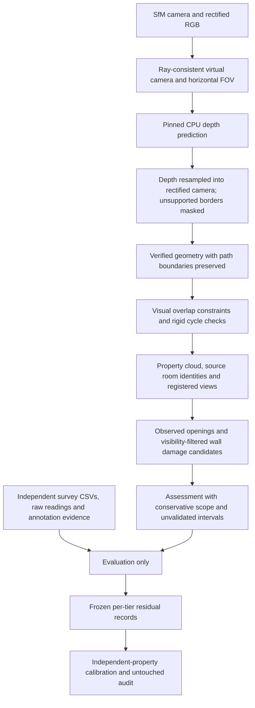
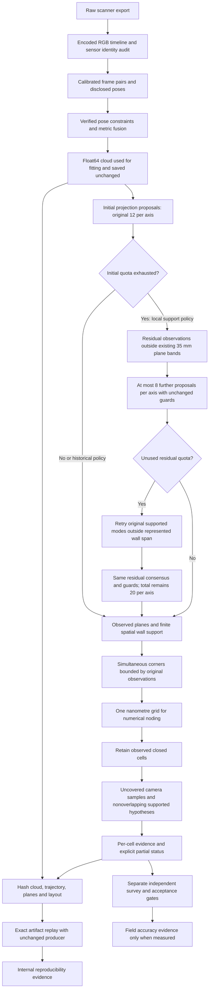

# Phase 3 architecture and decisions

**Historical engineering ledger — superseded by the development freeze.**
See [index](INDEX.md), [architecture](ARCHITECTURE.md), [validation](BENCHMARK_RESULTS.md)
and [compliance](ASSIGNMENT_COMPLIANCE.md) for the final handoff. Recorded results
remain historical evidence; further experiment suggestions are not active work.

**Latest local-floor source audit:** [batch032](fixes/032_ROOM_FLOOR_SOURCE_SUPPORT_AUDIT.md)
traces all 6,899 original ceiling-scan depth/confidence pairs for fixed room_2 /
plane 1. The retained 300 frames contain 9,818 accepted local pixels in 92 cells:
29.2154% diagnostic coverage. Stride-8 retains 150 returns in 43 cells: 14.1246%.
Native fusion reproduces the 202,477-point cloud and weights bit-for-bit and
retains all 148 local support voxels/cells. Extraction/calibration/timing match
the originals. All-source accepted coverage is 44.0880% under raw poses;
confidence-2 alone gives 34.9107%. Frame selection and spatial sampling lose
available observations; original absence and fusion loss are not the main cause.
Selected dense confidence-2 coverage is only 20.6258%; pixel unions are not native
fused acceptance or physical accuracy. No production defect or safe adoption is
proven. Keep the 25% guard, production and geometry unchanged; no commit/push.
15/15 exact geometry checks, 82 focused and 390 full tests pass. Local floor/
ceiling remain unavailable; 0.702677 m footprint notch remains unvalidated;
floor-only stays 25/176. RGB registration stays CLOSED and XFeat experimental.
REQ-07/08/25 remain partial; REQ-42 gains source-to-cloud trace evidence.
Next run an isolated full-pixel 2 cm native-fusion floor-support control on the
same 300 frozen frames/poses/planes/polygon, without refitting walls/layout or
changing guards; inspect confidence/repeated-view support before adoption.
[Evidence](results/phase3_room_floor_support_summary.json). Earlier notices are historical.

**Latest observed-ceiling decision trace:** [batch031](fixes/031_OBSERVED_CEILING_DECISION_TRACE.md)
reproduces room_2's native floor/ceiling decisions on the fixed cloud, planes and
cameras. observed_ceiling exits at the missing-local-floor guard and visits zero
ceiling planes. Floor plane 1 has 148 local points in 43 occupied cells: 14.1246%
clipped coverage, below the unchanged 25% guard. 44 planes fail horizontal
alignment, six fail floor camera-height clearance and three fail reference-level
agreement. An above-camera plane already has 3,178 points /89.8986% coverage;
this supplementary inventory does not infer a ceiling height or bypass any guard.
Correct policy rejection; physical floor-support loss remains evidence-limited.
No reproducible production defect or justified parameter change is proven.
Two final native traces repeat byte-for-byte; 15/15 geometry checks, 74 targeted
and 374 full tests pass. Production, geometry and thresholds remain unchanged.
No commit or push. The 0.702677 m footprint notch remains unvalidated; area
stays 9.945719535 m² and ceiling height/evidence stay unavailable. Floor stays
25/176; RGB registration remains CLOSED and XFeat experimental.
REQ-07/08/25 remain partial; no physical or final acceptance is claimed.
Next trace original selected depth/confidence returns for plane 1 in room_2,
comparing the retained stride-8 lattice with other accepted pixels under fixed
calibration/poses to distinguish insufficient observations from sampling loss.
Do not rerun the rejected global stride-4 trial or alter the notch.
[Evidence](results/phase3_observed_ceiling_summary.json). Earlier notices are historical.

**Latest ceiling-boundary sensor audit:** [batch030](fixes/030_CEILING_BOUNDARY_SENSOR_AUDIT.md)
identifies the 0.702677 m change as a floor-plan notch in the ceiling-scan case,
not a ceiling-height change: area 10.477367 -> 9.945720 m². The added residual
horizontal plane joins an existing inner finite segment. Original selected PNGs,
per-frame calibration/raw poses and stride-8 fusion reproduce exactly; current
ceiling layout passes 15/15 exact checks. Local notch returns concentrate below
1.5 m; high-confidence crossing rays above them persist under raw/refined poses.
This supports local surfaces but cannot establish a full-height room perimeter
or validate either footprint without semantic/survey evidence. No reproducible
production defect or safe correction is proven. Keep production/geometry/guards
unchanged and retain the 0.702677 m accuracy warning; ceiling height stays null.
60 targeted /360 full tests pass. No production fix, commit or push.
Floor stays 25/176; RGB registration stays CLOSED and XFeat experimental.
REQ-07/08/10/25 remain partial; no physical or final acceptance is claimed.
Next trace _observed_ceiling rejection reasons for current room_2 with existing
cloud/planes/cameras, keeping geometry and thresholds fixed.
[Evidence](results/phase3_ceiling_boundary_summary.json). Earlier notices are historical.

**Latest LiDAR floor result:** [batch029](fixes/029_LIDAR_FLOOR_SAMPLING_CONTROL.md)
reproduces the supplied floor baseline exactly (15/15 checks), then evaluates
stride-4 depth sampling with identical 176 frames and frozen sensor poses.
Fused points increase from 116,480 to 360,845; camera coverage rises from 25/176
to 79/176, with one observed polygon and three inferred cells. The accepted
baseline polygon is not preserved in the known common coordinate frame.
Reject a production density change: more inferred coverage does not justify
changed boundaries. Production floor coverage remains 25/176; no new connecting
wall is introduced. 69 targeted /343 full tests pass. No production change,
commit or push; prior evidence and unrelated work are preserved.
REQ-07/10 remain partial. RGB registration is CLOSED and XFeat experimental.
The 0.702677 m ceiling-boundary shift and physical acceptance remain unvalidated.
Next audit original versus shifted ceiling-scan boundary against confident depth
surface/ray evidence; do not reopen registration or infer independent cm accuracy.
[Evidence](results/phase3_lidar_sampling_summary.json). Earlier notices are historical.

**Final registration-chain status: CLOSED, inconclusive.**
[Batch028](fixes/028_FINAL_FRAME31_REPLAY.md) replays frame31 once from snapshot26.
The input model state reproduces exactly, with unchanged RGB/frontend rows and
fixed intrinsics, but the control ends30 views/6045 points versus snapshot27's
30/6055 and emits37 solver warnings versus0 in the original frame31 interval.
Exact output reproduction fails; intermediate geometry must not be interpreted.
The34/37 landmarks remain first observable in trusted snapshot27 after frame31
registration/refinement. The new run cannot localize their original substage.
Prior inherited-model-bias evidence remains a hypothesis, not a proven defect.
Do not replay earlier frames or extend this diagnostic chain. Keep XFeat
experimental, production SIFT/guards unchanged.144 targeted /326 full tests pass;
1329 prior pinned entries remain intact. No production fix, commit or push.
REQ-03/05/10/27/29 remain partial; floor25/176, ceiling0.702677m shift and physical
acceptance remain unresolved. [Evidence](results/phase3_frame31_final_summary.json).
Earlier next-step notices below are historical and are superseded by this closure.

**Latest registration-support evidence:** [batch027](fixes/027_REGISTRATION_SUPPORT_AUDIT.md)
audits83 visible features /87 distinct candidate rows /37 accepted associations
without running a pose solver. Only1 accepted feature has competing landmark IDs;
accepted source tracks have no repeated-image identities. Their hull covers3.40%
of the target image;28 landmarks have only2 prior views. A systematic1.194292x
native/sensor-reference depth discrepancy persists outside flagged identities;
27->31 input motion already disagrees by4.206027deg and1.318052x normalized length.
Most rejected support is sensor-inconsistent, but two unambiguous rejected wall
observations have3.150/9.808px held-out sensor predictions versus81.737/64.738px
native residuals. Evidence favors inherited geometry bias plus concentrated
support; no concrete solver defect or deterministic production change is proven.
Keep XFeat experimental and SIFT/guards unchanged.129 targeted /311 full tests
pass; both read-only audits repeat exactly and1301 prior entries remain unchanged.
No new commit/push. Floor25/176, ceiling0.702677m shift and physical acceptance
remain unresolved; REQ-03/05/10/27/29 stay partial. [Evidence](results/phase3_registration_support_summary.json).
34 of37 accepted landmarks first appear at frame31's snapshot27. Next replay
frame31 from29-view snapshot26, capturing registration/triangulation before local
and global refinement and requiring snapshot27 reproduction. Sensor poses remain
post-hoc only. Earlier notices are historical checkpoints.

**Latest pre-local-refinement evidence:** [batch026](fixes/026_NATIVE_REGISTRATION_STAGE.md)
resumes frame34 from the saved30-view state twice, without sensor poses or any
frontend/guard changes. Accepted registration already disagrees with odometry
by7.842073deg; triangulation preserves poses; local refinement reduces disagreement
to6.590696deg and reproduces the retained31-view model state exactly. Four native
binaries match; every image record byte matches with output order alone different.
All five stage binaries and audited metrics repeat exactly between controls.
No concrete software defect or production fix is established; keep XFeat
experimental and SIFT unchanged.116 targeted /298 full tests pass;1147 prior
pinned entries remain unchanged. No new commit/push. Floor25/176 and ceiling
0.702677m shift remain unresolved; REQ-03/05/10/27/29 and physical acceptance stay
partial. [Evidence](results/phase3_registration_stage_summary.json). Next audit
83 visible frame34 registration candidates /37 accepted observations against
saved30-view landmark geometry, retaining the native solver and post-hoc sensors.
Earlier notices are historical checkpoints.

**Current stage-history decision:** [batch025](fixes/025_NATIVE_REGISTRATION_SNAPSHOTS.md)
adds isolated native snapshots and a separate post-hoc auditor. Only output
path/frequency change; exact final baseline reproduction is mandatory before
sensor comparison. Snapshot point errors are recomputed from projections for
stage diagnostics, since native stored errors can be stale.31->34 disagreement
is present by its first post-registration/local-refinement state; native snapshots
cannot expose the raw PnP pose. Keep inference and sensor validation separate.
No reconstruction/guard change is justified; SIFT remains production.99 targeted /
281 full tests pass. Next native stage replay must reproduce the post-local state
before attributing the remaining error to registration or local adjustment.

**Current support-audit decision:** [batch024](fixes/024_LATE_LANDMARK_SUPPORT_AUDIT.md)
distinguishes raw transitive conflicts, final native associations and unavailable
registration-inlier provenance. Adequate saved triangulation/pixel fit does not
certify late orientation.82/97 target points are confined to late views, and
frame34 has21 narrowly distributed earlier-connected landmarks. This supports
a weak-anchor hypothesis without establishing a mapper defect. Keep architecture,
SIFT and guards unchanged; do not prune raw components or seven local conflicts
on this evidence. Next native registration snapshots expose when the disagreement
appears; changing diagnostic-output fields must preserve final model bytes/metrics.
No optimization, metric scale or physical acceptance is introduced by the audit.

**Current ablation decision:** [batch 023](fixes/023_MAPPING_ONLY_FIXED_INTRINSICS.md)
isolates mapping calibration from verified-inlier selection. Original rows remain
exact; fixed supplied cameras improve target sensor agreement without any new
verification or sensor-assisted optimization. Intrinsic initialization/prior
status/locking are still bundled; their individual effects are not isolated.
Residual late drift, direction-tail regressions and ambiguous tracks remain.
Keep the architecture, production SIFT and guards unchanged; no mapper patch or
frontend adoption is justified. Next audit saved 31->34 landmark identity and
triangulation angles. Older design notices below describe historical decisions;
none supersedes the current evidence or establishes physical accuracy.

**Current camera-policy evidence:** [batch 022](fixes/022_FIXED_INTRINSICS_CONTROL.md)
demonstrates that correctly supplied, fixed intrinsics improve the experimental
XFeat transition while withholding sensor poses. It does not eliminate drift or
justify changing production SIFT. Calibrated verification also changes inlier
selection, so a mapping-only ablation with original verified inliers is next.
Keep the existing architecture and accuracy/evidence gates. No production camera
policy is changed, and stock videos cannot assume scanner calibration exists.

**Current validation decision:** the [withheld-odometry audit](fixes/021_TRANSITION_ODOMETRY_AUDIT.md)
rejects the experimental 29-view joint bridge for production. Relative rotation
and translation disagree across correctly identified RGB frames. Preserve the
current architecture/SIFT/guards; no pose correction or reconstruction change
is made. Next isolate per-frame intrinsic freedom in a fixed-calibration control,
with all sensor poses still withheld. This design alternative has not been tested.
Software repeats and sensor consistency remain distinct from physical acceptance.

**Current matcher decision:** retain production SIFT after the [24-view pinned
DISK + LightGlue comparison](fixes/017_DISK_LIGHTGLUE_TRANSITION.md). The isolated
candidate connects the verified graph reproducibly but fails joint 3D mapping.
Camera priors, native verification/mapping configuration and acceptance policy
are held constant; no model union is treated as property geometry. The next
bounded experiment adds existing RGB reconstruction context, not previous poses.
No production source or geometry changes in this batch; full suite 192 passed.

Scanner intake now uses the encoded MP4 timeline and audits full decoded PTS
against odometry cadence before pairing RGB/depth/poses. This restores the first
encoded frame omitted by playback edits in supplied exports. Source times,
clock fit and missing-tail counts remain explicit; ordinary video playback is
unchanged. Boundary stage diagnostics preserve the finite junction network and
polygon rejection evidence. See [the active pass](PHASE3_SYNC_BOUNDARY_PASS.md).

Wall projection proposals now use local raw-point/spatial-cell acceptance while
retaining global-equivalent counts for ranking. This corrects suppression of an
unchanged wall when unrelated property surfaces enlarge the cloud. The original
band, seed budget, finite-wall/gap rules and incomplete-status guards remain.
The historical policy is retained for controlled geometry-only comparison;
larger Open3D/density proposal alternatives are isolated experiments.
The drift ablation report audits actual accepted geometric graph edges and pose
changes, including segmented graphs; loop counters alone are insufficient.
Neither mechanism establishes independently measured accuracy.
RGB rectification now converts COLMAP source pixel centers to OpenCV array
coordinates before remapping; the existing virtual camera calibration stays
unchanged. Identity/downsample controls reproduce the old shift and pass after
correction. Geometry/topology remains numerically sensitive and physically
unvalidated; tested precision grids did not establish a remedy.

The agreed scope and acceptance holds are in [PHASE3_IMPLEMENTATION_PLAN.md](PHASE3_IMPLEMENTATION_PLAN.md).
Progress and actual test results are in [PHASE3_IMPLEMENTATION_STATUS.md](PHASE3_IMPLEMENTATION_STATUS.md).
This document describes implemented interfaces and explicitly experimental paths.

The [supplied-data continuation](PHASE3_SUPPLIED_DATA_PASS.md) adds bounded
raw-support wall proposals when global plane selection misses observed walls,
room-local floor/ceiling evidence, origin-invariant plane heights and explicit
fitted-slope ranges. Finite boundary and coverage guards still decide readiness.
Historical loop verification uses a different motion policy from consecutive
tracking. Damage view budgets select registered imagery first; independent
measured extents remain separate from annotation polygons. These are incremental
corrections within the existing architecture, with no measured accuracy claim.

## Interfaces and compatibility

- `run-capture` keeps existing flags and defaults to `research` for compatibility.
- `--profile assignment` rejects measured scale/manual adjacency; photos additionally reject supplied depth/poses. Geometry readiness and contract completeness are separate.
- `--experimental-rgb` is explicitly opt-in. Its current backend is not accepted for an assignment success exit even if a geometric proposal is produced.
- `--property-id` identifies a physical property consistently across tiers/repeats. `--calibration` loads a producer-bound artifact. Keep separate compatible artifacts per tier/configuration.
- `assessment.json` v2 contains property footprint, rooms, surfaces, physical opening identities, adjacency, measurements, damage, rules and scope. Published-schema verification remains false.
- `evaluate-assignment` accepts a run directory, v1/v2 assessment, or a legacy plan. It preserves global rigid alignment with scale one. `calibrated_known_gates_pass` is stricter than the historical presence/geometry `known_gates_pass` field; neither implies official completion.
- `audit-benchmark` checks composition/asset identities, not measurement accuracy.
- `compare-consumer` requires LiDAR output, declared same-property two-room mappings, app version, original export checksum and independent dimensions.
- `calibrate-intervals --profile assignment --producer-run ...` selects 90% unless explicitly overridden. Insufficient groups stay unavailable; engineering intervals are not silently substituted.
- `audit-calibration` scores independent property groups and reports widths and small-sample coverage uncertainty; it never refits on audit data.
- `scripts/fix_evidence.py declare` snapshots a measured failure and prediction before changing its producer. `verify` checks input/reference/evaluator identity, execution chronology and source/configuration diffs. Actual baseline replay and worst-gate selection still need evidence.
- `scripts/reproduce_artifacts.py` executes argument-list commands in fresh directories and checks JSON claims or hashes. Historical copies, skipped entries, unchecked execution and failures do not count as regenerated evidence.

## Measurement decisions

The [remaining-gap pass](PHASE3_REMAINING_PASS.md) adds the following verified
interfaces. A camera-conditioned prediction is made in a centered square-pixel
virtual camera and resampled into the rectified SfM domain; changing only the
backprojection K is insufficient. The public development replay supports this
correction, but does not close RGB geometry or field-accuracy acceptance.

Stitching retains camera transforms, depth units and frame provenance for opening
and damage projection. Lost/ambiguous photo-folder identities are rejected, rather
than treated as complete merely because the output has enough polygons. Verified
redundant links are checked against the spanning path before graph optimization.
The 15 cm / 5 degree cycle bounds are conservative development settings, not
dimensional acceptance tolerances. ICP correction has an additional 5 degree
rotation bound. Independent camera views and tracking gaps carry no implicit
sequential constraints; continuous pieces are optimized separately.

Damage visibility distinguishes physical wall faces. The same registered view
cannot label both sides of a shared wall. Independent annotations and clean
controls produce diagnostic class/extent scores; their matching IoU is not a
new assessment damage threshold. The classical detector remains experimental.

Survey import, damage scoring and calibration record construction run strictly
after inference. Calibration requires one frozen tier/recipe per artifact and
complete measurement correspondence; missing measurements cannot quietly narrow
the fitted intervals. Survey identity and authenticity still require physical
review even when file checks pass.

The final line-selection guard uses fitted-plane inclination across its full
support, rather than point-noise RMS (development resolution: 6 mm lateral span).
Wall fragments and doorway bridges inherit the same choice. Bounded corner
intersection trims small overshoots as well as extending gaps, assigning identical
nearby endpoint coordinates to preserve polygonization; the 15 cm bound is retained.
The two-room replay in the status document caught and validated these corrections.

Keep verified graph constraints, supported-cell guards, null observations and separate truth evaluation. Wall residuals are measured against fitted planes rather than their axis projection. Finite fitted lines preserve slight wall inclination; bounded corner extension remains 15 cm. Occupied ceiling cells replace convex-hull coverage. Openings need two camera origins, through-ray evidence and observed jamb/header boundaries. Closed-door appearance recognition and current-app distortion-domain verification are still pending. Crack inspection quantities use a metric skeleton centreline; stain quantities use deduplicated occupied surface area.

The learned-depth experiment uses the pinned MoGe-2 ViT-S code/checkpoint, checksum-before-load, 1024-pixel long edge, 1200 tokens and CPU. SfM metric scale needs at least fifty consistent tracks over two supported views. Those are development settings, not official thresholds. When a multi-room global model fails, the experiment can attempt independent room models and verified overlap stitching; disconnected/incomplete identities stay failed. No manual connectors or laser controls enter this path.

## Evidence and process

The current finite-corner search evaluates immutable observed lines in canonical
pair order and selects endpoint extrema simultaneously. Every proposal is bounded
by the original 15 cm extent, preventing successive joins from extending farther
than the declared guard. It preserves observed wall directions and finite support.
Fused clouds are saved at the float64 precision actually used for fitting; rounding
only their saved representation previously changed artifact replay geometry.
The run ledger hashes cloud/trajectory/planes/layout artifacts, and measurement
fingerprints include Shapely. Exact saved-artifact replay is separate from raw
rerun stability, independent capture repeatability and measured field accuracy.

Observed closed cells no longer disable partial-cell proposals for the rest of
a capture. The existing four-sided support solver considers only camera samples
outside observed cells, rejects overlapping hypotheses before ranking, and appends
accepted hypotheses with per-cell boundary-review evidence. Observed cell IDs and
geometry are retained. Inferred edges cannot establish adjacency or openings;
their presence keeps output partial even at full camera coverage. Repeated edge
support is cached and candidate occupancy uses Shapely's vectorized predicate
with the original rounded buffer. See [the focused correction](fixes/012_PARTIAL_CELL_COMPLETENESS.md).

The residual stage was selected only after an unchanged-producer audit of all
151 uncovered floor camera samples and frozen-input alternative trials.
`_supported_wall_proposals` retains initial `_projection_wall_proposals` results
exactly and uses bounded unexplained-point search only when a local initial quota
is reached. Each stage fits at most 48 candidate bins per axis. Original-cloud
sampling weights rank additional planes; a smaller residual cloud cannot inflate
their relative support. Proposal metadata discloses the two-stage budget. The
historical global-equivalent policy remains unchanged. Finite corner, area,
overlap, inferred-boundary and adjacency guards retain their previous values.

This recovers support, not missing physical walls. Floor coverage stays 25/176;
ceiling coverage becomes 295/300 while remaining partial, and a prior observed
cell boundary changes by 0.7027 m without accuracy validation. No calibrated
measurement artifact should be reused across producer changes: independently
measured records must match the frozen new producer before any acceptance claim.
See [audit, alternatives and measured software changes](fixes/013_FLOOR_SAMPLE_WALL_AUDIT.md).

The [per-frame strip trace](fixes/014_EXTERIOR_STRIP_SENSOR_TRACE.md) identifies a
second omission: residual masking can dilute a histogram peak while leaving a
sufficient fitted consensus. Unused residual quota now permits bounded original
seed replay outside the represented axis-family centroid span plus the existing
5 cm seed-spacing guard. Fits still use only unexplained points and every prior
support threshold. Interior replay was tested and rejected after a cell regression.
Initial and residual proposal prefixes are preserved; maximum accepted count stays
20 per axis, with at most three 48-bin search stages (144 candidate bins per axis).
This is a conservative proposal search restriction, not a physical exterior label.
It recovers two finite floor fragments without establishing a room enclosure.
The prior ceiling geometry and its unvalidated 0.7027 m historical change must
remain separately disclosed. Calibration still requires the new frozen producer.

The [lower adjoining-span trace](fixes/015_LOWER_ADJOINING_SPAN_TRACE.md) retains
the same producer. Only 29 fused wall-height points (nine residual) exist in the
query, while measured depth rays and raw/refined traversal cross it. Treating
this as a solid connecting wall is unsupported. The audit emits no geometry,
changes no confidence/consensus/junction guards, and verifies exact floor and
ceiling layouts. All raw-frame stride counts are repeated observations in raw
pose coordinates; they are not independent accuracy measurements.

The next cached video audit distinguishes verified-pair connectivity from
triangulable camera geometry. Eight disconnected nontrivial components and two
disjoint saved models explain why a union count is insufficient for a common
property plan. Preserve best-model selection until a measured bridge or legitimate
common-coordinate registration exists. Evaluate a bounded RGB-only bridge-view
trial before adding a matcher dependency or changing stitching.

The [controlled bridge-view trials](fixes/016_RGB_VIDEO_BRIDGE_TRIAL.md) retain
all 68 original RGB views, cached features/pairs and matching/mapper options.
Only real intermediate views are added in the bounded source interval. Requested
8/16 Hz recipes create local verified support but no cross-target path or joint
model; exact repeats reproduce database contents and binary models. The native
pre-verification audit identifies insufficient correspondence support. No model
concatenation, new scale prior, lowered inlier/error threshold or production
sampling/matcher change is justified. A bounded pinned learned-matcher trial is
the next design option, requiring endpoint connectivity and joint 3D geometry
before any integration. This is not an accuracy or final-acceptance result.

Alternative designs were reviewed. Some historical trials and the current RGB integration were actually executed; refer to their individual artifacts rather than claiming all options were tested. New geometry tests are component evidence, not surveyed centimetre proof. Do not retrospectively fabricate a Part 4 declaration for a fix already implemented. Select a future declared fix from a measured development benchmark, preserve its producer, predict before implementation, and keep audit properties untouched.

No reference implementation is copied. Third-party models, tools and datasets retain explicit revision/license provenance. Existing local changes are preserved and are not silently included in commits.
