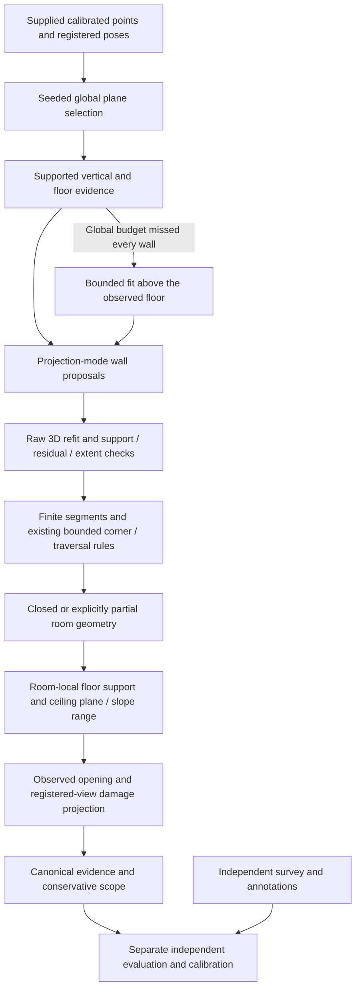

# Phase 3 supplied-data continuation — This continues the [approved plan](PHASE3_IMPLEMENTATION_PLAN.md) and
[previous checkpoint](PHASE3_REMAINING_PASS.md). It does not replace the
[assessment](Applied%20AI.html). No commits or pushes are authorized in this pass.

## Verified baseline and first actionable defect

The current regression baseline passes **113 tests in 20.24 s**. Existing dirty
files were preserved. A fresh raw `single_room/c00a170fe1` capture reproduces
`incomplete_geometry`, tracking all 115 sampled frames. Fresh current-source
replays of the existing normalized supplied floor/ceiling inputs track 175/300
frames respectively and also produce no closed plan. These are inference sensor
inputs, not independent truth; nearby scan times do not establish repeat identity.

`scripts/diagnose_supplied_geometry.py` renders frozen fused points, fitted wall
segments and camera paths, preserving cloud/run hashes. The ceiling cloud has
observed cross-walls omitted by the 14-plane global RANSAC budget: many selected
planes are horizontal furniture surfaces. The rendered support is integration
evidence; it cannot supply laser dimensions or certify wall semantics.

## Alternatives actually evaluated

- Inspected Reference A's pinned `scanplan/geometry/walls.py`: wall-height-band
  projection produces structural proposals. Its room-independent histogram and
  broad support idea is relevant, but raster filling/dilating an apparent
  footprint cannot certify an unobserved boundary here.
- Inspected Reference B's pinned `cozmoscan/geometry/manhattan_room.py`: projection
  modes select wall positions. Its rectangular box and raw-extent fallback do
  not satisfy the project's concave/observed-boundary requirements.
- Ran raw projection-mode/SVD proposals against the frozen single/ceiling clouds.
  The first variant added 19/55 planes; most were too weak to justify adoption.
  A height/length filter alone still added 18/54. Neither variant was integrated.
- Retaining the existing RANSAC-equivalent 250-point support minimum and bounding
  candidate fits to 12 per axis reduced the proposals to 9/12. These recover
  partial observed geometry while retaining low coverage/incomplete status.
- Tested a one-micrometre union precision grid on those same proposals: it did
  not improve the observed outcome, so that numerical change was not adopted.

These are local development comparisons, not physical accuracy experiments or
prospective Part 4 fix evidence. Reference revisions remain the ones recorded in
the approved plan; no implementation was copied.

## Implemented wall-completion change

CHANGE-07/10; REQ-07, 10, 42 (partial requirements remain partial).

`layout._supported_wall_proposals` proposes omitted wall planes using the
already established floor/wall basis. It refits actual three-dimensional support,
requires the original RANSAC-equivalent sample support, residual <=2.5 cm,
supported height/length spans and existing vertical/orientation limits. Weak
table/column modes and duplicate observed planes are rejected. Histograms are
memory bounded; at most 24 seed fits are considered. These are documented
development settings, not dimensional acceptance tolerances.

One observed wall plus the supported vertical can establish projection axes;
the former three-wall precondition prematurely stopped extraction when global
plane selection missed other observed walls. Finite boundary extraction,
camera coverage, existing 15 cm corner bounds, traversal checks and explicit
partial status still determine geometry readiness. The method does not fill
unobserved walls or assume ceilings. New raw-support proposals are recorded in
`layout_evidence.json` and plan provenance.

The first regression exposed an actual extrema-bin omission in the new proposal
histogram (1 failure, 21 passing). Empty border bins fix it without changing
support thresholds. The corrected targeted geometry/opening suite passes
**22 tests in 6.42 s**, including omitted-but-observed cross-walls, a genuinely
missing boundary, furniture/column rejection and the existing two-room topology.

## Supplied-data replay procedure

```powershell
.\.venv\Scripts\python.exe scripts/reproduce_artifacts.py docs/benchmark/supplied_geometry_reproduction.json --out demo\fresh_supplied_replay
```

This current development manifest explicitly names the normalized capture
manifests whose raw sources are `datasets/Given_dataset`. It requires the local
raw-data/intake volume. The single-room normalization is freshly reproduced in
this pass; the floor/ceiling normalizations retain their previously inventoried
omissions and hashes. Direct reconstruction timing excludes intake. To redo
intake too, run `run-capture --tier lidar --source <original-session> --max-frames
120/180/300 --profile assignment --property-id <documented-property> --out <fresh>`
for single/floor/ceiling respectively. Keep identity unverified until confirmed.

All incomplete assignment captures must exit nonzero and write assessment/report
artifacts. A regenerated failure or additional plausible room is not a measured
acceptance pass.

## Additional confirmed defects corrected

- CHANGE-07: the supplied floor-labelled scan actually contains captured walls.
  Its global 14 selections were all horizontal. An executed above-floor-band
  RANSAC trial recovered three vertical planes and a partial cell at 9.14% camera
  coverage. The integrated bounded fallback requires an already observed floor,
  refits only captured points and preserves the global-equivalent minimum
  support. It never derives wall directions from a truly floor-only cloud.
- CHANGE-09: historical loop verification no longer applies the consecutive
  video's 45-degree/1-metre motion bounds. Descriptor, reprojection, metric-depth
  and ICP checks remain; sequential tracking keeps its limits. The targeted
  loop/registration/ablation suite passes **10 tests in 3.10 s**, with actual
  Open3D graph/ICP exercised and a stubbed visual constraint in the loop test.
- CHANGE-11: apply the damage view budget after retaining registered trajectory
  frames. Otherwise all uniformly sampled views can be rejected, hiding usable
  imagery. No empty/missing trajectory can fall back to unregistered raw poses.
  A new test also exposed valid integer JSON wall endpoints crashing division;
  projection now converts them to floating-point coordinates.
- CHANGE-04/11/12: damage scoring preserves an independent measured area apart
  from its association polygon; all metric extents are validated even when a
  region is unmatched. Duplicate region IDs and surveys containing only excluded
  raw readings are rejected. The first damage regression found the integer
  endpoint failure (1 failed, 31 passed); the corrected targeted suite passes
  **32 tests in 5.05 s**. Expanded failure-path checks pass too.
- CHANGE-03/05/09: stock-video intake ignored the CLI frame budget. It now honors
  smaller supplied budgets while preserving the previous default ceiling of 180
  selected frames. The requested budget is recorded in intake. The targeted
  capture/camera/SfM suite passes **23 tests in 6.49 s**.
- CHANGE-07/08/11: floor observation is checked in each room, using clipped
  occupied cells; a neighboring room's floor cannot certify it. A broad table
  cannot replace the observed storey datum. Openings and damage projection use
  the room's observed datum, with unknown rooms withheld. Stepped floors outside
  that common datum need additional geometry; they are not guessed.
- CHANGE-07: ceiling plane height is evaluated at the room centroid, not at the
  arbitrary global origin. A translated tilted-plane regression proves gauge
  invariance. Resolved slopes retain the observed height range/centroid proposal
  while withholding scalar acceptance pending a scoring definition. The 3 cm
  slope-resolution and 4 cm storey-datum guards are development observation
  settings, not relaxed dimensional gates. Canonical assessment retains this
  evidence and explicit missing-height reasons.

No existing changes receive a retrospective measured worst-gate declaration.
Producer hashes change with these measurement changes; calibration must be
rebuilt from a subsequently frozen recipe and genuinely independent properties.

The derived RGB pose world may have arbitrary axes. `rgbd.reconstruct_rgbd` now
uses the first retained camera's down axis in that world as its weak prior when
explicit gravity is unavailable. Explicit sensor gravity stays authoritative.
The default world-Y assumption could reject otherwise valid rotated SfM geometry.
The gauge/registration/geometry targeted suite passes **24 tests in 9.60 s**.



The supplied RGB video is also tested with a 24-frame budget, without reading
its neighboring sensor pose/depth/calibration files. It is an RGB-only sensor-app
export, not independent Native Camera or physical accuracy evidence. Any result
from it remains an unpromoted RGB experiment.

## Final-source verification and supplied-data results

The final isolated source/test copy, excluding historical `demo/` and private
`datasets/` inputs, passes **133 tests in 25.63 seconds**. It reuses workstation
dependencies: this is not a clean-machine installation test. The saved log and
JUnit results are `demo/phase3_supplied/serial_report_final_tests.log` and
`serial_report_final_tests.xml`. The preceding serial checkpoint passed 131 tests
in 28.52 s, before the two report regressions were added.

The immediately preceding full-suite attempt overlapped the supplied-video
reconstruction and failed **4 tests, with 127 passing**. Windows reported native
resource exceptions (`0x8007000e`) and OpenCV exceptions. The same final source
passes serially after the reconstruction finishes. This supports resource
contention as the explanation; it does not prove concurrent execution reliable.
Run these CPU/native workflows serially for the current demo.

Final-source normalized supplied replays are under
`demo/phase3_supplied/current_supplied`. All **3/3 cases and 12/12 declared output
checks** regenerate. All source ledgers record `code_changed_during_run: false`.
These checks validate execution, frame counts, reporting and honest non-success;
they are not measurement-accuracy checks.

| Supplied case | Tracked / input | Rooms proposed | Camera coverage | Reconstruction seconds | Outcome |
|---|---:|---:|---:|---:|---|
| Single room | 115 / 115 | 1 | 34.78% | 13.15 | Partial; boundary review required |
| Floor-labelled scan | 175 / 175 | 1 | 10.29% | 21.94 | Partial; captured wall support recovered, property coverage insufficient |
| Ceiling-labelled scan | 300 / 300 | 1 | 8.00% | 23.73 | Partial; whole-property boundaries remain incomplete |
| Supplied RGB-only video, 24 selected views | 2 / 24 original SfM views; 2 / 2 derived depth views | 0 | No closed room | 158.89 reconstruction; 167.05 with intake | Partial experiment; no floor plan |

The video consumes only the MP4 hash recorded in its input ledger; neighboring
depth, confidence, calibration and odometry are withheld. Its 24-view SfM model
has 81 sparse points, with 14/276 geometrically verified candidate pairs.
An accepted internal model-scale consistency check is not a calibrated metric
accuracy pass. The result remains `model_scaled`, unpromoted and incomplete.
The accepted native-photo/video requirements are therefore still open.

### Additional video calibration control actually executed

Reference B's `cozmoscan/capture/video_tier.py` uses supplied per-frame intrinsics
and sensor VIO poses for triangulation. Those inputs would change the approved
stock-video experiment, so that implementation is not substituted here.
The observed default result estimated different focal lengths between its two
registered views. We instead tested the existing `camera_grouping: shared`
configuration on the identical MP4 and 24-view selection, without sensor sidecars.

`supplied_video_shared_control.json` and `supplied_video_shared_result` under
`demo/phase3_supplied` retain the actual configuration/output. Registration rises
from 2/24 to 3/24; all three derived depth views are retained, but no room closes.
The result remains partial/model-scaled, with unchanged source, in **155.31 s**
(direct reconstruction, excluding intake). This is not sufficient evidence to
change the production default or promote RGB. The shared-camera option remains
explicitly selectable for further calibration-controlled experiments.

The additional frozen regression replay under `current_checkpoint` verifies all
**4/4 cases and 25/25 claims**: supplied extracted photos remain incomplete
(1/4 derived views, zero rooms, 51.03 s reconstruction / 52.34 s with intake);
the public TUM video remains partial (6/12 original SfM views, 6/6 derived views,
zero rooms, 60.45 / 61.11 s); raw supplied single-room LiDAR produces the partial
room (115/115 views, 15.73 / 39.04 s); the generated two-room control preserves two
rooms, one adjacency and its research proposal (11.89 s). Every assignment
contract is incomplete. These replays were sequential, with no source changes.
All 37 Python producer-module hashes match the isolated copy used for the final
regression suite. Whitespace validation passes with Windows CRLF-aware settings.

### Supplied identical-input pose comparison

The correction-off replay uses the same single-room capture manifest and source
as the final correction-on replay. `current_single_drift.json` verifies both hash
identities across 115 shared poses. Off has no room (8.40 s); on proposes one
partial room (13.15 s), 7.3554 m2 of inferred footprint and 34.78% camera coverage.
Maximum camera translation change is 0.07330 m; rotation change is 0.58656 degrees.
There are **zero verified loops**. `accuracy_improvement` is null and
`verified_drift_correction_demonstrated` is false. The altered geometry is not
proof of better physical dimensions or effective loop-drift correction.

```powershell
.\.venv\Scripts\python.exe -m floorplan.cli reconstruct demo\phase3_supplied\baseline_single\intake\capture.json --pose-correction off --out demo\fresh_single_off
.\.venv\Scripts\python.exe -m floorplan.cli compare-pose-correction demo\fresh_single_off demo\fresh_supplied_replay\single --out demo\fresh_drift.json
```

### Visual and reporting verification

The final three-page [technical checkpoint](../demo/phase3_supplied/technical_checkpoint_final/technical_checkpoint.pdf)
is generated from the three supplied sensor replays and original RGB-only video.
All three page PNGs were visually inspected. A discovered reporting omission
initially displayed 2/2 derived depth views in the video table; the corrected
report displays **2/24 original RGB views** and preserves both counts in its
metadata. Two targeted snapshot regressions pass (0.17 s). Coverage explanations
now appear for partial sensor results. The PDF is explicitly a development
checkpoint, with `final_submission: false` and artifact hashes, not the final
surveyed report.

The cloud diagnostic now renders the frozen layout basis/slab, rather than
refitting with current code or assuming world gravity. Its executed
`diagnostic_current_ceiling` plot shows 202,477 actual fused points and 30 fitted
segments, recording cloud/layout/run hashes. That plot was visually inspected.
Ceiling evidence in the partial cell retains a fitted 2.2694–2.3395 m height
range with scalar height unavailable. Sensor/fitting bias may contribute to the
apparent slope; neither the range nor the cell identity has independent truth.

## Requirement disposition and exact remaining evidence

This pass closes concrete software defects in CHANGE-03/04/05/07/09/11/12 and
adds validation under CHANGE-14. It does not close the parent assessment
requirements by substituting development tests for their field gates.

| Requirement group | Supported status now | Remaining work |
|---|---|---|
| REQ-07/08/10/42 geometry | PARTIALLY IMPLEMENTED: omitted observed walls can be proposed; room-local floor/ceiling evidence and slope ranges retained | Whole-property closure/coverage and wall semantics on supplied data; independently measured dimensions/heights |
| REQ-02/03/05/07-10/28-29 RGB/property | PARTIALLY IMPLEMENTED: arbitrary-world down prior and bounded video intake fixed | Native 2/4/8-photo and full-video reconstruction, metric scale/coverage, automatic shared-room/property proof |
| REQ-11-13/20/40 damage/scope | PARTIALLY IMPLEMENTED: registered views selected correctly; independent measured extents and input failures handled | Two staged classes, clean/adverse controls, reviewed surface UV associations and measured areas/crack lengths |
| REQ-14/15 calibration | PARTIALLY IMPLEMENTED: record/import/scoring paths tested | Refit against a frozen producer with at least nine independent properties per finite 90% tier/kind/unit group and separate audit |
| REQ-19/21-27/30/38 physical benchmark | PARTIALLY IMPLEMENTED: independent evaluation paths remain available | One identified property with three nonconnector rooms plus connector in all tiers; independent repeat and raw laser/tape readings; original two-room consumer export/version; measured drift gates |
| REQ-16 and unavailable Round 1 rules | External specification hold | Actual published JSON schema and earlier LiDAR wall/scoring definitions |
| REQ-31/32-37/41-42 evidence/demo | PARTIALLY IMPLEMENTED: portable serial tests, frozen ledgers, regeneration and report procedures | Future prospective worst-measured-gate fix evidence, actual clean-machine timing, final surveyed bundle and unseen-phone rehearsal |

The independent survey procedure is already implemented: populate
`docs/benchmark/truth/*.csv` in a property survey directory with original raw
laser/tape evidence and shared coordinates; run `import-survey`, then
`evaluate-assignment` and `evaluate-damage` **after** reconstruction. Use the same
capture manifest for correction-off/on runs and supply that independent reference
to `compare-pose-correction`. Calibration/audit commands and exact file formats
are in [Phase 3 operations](PHASE3_OPERATIONS.md#additional-measured-evidence-commands).
No inference capture should contain these survey values as hidden scale controls.

## Files changed in this continuation

Production changes: `floorplan/layout.py`, `mapping.py`, `rgbd.py`, `damage.py`,
`damage_evaluation.py`, `survey.py`, `ingest.py` and `assessment.py`.
Regression changes: `tests/test_wall_completion.py`, `test_pose_boundaries.py`,
`test_metric_registration.py`, `test_damage_validation.py`,
`test_survey_records.py`, `test_ingest.py` and `test_ceiling.py`.
`tests/test_checkpoint_report.py` covers original RGB registration and incomplete
property reporting.
Evidence additions: `scripts/diagnose_supplied_geometry.py`, this ledger and
`docs/benchmark/supplied_geometry_reproduction.json`. The checkpoint reproduction
manifest's LiDAR expected result is updated only after observed partial output;
its nonzero exit and false completeness expectations are retained.
`scripts/render_phase3_report.py` describes arbitrarily selected runs without
asserting that every set includes a synthetic control, preserves source RGB
registration and explains incomplete property coverage.
Current status/README/brief/dataset/operations/decision documents link this pass.
Earlier uncommitted Phase 3 work remains intact.

Known risks remain: furnished wall proposals can still include nonstructural
surfaces; partial cells do not establish true room identities; multi-level floors
and scalar slope scoring are unresolved; classical damage candidates are
unvalidated; learned depth is uncalibrated; concurrent native CPU execution hit
resource limits. No physical accuracy or full assignment acceptance is claimed.
