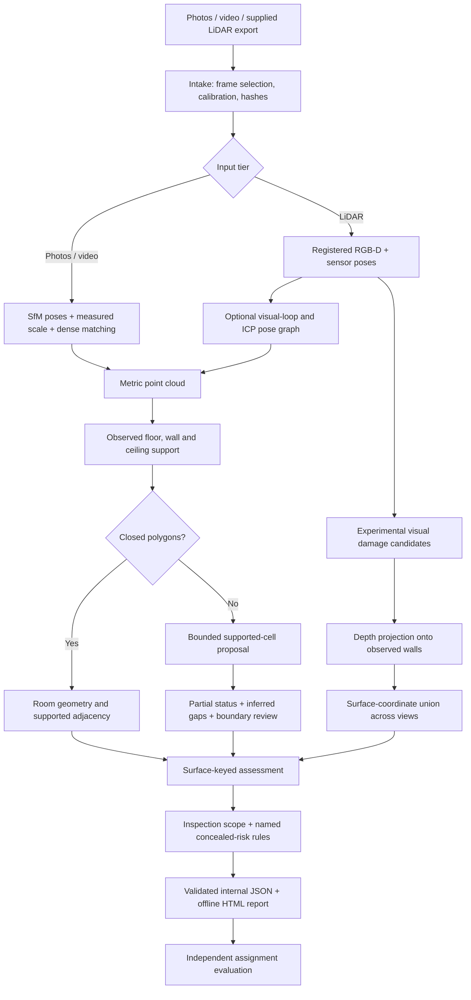

# Restoration demo flow and current evidence

Updated 2026-10-06. Personal design reference; read alongside the exact assignment
and `ASSIGNMENT_COMPLIANCE.md`. This document describes implemented software and
explicitly distinguishes it from validated assignment outcomes.



## Decisions implemented

- Exact observed polygons remain the primary geometry output. If none close, a
  bounded fallback requires observed support on all four sides and camera occupancy.
  Missing boundary spans are recorded; they are not automatically doors.
- Unknown ceilings and resulting wall quantities remain unavailable. A rectangular
  footprint alone cannot supply height or complete property coverage.
- Each assessment uses explicit room, surface and measurement identifiers. Schema
  validation is internal and provisional because the published Cozmo schema is absent.
- Engineering intervals expose a perturbation envelope and are marked uncalibrated.
  Calibration code groups residuals by independent property and rejects evaluation
  on its development properties; no field calibration has been completed.
- RGB-D damage candidates are projected into wall coordinates and unioned on a 2 cm
  grid, preventing the same region from being counted once per view. This grid size
  is a representation choice, not an accuracy guarantee.
- Current stain/crack masks are experimental image heuristics. Their scope actions
  request inspection. Concealed-moisture flags name the fired rule and never assert
  that concealed damage has been observed. Photo/video damage remains unevaluated
  when depth-to-image projection is unavailable.
- Every reconstruction attempts an offline report, including failures. Runtime and
  memory monitoring include assessment generation; deliverables are hashed.

## Incremental verification

The first supported-cell experiment changed the supplied single-room result from
zero polygons to one partial room, approximately 2.54 by 3.00 m. Camera coverage was
36.6%; ceiling was unavailable. These are estimates, not measured accuracy results.

The new full suite passed **44 tests** after optional model and sparse-entry integration.
It includes missing-wall rejection, unvisited-cell rejection, missing ceiling
withholding, synthetic candidate segmentation, cross-view deduplication and
independent-property calibration checks.

`demo/given_restoration_on/report.html` is a fresh supplied-data integration report.
Its run includes assessment generation (16.46 s in this run). Pose correction accepted
no verified loop closures; its maximum camera translation change was 0.140 m.
Consequently this is not evidence that loop closure improved accuracy. An off/on
comparison must report both outcomes without treating the corrected result as truth.

The paired experiment is saved as `demo/given_pose_ablation.json` and archived in
[given_pose_ablation.json](results/given_pose_ablation.json), so the comparison is
inspectable without the ignored demo directory. With identical
hashed inputs and reconstruction code, correction off/on both return one partial
room at 36.6% camera coverage. Areas are 7.535/7.608 m2 and runtimes 12.80/16.46 s.
The area difference is not an accuracy improvement. Fresh V3 LiDAR reconstruction
preserves all old room corner coordinates exactly; additional ceiling-evidence
fields explain why the entire room dictionaries differ. Both rooms still lack
supported ceilings.

Fresh photo/video regression runs also preserve every prior corner coordinate,
take 247.43/246.10 s with reused SfM caches, and write the new assessment/report.
Their damage stage remains explicitly unevaluated without registered RGB-D surfaces.
The [archived regression summary](results/restoration_v3_regression.json) records
the unchanged geometry and still-failing assignment height/interval gates.

Visual inspection of `damage_evidence/frame_1390.png` found candidates near fixture
and shadow boundaries. This confirms that candidate output cannot be presented as
validated damage detection; annotation and a stronger detector remain necessary.
The actual eight-frame learned-depth results and rejection decision are recorded
in [OPEN_SOURCE_DECISIONS.md](OPEN_SOURCE_DECISIONS.md).

```powershell
& .\.venv\Scripts\python.exe -m floorplan.cli reconstruct demo/given_single_room_run_v2/intake/capture.json --out runs/correction_off --pose-correction off
& .\.venv\Scripts\python.exe -m floorplan.cli reconstruct demo/given_single_room_run_v2/intake/capture.json --out runs/correction_on --pose-correction on
& .\.venv\Scripts\python.exe -m floorplan.cli compare-pose-correction runs/correction_off runs/correction_on --out runs/pose_ablation.json
```

## Remaining acceptance evidence

The brief still needs successful sparse 2–8 photo reconstruction, full multiroom
coverage on the supplied real data, independently verified ceilings/openings,
trained and evaluated damage segmentation, calibrated uncertainty, same-property
three-tier survey truth, repeated captures, the consumer comparison, the published
schema, and a clean-machine timed demonstration. Synthetic tests and a partial
real room do not establish these gates.
