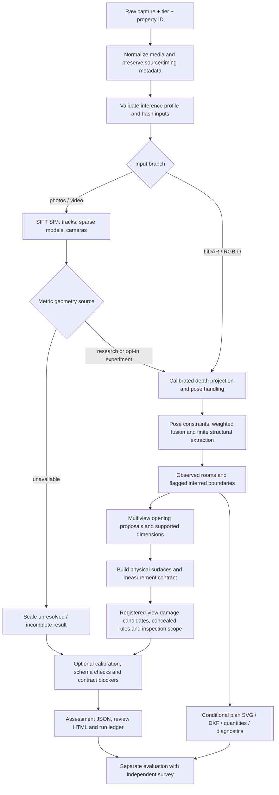

# End-to-end processing and output availability

Canonical processing flow for the final development state. The detailed module
map is [architecture](ARCHITECTURE.md); this page explains the executable route.

1. `run-capture` normalizes raw input into `intake/`. Intake/preflight failures
   retain `capture_attempt.json` and a failed result where possible.
2. `workflow.reconstruct` selects the configured branch. The strict photo
   profile forbids supplied depth/poses, manual scale and manual adjacency.
3. Reconstruction saves evidence. Insufficient scale/registration/structural
   support can leave a sparse model or diagnostic segments without a plan.
4. Layout detects supported room/surface geometry and openings. Independent
   capture stitching is a separate `stitch-captures` operation with verified overlap
   and graph constraints; it cannot force disconnected captures together.
5. Assessment writes surfaces, measurements, scope, coverage and review output;
   optional calibration is applied only with matching producer/settings.
6. `run_succeeded` checks ready geometry and written assessment; assignment
   profile additionally requires a complete contract and nonexperimental backend.
7. Evaluators read frozen output and separate truth. Synthetic tests, camera
   containment and exact replay do not replace measured field gates.

## Reading a result

| Question | Artifact / field |
|---|---|
| Did intake/reconstruction execute? | `result/run.json`: result status, errors and hashes |
| Is there supported geometry? | `result/plan.json` when present; `layout_diagnostic.svg` for supported partial segments |
| Is the output contract complete? | `assessment.json`: `contract_complete`, `contract_blockers`; `contract_coverage.json` |
| Are measurements available/calibrated? | Measurement value and interval fields; null means unavailable |
| What should be reviewed? | `report.html`: geometry, matching, missing outputs and damage candidates |
| Did physical gates pass? | Separate `evaluate-assignment` result against independent survey; not the report's mere existence |

LiDAR metric scale comes from depth units. Research RGB scale comes from
explicit reference measurements or experimental model predictions, each labelled.
Neither label certifies independently demonstrated accuracy.
