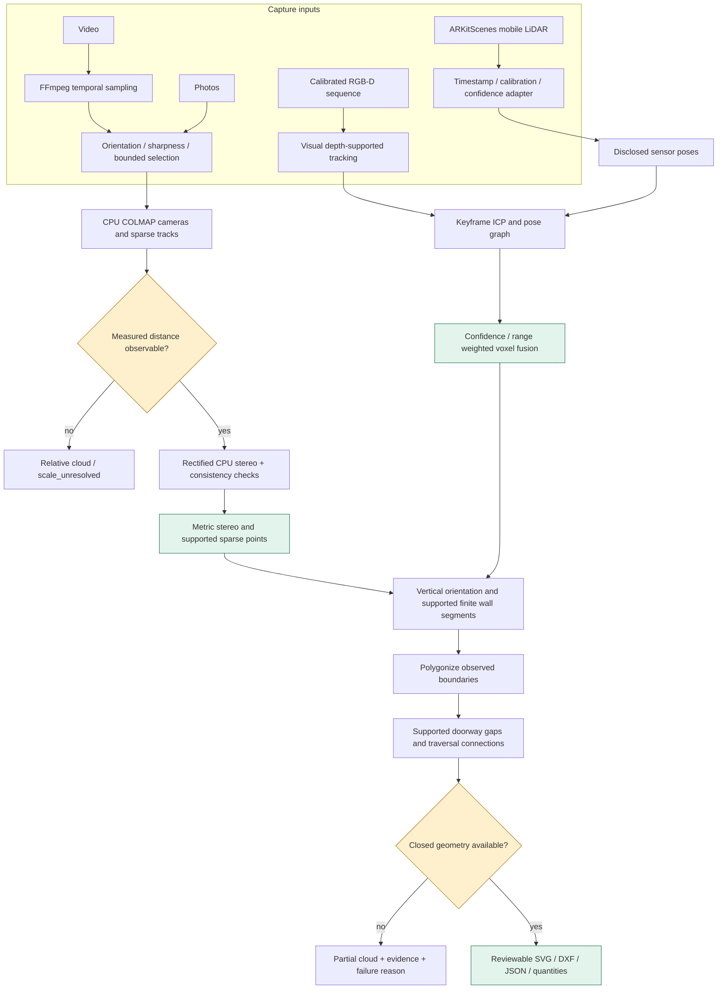
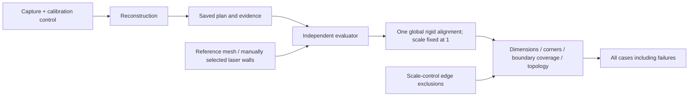

# Implementation, decisions and demo guide

This is a CPU research prototype, not a completed cm-accurate product across all
three tiers. The second implementation adds actual phone LiDAR ingestion,
multiroom geometry, verified RGB-D capture stitching, a metric RGB bridge, and
an independent evaluator. **RGB wall completeness remains the main blocker.**

## What runs

| Path | Implemented behavior | Evidence boundary |
|---|---|---|
| Photos/video | Quality-selected views, CPU COLMAP, triangulated measured scale, rectified SGBM depth, consistency filters, supported sparse tracks, shared layout extraction | Tested metric clouds; photos have incomplete boundaries and the tested video proposal fails topology |
| RGB-D | Depth-supported tracking, keyframes, ICP refinement, visually verified loop candidates, pose graph, weighted voxel averaging | ICL development and unseen trajectory are reported separately |
| Phone LiDAR | ARKitScenes synchronized RGB/depth/confidence, per-frame intrinsics, explicitly supplied sensor poses | Three physical venues acquired; one provisional scanner-derived room reference |
| Continuous multiroom | Finite wall segments, concave polygon rooms, doorway evidence, shared metric frame | Two-room L-shaped controlled fixture passes; exact simulated sensor poses disclosed |
| Separate captures | Visual 3D correspondences, ICP verification, global capture pose graph; disconnected components exported separately | Controlled overlapping captures in independently transformed coordinate frames |
| Outputs | SVG dimensions, DXF dimension entities and opening layer, plan JSON, quantity CSV | Doorway heights remain unknown unless supplied; no invented net wall area |

All automatically generated plans require review. `floor_plan_ready` means a
proposal was generated with adequate tracking and camera-center coverage, not independently
validated centimetre accuracy or a guarantee that the entire property was seen.
`accuracy_validated` stays false in reconstruction; only evaluation reports
measured errors. At least 90% of observed camera centers must lie in the proposed
rooms for a ready proposal. A truncated sequence stays partial. Property
coverage beyond what cameras observed remains unknown without a reference.

## Implemented data flow



Vertical can come from a supported horizontal plane or the intersection of two
supported wall directions. If the floor itself was not observed, the JSON says
so; wall projection does not create a fictitious measured floor elevation.
Current geometry is rectilinear: wall directions must be within 8 degrees of
the fitted axes, and retained segment RMS must be at most 3 cm. Unsupported
angles and missing corners produce incomplete geometry.

Small endpoint gaps up to 15 cm may be joined where perpendicular observed wall
segments meet. Nearby duplicate faces are suppressed only when cameras occupy
the same side. Doorway gaps of 0.55–1.4 m require traversal evidence. Unordered
photos never manufacture a traversal from filename ordering. An ordered photo
capture can explicitly set `ordered_capture: true`; video views retain ordering.

## Interfaces and reproducibility

Install all demo dependencies:

```powershell
& .\.venv\Scripts\python.exe -m pip install -e ".[sfm,rgbd,mapping,evaluation,test]"
& .\.venv\Scripts\python.exe -m floorplan.cli reconstruct examples\icl_rgbd.json --out demo\my_run
& .\.venv\Scripts\python.exe -m floorplan.cli benchmark examples\public_benchmark.json --out demo\my_public_suite
```

Every output directory must be fresh. `run.json` records configuration, input
hashes, source-code hashes, dependency versions, runtime, process-tree peak RSS,
status and failure reasons. `error.log` preserves unexpected exception traces.
Detailed geometry stays in `artifacts/`; successful plans also have stable
top-level `plan.json`, `plan.svg`, `plan.dxf`, and `quantities.csv` names.

A common manifest for depth inputs:

```json
{
  "schema_version": 2,
  "tier": "lidar",
  "sequence": "prepared/sequence.json",
  "optimize_poses": true
}
```

Sequence files contain `intrinsics`, positive `depth_scale`, and ordered `frames`
with unique IDs, RGB/depth paths, and optional confidence, timestamps, and
per-frame intrinsics. Supplied rigid `camera_to_world` matrices require
`pose_source: "sensor"`. ARKit's world-to-camera trajectory is inverted by the
adapter. RGB/depth pixels must already be aligned. Native RoomPlan USDZ and
arbitrary LiDAR file formats are not implemented importers.

An RGB manifest:

```json
{
  "schema_version": 2,
  "tier": "photos",
  "source": "photos",
  "camera_model": "PINHOLE",
  "camera_params": "481.2,480,319.5,239.5",
  "max_frames": 100,
  "matching": "exhaustive",
  "scale_references": [{
    "length_m": 1.0,
    "a": [{"image": "001.png", "pixel": [120, 180]}, {"image": "002.png", "pixel": [102, 181]}],
    "b": [{"image": "001.png", "pixel": [300, 180]}, {"image": "002.png", "pixel": [281, 181]}],
    "excluded_evaluation_edges": []
  }]
}
```

These illustrative pixels are not runnable measurements. Each endpoint needs at
least two registered views, 2-degree triangulation parallax, positive depth and
at most 2-pixel reprojection error. Multiple measured controls must agree within
3%. A known camera calibration must match the selected image orientation and
resolution; calibrated mixed lenses need separately prepared captures. Images
containing controls are retained during selection. For video, inspect the
extracted frame names before supplying pixel controls.

`sfm_cache` optionally points to an existing unified run. Input hashes and SfM
configuration must match before reusing its model. This supports correcting
measurement annotations without re-running minutes of feature matching. Cache
source hashes are recorded; a fresh result directory is still required.

Separate RGB-D captures:

```powershell
& .\.venv\Scripts\python.exe -m floorplan.cli stitch-captures demo\capture_a demo\capture_b --out demo\joined
& .\.venv\Scripts\python.exe -m floorplan.cli evaluate-plan demo\joined\component_0\plan.json reference.json --out demo\joined_metrics.json
```

Separate RGB-only models are not automatically merged by this command. Supply
their overlapping photos/video views to one SfM reconstruction instead.

## Accuracy protocol



Targets are P95 wall-length error <=3 cm, P95 corner error <=5 cm, at least 90%
reference boundary coverage within 5 cm, and correct room connectivity/count.
Missing rooms and wrong corner counts cannot pass. ICL rectangle-only results
do not qualify as complete topology/corner evaluations. The 1 cm uncertainty
floor assigned to the hand-selected FARO reference is an explicit assumption,
not a certified survey tolerance; nominal passes are provisional.

## Deliberate choices and remaining work

- **CPU baseline:** COLMAP/OpenCV/Open3D run on this machine. No learned metric
  depth or GPU inference is required. CPU stereo currently misses important
  walls; this is the priority for the next iteration.
- **Weighted point fusion:** averages every observation using confidence and
  inverse-range weighting. Full TSDF integration was not implemented; avoid
  describing the current point averaging as TSDF.
- **Direct segment polygonization:** chosen for traceable wall support and
  concave rooms. An occupancy/free-space watershed backend was not implemented.
- **Bounded mapping:** keyframe ICP, verified nearby visual loops and global
  optimization are implemented. Full relocalization after tracking loss and
  robust large-property drift handling remain open.
- **Frame QA:** orientation, sharpness and temporal coverage are implemented.
  Stereo pair selection uses baseline, orientation and shared tracks; a
  dedicated parallax-aware capture keyframe policy remains future work.
- **Confidence:** evidence/residuals are exported; calibrated per-dimension
  uncertainty intervals are not yet estimated.
- **Validation:** actual phone data and scanner references are downloaded.
  Two held-out venue references still need structural annotation; one unseen
  ICL trajectory remains a failed capture. No broad field accuracy claim.
- **Next upgrades:** improve textureless-wall reconstruction, add guided overlap
  and scale capture, then evaluate GPU multiview/learned-depth methods under the
  same leakage-free metric protocol. Validate independent properties before
  offering restoration estimating accuracy guarantees.

## References used in implementation

- [COLMAP / PyCOLMAP](https://colmap.github.io/pycolmap/index.html)
- [Open3D multiway registration and pose graphs](https://www.open3d.org/docs/release/tutorial/pipelines/multiway_registration.html)
- [OpenCV StereoSGBM](https://docs.opencv.org/4.x/d2/d85/classcv_1_1StereoSGBM.html)
- [ARKitScenes raw formats](https://github.com/apple/ARKitScenes/blob/main/raw/README.md)
- [ARKitScenes trajectory conversion reference](https://github.com/apple/ARKitScenes/blob/main/threedod/benchmark_scripts/utils/tenFpsDataLoader.py)
- [ARKitScenes dataset terms](https://github.com/apple/ARKitScenes/blob/main/LICENSE)

Read [V2 results](V2_RESULTS.md) for the measured outcomes, including failures.
