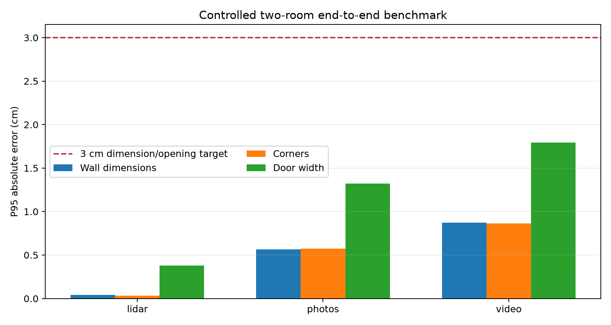

# V3 measured results

**Scope correction, 2026-10-06:** these are historical custom-benchmark results,
not passes against the newly supplied Cozmo brief. The [compliance audit](ASSIGNMENT_COMPLIANCE.md)
details the differences in inputs, outputs, data composition and scoring gates.

The CPU demo now completes all three input tiers on the controlled two-room scene.
This is a meaningful prototype milestone, not evidence of field accuracy on arbitrary
phone captures.

| Tier | Status | P95 wall dimension | P95 corner | P95 doorway | Topology |
|---|---|---:|---:|---:|---|
| Photos | Proposal | 0.565 cm | 0.573 cm | 1.321 cm | Pass |
| Video | Proposal | 0.872 cm | 0.865 cm | 1.794 cm | Pass |
| Simulated LiDAR | Proposal | 0.043 cm | 0.031 cm | 0.380 cm | Pass |

All three have two matched rooms, the correct connection, full 5 cm boundary
coverage, and no reference-fitted scale. The photo/video scale comes from the
simulated 0.5 m measured control. Photo camera ATE is 0.508 cm RMS after one global
rigid alignment with scale fixed. The scene, motion, imagery, and LiDAR remain
synthetic and correlated, so three passes are not three independent properties.

## Failure analysis and improvement

The original fixture registered all 97 RGB views but had 109 cm camera ATE RMS.
Its texture repeated every 6.39 m across a 7 m wall; the reconstruction contained a
6.17 m adjacent-camera jump. Fixed intrinsics produced 109 cm RMS again, proving
calibration drift was not the cause. A non-repeating texture reduced ATE to 0.508 cm.
The old capture remains as a regression and is rejected before densification.

OpenMVS recovered 88,734 dense points from public ICL photos, but observed walls did
not close a room. This is reported as incomplete geometry. OpenMVS therefore improves
the controlled case without being presented as a universal RGB solution.

## Public-data evidence

| Case | Result | Measured evidence |
|---|---|---|
| ICL development | Proposal | 0.96 cm maximum side-length error; rectangle dimensions only |
| ICL held-out trajectory | Incomplete | All 194 sampled frames tracked; walls still do not close a room |
| ARKitScenes development | Proposal | 1.96 cm P95 dimensions against provisional FARO-derived reference |
| ARKitScenes held-out 1/2 | Proposal | No reviewed polygon references, so no accuracy claim |

The ARKit reference is a manual region selection followed by robust wall-line fitting
on the registered laser scan. It has an assumed 1 cm uncertainty floor and has not
been independently reviewed. The held-out laser scans are retained, but occlusion
and connected spaces prevent responsible automatic rectangle labels.

Tests: 18 passed. Run ledgers record inputs, dependency versions, peak memory, code
hashes at start and completion, external executable hashes, and failure reasons.
Raw evidence is in `demo/v3_verified`, `demo/v3_public_final`, and
`docs/results/v3_results.json`.

The outstanding acceptance evidence is repeated real-phone capture accuracy across
independent properties and devices. Until that exists, every output keeps
`accuracy_validated: false` and `proposal_requires_review`.
