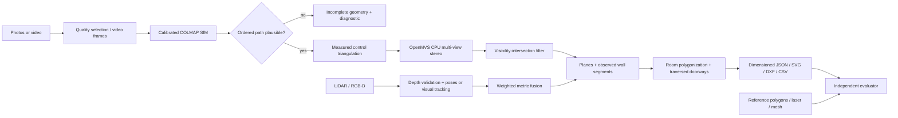
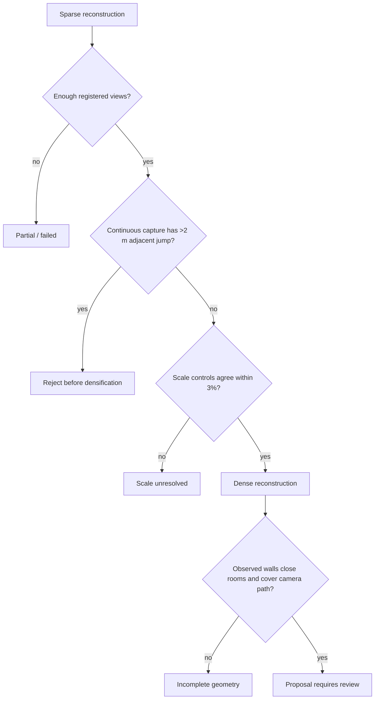

# Multi-view reconstruction baseline and implementation decisions

This iteration makes the CPU photo/video path materially useful while retaining
the conservative failure behavior required for property-restoration measurements.
It does not establish cm accuracy on arbitrary phones or properties.

## End-to-end architecture



Ground truth enters only the evaluator. Capture manifests reject reference assets.
RGB needs a measured scale visible in at least two registered views. LiDAR/RGB-D
uses calibrated depth units. All exports remain review proposals.

## Failure handling



The adjacent-camera check catches the V2 failure where repeating texture created a
6.17 m false jump. It is a failure screen, not proof of pose accuracy. Unordered
photo sets skip this temporal assumption unless `ordered_capture` is declared.

## Key decisions

| Decision | Reason | Evidence / limitation |
|---|---|---|
| Pin OpenMVS 2.4.0 CPU binaries by SHA-256 | Stronger multi-view consistency than the local pairwise stereo baseline | External AGPL-3.0 dependency; installer records source and checksum |
| Disable tower ROI/cropping | Indoor captures are rooms, not isolated towers | Full capture may cost more memory |
| Apply visibility-intersection filtering | Removed unsupported doorway-edge points | Controlled opening error fell from 19.2 cm to 1.3 cm |
| Fix supplied intrinsics during bundle adjustment | Calibration is measured input | Did not repair the repeating-texture failure by itself |
| Lower SIFT contrast threshold for RGB-D | Feature-poor painted walls still contain useful texture | PnP and metric depth checks remain mandatory |
| Retry up to five RGB-D frames | Recover from brief weak views without inventing poses | Frames are skipped; longer failures still stop tracking |
| Include doorway widths in pass/fail | Restoration quantities depend on openings | Threshold is 3 cm P95 for this demo |

The OpenMVS adapter runs `InterfaceCOLMAP`, dense reconstruction, and the visibility
filter as isolated subprocesses. It saves exact commands, executable hashes, logs,
runtime, and intermediate scene files. Installation is reproducible through
`scripts/install_openmvs.py`; downloaded binaries stay under ignored `.tools/`.

## Reproduction

```powershell
& .\.venv\Scripts\python.exe scripts\install_openmvs.py
& .\.venv\Scripts\python.exe scripts\datasets\make_multimodal_fixture.py datasets\controlled_multimodal_v3_new --dense-backend openmvs --ordered-photos
& .\.venv\Scripts\python.exe -m floorplan.cli benchmark datasets\controlled_multimodal_v3_new\suite.json --out demo\v3_new
& .\.venv\Scripts\python.exe -m floorplan.cli benchmark examples\public_benchmark.json --out demo\public_new
& .\.venv\Scripts\python.exe -m pytest -q
```

The generated fixture is deterministic but synthetic. Reusing `sfm_cache` is allowed
only when the workflow verifies capture hashes and reconstruction configuration.

## Open-source references used

- [COLMAP tutorial](https://colmap.github.io/tutorial.html): sparse camera recovery
  followed by dense multi-view reconstruction.
- [OpenMVS v2.4.0 release](https://github.com/cdcseacave/openMVS/releases/tag/v2.4.0):
  pinned Windows CPU release and dense-reconstruction improvements.
- [OpenMVS usage guide](https://github.com/cdcseacave/openMVS/blob/develop/docs/wiki/Usage.md):
  COLMAP interface and CPU reconstruction workflow.
- [ARKitScenes](https://github.com/apple-aiml-research/ARKitScenes): mobile RGB-D
  captures and registered laser scans used for real-phone testing.

## Remaining route to the product goal

1. Collect multiple real phone properties with independently surveyed corners,
   wall lengths, openings, and capture repeats across devices.
2. Replace frame-to-frame RGB-D tracking with relocalizing keyframe SLAM and expose
   uncertainty from calibration, scale controls, poses, plane fits, and wall joins.
3. Add semantic wall/door evidence and occupancy reasoning for occluded boundaries,
   but keep inferred geometry visibly separate from measured geometry.
4. Validate by property, not by frame: held-out houses, device models, operators,
   lighting, damage conditions, and repeated captures.
5. Define a release gate such as P95 wall/opening error <=3 cm, P95 corners <=5 cm,
   >=90% observed-boundary coverage, correct topology, and a low false-pass rate.

