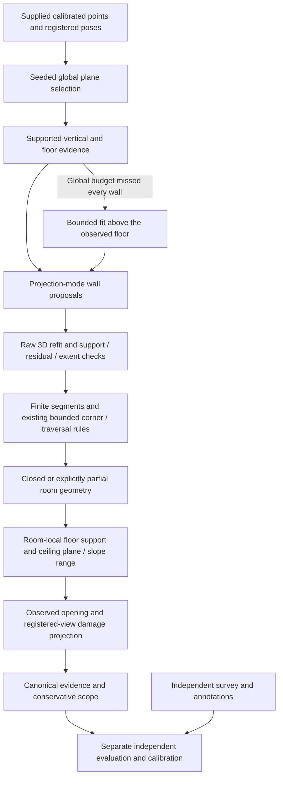

# Implementation evidence history

This consolidated record preserves completed engineering work and its original evidence scope.
Use [validation and decisions](../validation.md), [Fix Loop](../fix_loop.md) and
[compliance](../compliance_matrix.md) for the current submission status. The sections
below are historical evidence, not an active development plan. Measurements,
producer identities and acceptance limitations retain their original meaning.

## Reading map

| Section | Scope |
|---|---|
| [Contract, calibration and reliability corrections](#contract-calibration-and-reliability-corrections) | Contract, calibration and error-handling corrections |
| [Supplied-capture reconstruction integration](#supplied-capture-reconstruction-integration) | Supplied-capture integration and partial reconstruction |
| [Sensor synchronization and boundary evidence](#sensor-synchronization-and-boundary-evidence) | RGB timing, wall support and room-boundary validation |
| [Consolidated implementation and acceptance ledger](#consolidated-implementation-and-acceptance-ledger) | Historical outcomes and acceptance limitations |

These records supersede the separate implementation, completion, supplied-data
and sensor-boundary ledgers. Exact earlier versions remain in Git history.

## Contract, calibration and reliability corrections

This checkpoint preserved existing local work and distinguished software changes
from surveyed acceptance. Its results remain historical evidence.

This is the earlier frozen checkpoint. The subsequent
[supplied-data continuation](implementation_history.md#supplied-capture-reconstruction-integration) records the latest
wall/floor/ceiling, loop, damage and intake fixes, 133 serial passing tests and
fresh partial supplied-data results. Numbers below retain their historical meaning.

### Priority and observed outcomes

1. CHANGE-06 calibration consistency: confirmed that inferred depth was being
   backprojected with a different SfM camera. The pinned MoGe API accepts horizontal
   FOV only; a centered square-pixel virtual camera now conditions inference, and
   depth is resampled back into the rectified source camera. Invalid calibration
   is rejected; unsupported borders are masked. RGB-inferred K uses pixel-center
   coordinates consistently. This remains an experimental metric prior.
2. CHANGE-09 camera alternatives: same public six-second development video,
   same quality selection and exhaustive matching: explicitly shared SIMPLE_RADIAL
   camera registered **2/12**, versus the historical auto-camera checkpoint **6/12**.
   Shared calibration is an explicit configuration option, not the new default.
   This comparison does not establish an advantage on other captures or lenses.
3. CHANGE-06 actual replay: `demo/phase3_remaining/icl_conditioned/result/run.json`
   recorded unchanged source, 33.03 s reconstruction / 33.46 s including intake.
   Previously the same RGB-only synthetic development control rejected its metric
   prior. Conditioned inference accepts **233 tracks across three views**, log-ratio
   p80 **0.09473** against the unchanged 0.25 development rejection bound. Still
   **3/4** original images register; no supported closed room is produced. This is
   a development diagnostic improvement, not physical accuracy or Part 4 proof.
4. CHANGE-09: requested correction on/off reaches the experimental RGB sequence
   and roomwise fallback. Rejected frames preserve original path boundaries;
   tracking gaps cannot manufacture doorway traversal. Continuous pieces refine
   independently, without sequential constraints/interpolation between photo views.
   ICP additionally bounds rotation, and rejected sequential ICP keeps a weak raw
   pose prior instead of claiming strong geometric information.
5. CHANGE-10: capture links now check rigid transforms and verified cycle residuals;
   redundant cycle constraints are uncertain. Registered views/poses/depth units
   survive property fusion for shared opening/damage projection. Room identities
   use one-to-one transformed polygon overlap; unresolved identities stay failures.
6. CHANGE-11: shared walls use camera-side/room visibility so one image does not
   assign the same mark to both faces. Evaluated-no-candidates is explicitly
   different from no registered views. Independent annotation scoring reports
   misses, phantoms, class precision/recall, IoU and metric extents, including clean
   control surfaces. It never promotes an unvalidated classifier automatically.
7. CHANGE-04/12/13: the survey CSV importer rejects blank templates, missing walls,
   mixed property identities and missing external reading evidence. Direct surveyed
   wall lengths are preserved in assignment/repeatability scoring. Raw tables and
   evidence are hashed; derived references never enter reconstruction. Unannotated
   damage is unavailable, while explicit clean-control rows can be scored. Shared
   wall net-area references remain unavailable without their face association.
8. CHANGE-12: calibration records now have a builder from frozen assessment/run
   artifacts and independent measurement references. Missing estimates/references,
   mismatched units/kinds, duplicate records and mixed producers are explicit.
   Producer identity includes tier/camera grouping; calibration is fitted per tier
   and frozen recipe. A source/configuration change requires refitting.
9. CHANGE-05/09: orientation-corrected normalized and selected photos retain their
   EXIF camera metadata. Every quality candidate is accounted for with its selection
   or rejection reason. Metadata remains a camera prior, not a surveyed K matrix.
10. CHANGE-06/09: independent-photo registration now searches any of up to 24
    registered views, rather than relying on filename order or video-sized motion.
    Default ordered-video motion bounds remain unchanged. All paths require at
    least 20 mutually consistent depth correspondences and verified reprojection
    after metric refinement. Previously a failed metric-depth refinement could
    leave a successful PnP pose eligible for use; it is now rejected. An unusable
    first view can be skipped without preventing later initialization.
11. CHANGE-03/06: repeated video runs exposed sensitivity at the scale bound.
    Matching now uses one CPU thread, while all existing seed controls remain.
    Three actual serial SfM trials produce identical camera parameter arrays,
    registered counts (**6/12**) and sparse point counts (**85**). Torch inference
    additionally sets seed 7 and deterministic algorithm mode. This establishes
    only the tested configuration's repeatability, not cross-machine guarantees.
12. CHANGE-08: observed jamb/header measurements no longer require an observed
    ceiling. Sufficient actual wall support bounds the detector raster; it does
    not become a ceiling estimate or an assumed opening height. The existing
    multi-view through-ray and raw-edge evidence requirements remain.
13. CHANGE-06/10: a successful verified roomwise fallback is not downgraded by
    the failed initial global SfM model. Conversely, a partial child plan is not
    enough to enter property fusion. Experimental and incomplete assessment
    contracts still cannot report assignment success.

### Alternatives evaluated from source

The evaluated height-band reconstruction approach at `d5105858440bdb549626845948bc51da8a8b9f02`:
`scanplan/ingest/photos.py`, `ingest/video.py`, `geometry/register.py`.
Exif-informed camera selection and floor-orientation handling were considered.
Its photo path explicitly does not reconstruct SfM or automatically stitch;
fixed default FOV/rectangular estimates/side-by-side placement cannot close our
strict-photo requirements. Its video requires external poses. Raster registration
is useful for evaluation pairing but lacks the visual verification needed for
repetitive-room inference. Those substitutions were not adopted.

The evaluated projection-based reconstruction approach at `c9dfacbed60ddb6554a7c9b6721696dfb748013a`:
`cozmoscan/capture/photo_tier.py`, `video_tier.py`, `geometry/stitching.py`,
`damage/scope.py`. Motion/coverage-aware keyframe selection and surface-linked
scope were considered. Its photo scale assumes camera height/levelness; video
consumes VIO; stitching requires connectors and lacks cycle closure. These do not
solve our selected stock-camera route. Retain verified constraints, calibrated
intervals and inspection scope; do not introduce assumed heights, manual links
or automatic drywall removal from a visual candidate.

The MoGe conditioning change follows its documented, inspected pinned API:
[MoGe infer](https://github.com/microsoft/MoGe/blob/74fbce054ebed49800de42d0ad0e83495065719a/moge/model/v2.py).
Source alternatives were inspected; they were not installed or benchmarked here.

### Validation so far

- Camera/contract/SfM targeted suite: 26 passed (4.67 s).
- Boundaries/cycles/identity/camera/contract/existing plan suite: 32 passed (8.36 s).
- Shared-wall visibility/damage scoring/assessment/boundaries: 12 passed (2.85 s).
- Shared-camera SfM experiment and conditioned RGB replay described above.
- Survey/calibration/ablation/accuracy/repeatability targeted suite: 28 passed
  (6.22 s). Expanded full suite: 105 passed (19.87 s), before adding the RGB
  correction-off regression; that targeted six-test file passes (1.24 s).

The first full replay against the earlier checkpoint expectations verified three
cases, but the video case no longer satisfies its historical partial-output claim.
Conditioning depth on the actual estimated camera rejects the public clip's global
metric prior. The failed reproduction is retained in
`demo/phase3_remaining/reproduction`. This is a stricter failure outcome, not a
video capability improvement. A second replay crossed the same bound in the other
direction and did not reproduce rejection (`reproduction_final`, retained).
After serializing matching, the full video replay `serial_video` produces a
partial result: 6/12 sparse registration, 6/6 derived views tracked, 257 supported
tracks across five views, log-ratio p80 **0.2476736**, no plan; 55.37 s reconstruction.
Its ledger records unchanged source. The current manifest expects this tested
partial state, retaining the **0.25** bound. It does not count failure cases as
successful captures. `metric_scale_attempt.json` records verified sparse/model depth samples
and the accepted scale evidence or rejection reason for reproducible diagnosis.

The actual overlap/fusion path was exercised with the generated two-room control
in two coordinate gauges (the SAME synthetic frames, deliberately not independent
captures): `demo/phase3_remaining/stitch_control/stitched`. It finds one verified
edge (2,000 visual inliers), one connected component, two room polygons, and
retains **194/194 unique merged frame IDs** with depths normalized to metres in
**10.59 s**. One-to-one room association correctly reports duplicate source-room
identities as unresolved. This cannot count as a same-tier physical repeat or a
strict photo-property acceptance pass. The second-gauge reconstruction's ledger
records unchanged source.

The actual identical-input correction on/off synthetic control keeps two rooms
in both modes. It compares 97 shared frames, union footprints 20.000019 / 19.998554
m², and no verified loops. Maximum camera change is approximately 1e-15 m, so
`verified_drift_correction_demonstrated` is **false**. Tiny voxel/plane differences
are not reported as drift repair. This synthetic run cannot close the required
physical multi-room drift row.

Further targeted registration/intake/contract suite: **29 passed (7.99 s)**.
Expanded full suite before the last deterministic-Torch flag: **110 passed
(19.01 s)**. The final source/reproduction results follow.

#### Final verified source checkpoint

- The last opening/fallback changes pass their targeted suite: **24 tests in
  5.37 s**.
- Fresh isolated-source full suite: **113 passed in 22.73 s**, under
  `demo/phase3_remaining/isolated_source_v2`. Package import was independently
  checked to resolve within that copy; it has no `datasets/` or previous `demo/`
  assets. It reuses the installed workstation environment, so this is not a
  clean-machine installation or timing claim.
- Final reproduction summary (separate handoff: `demo/phase3_remaining/reproduction_verified_v2/reproduction.json`):
  **4/4 cases verified, 25/25 declared claims passed**, none skipped/historical.
  Each run records `code_changed_during_run: false` and a written assessment.
  Photo/video/LiDAR nonzero exits are expected incomplete outcomes, not successful
  assignment captures.
- Three-page checkpoint PDF (separate handoff: `demo/phase3_remaining/technical_checkpoint_verified_v2/technical_checkpoint.pdf`)
  was generated from those four fresh cases and inspected visually on all three
  rendered pages. It has no clipping/overlap and remains explicitly
  `final_submission: false`. Full ledger hashes and measured timings are in its
  companion `report_metadata.json`.
- Final source comparison confirms all **37 Python modules** match the tested
  isolated copy. The actual `import-survey` CLI rejects the blank template with
  exit 1; its log is `demo/phase3_remaining/blank_survey_cli.log`. Git whitespace
  validation passes with CRLF-aware settings. No commits or pushes were made.

| Fresh case | Geometry outcome | Reconstruction s | Total capture s |
|---|---|---:|---:|
| Supplied extracted RGB photos | incomplete; 1/4 derived views; no closed plan | 54.59 | 55.93 |
| Public video proxy | partial; 6/12 sparse originals, 6/6 derived views; no plan | 57.78 | 58.13 |
| Supplied single-room LiDAR | incomplete boundary; 115/115 tracked; no plan | 11.84 | 33.05 |
| Generated two-room control | research proposal; two rooms, one adjacency | 9.39 | unavailable: normalized input |

The control's ceiling and interval gates still fail. No fresh case satisfies the
complete assignment contract. Timings exclude first model/asset installation.
Passing reproduction checks establish the stated outcomes, including failures.

#### Requirement disposition

The approved plan's complete-requirement statuses are not replaced with green
rows for component function presence. The following maps the remaining holds
back to its REQ IDs.

| REQs | Locally completed paths | What still prevents acceptance |
|---|---|---|
| 01, 04, 06, 39 | Stock-route documentation, supplied sensor intake, CPU operation, provenance/disclosures | Literal operator rehearsal, native/current-app exports and measured device evidence |
| 02, 03, 05, 07-10, 17-18, 28-29 | RGB feasibility path, verified poses/fusion/identity, supported geometry/openings, common contract, CLI and rendering | Strict RGB and supplied geometry remain incomplete; all-tier measured property output and accuracy are not proved |
| 11-13, 20, 40 | Face-aware damage projection, conservative fired rules/inspection scope, independent class/extent scorer | Furnished two-class damage and clean/adverse-condition annotations; validated detector behavior |
| 14-15 | Frozen record builder, producer-bound property-grouped fitting and independent audit | Adequate independent calibration/audit properties and complete measurement groups |
| 16 | Internal validation explicitly separated from official acceptance | Published schema absent; external-spec hold |
| 19, 21-27, 30, 38 | Benchmark audit, direct-survey importer, detection/repeat/drift/consumer scorers | Same measured property with three rooms plus connector across tiers, independent repeat, raw truth and actual two-room app export; effective physical drift demonstration |
| 31 | Prospective declaration/snapshot/replay/diff and integrity checks | A future own worst measured gate declared before fixing; raw measured before/after |
| 32-37, 41-42 | Saved plan/design/decisions, portable tests, fresh verified development reproduction, checkpoint PDF and failure/integrity checks | Genuine milestone history, measured final bundle/report, official rule resolution, timed clean install/fresh result and unseen-phone rehearsal |

REQ-04 and rendering/rules/scope have tested local implementations as in the
approved plan; their full all-tier physical acceptance is a separate obligation.
The missing Round 1/LiDAR wall definition remains unavailable. No assumptions,
synthetic properties or undocumented scale controls were introduced to close it.

### Acceptance dependencies that remain

Strict RGB still lacks complete native-photo/property reconstruction and measured
accuracy; no available data establish cm accuracy. The physical benchmark needs
three nonconnector rooms plus a connector, furnished two-class damage/clean
annotations, identical property across all tiers, independent repeat, laser/tape
truth, actual two-room consumer export/version and calibration/audit properties.
Official schema/Round 1 definitions, prospective worst-measured-gate fix,
clean-machine timing and unseen-phone rehearsals are still pending. Component
success must not be presented as any of these acceptance results.

### Files changed in this remaining-gap pass

This list identifies this pass's work rather than claiming every dirty file in
the workspace was changed here. Earlier Phase 3 changes remain intact.

- Added `floorplan/pose_graph.py`, `damage_evaluation.py`, `survey.py` and
  `calibration_records.py` for verified constraints/identity and independent
  annotation, survey and calibration evidence paths.
- Updated `floorplan/rgb_metric.py`, `sfm.py`, `ingest.py`, `rgbd.py`,
  `mapping.py`, `stitching.py`, `workflow.py` and `openings.py` for camera/depth
  consistency, capture accounting, deterministic matching, metric registration,
  pose correction modes, property fusion and observed opening handling.
- Updated `floorplan/damage.py`, `ablation.py`, `assignment_gates.py`,
  `repeatability.py`, `provenance.py`, `uncertainty.py`, `benchmark.py` and
  `cli.py` for face visibility, independent evaluation and producer binding.
- Added `tests/test_rgb_camera_consistency.py`, `test_pose_boundaries.py`,
  `test_damage_validation.py`, `test_survey_records.py`,
  `test_metric_registration.py`; updated `test_ablation.py`, `test_ingest.py`,
  `test_openings.py` and `test_phase3_contract.py`.
- Updated the CPU dependency lock (`requirements/windows-cpu.txt`), README,
  Phase 3 design/status/operations, assignment compliance/brief map and this ledger; updated
  `benchmarks/manifests/checkpoint_reproduction.json` with current verified
  development outcomes. The approved implementation plan stays unchanged.

New CLI paths are documented in [operations](../reproducibility.md). Real data
remain outside inference truth inputs and outside the small tracked fixtures.

### Recommended next acceptance sequence

1. Supply native 2/4/8 stills and a native video of one furnished room, with an
   independently surveyed floor, every wall, ceiling and opening. Include doorway
   context. Run inference before evaluating the sealed truth. The first goal is
   complete supported geometry; then score dimensions and detection errors.
2. If a required measured gate fails, freeze that baseline and evaluator and make
   the prospective declaration before the next corrective producer change.
   Existing changes in this pass cannot satisfy that prospective requirement.
3. Expand to the required three rooms plus connector, all tiers, independent
   repeat and labelled two-class damage/clean controls. Obtain an actual named,
   versioned consumer export for two of those rooms.
4. After the measurement recipe freezes, collect adequate independent calibration
   properties and separate audits; refit after any subsequent producer change.
5. Resolve the official schema/Round 1 definitions, regenerate the measured bundle
   and final report, and perform clean-machine and unseen-phone rehearsals.

This sequence is a validation path, not a claim that measured data alone will fix
RGB registration or incomplete geometry. Those capabilities remain engineering
risks until the native and measured runs succeed.

## Supplied-capture reconstruction integration

This continues the earlier contract and reliability checkpoint.
The [assessment](../specification/applied_ai.html) remains the source of requirements.

### Verified baseline and first actionable defect

The current regression baseline passes **113 tests in 20.24 s**. Existing dirty
files were preserved. A fresh raw `single_room/c00a170fe1` capture reproduces
`incomplete_geometry`, tracking all 115 sampled frames. Fresh current-source
replays of the existing normalized supplied floor/ceiling inputs track 175/300
frames respectively and also produce no closed plan. These are inference sensor
inputs, not independent truth; nearby scan times do not establish repeat identity.

`scripts/diagnostics/diagnose_supplied_geometry.py` renders frozen fused points, fitted wall
segments and camera paths, preserving cloud/run hashes. The ceiling cloud has
observed cross-walls omitted by the 14-plane global RANSAC budget: many selected
planes are horizontal furniture surfaces. The rendered support is integration
evidence; it cannot supply laser dimensions or certify wall semantics.

### Alternatives actually evaluated

- Inspected The evaluated height-band reconstruction approach's pinned `scanplan/geometry/walls.py`: wall-height-band
  projection produces structural proposals. Its room-independent histogram and
  broad support idea is relevant, but raster filling/dilating an apparent
  footprint cannot certify an unobserved boundary here.
- Inspected The evaluated projection-based reconstruction approach's pinned `cozmoscan/geometry/manhattan_room.py`: projection
  modes select wall positions. Its rectangular box and raw-extent fallback do
  not satisfy the project's concave/observed-boundary requirements.
- Ran raw projection-mode/SVD proposals against the frozen single/ceiling clouds.
  The first variant added 19/55 planes; most were too weak to justify adoption.
  A height/length filter alone still added 18/54. Neither variant was integrated.
- Retaining the existing RANSAC-equivalent 250-point support minimum and bounding
  candidate fits to 12 per axis reduced the proposals to 9/12. These recover
  partial observed geometry while retaining low coverage/incomplete status.
- Tested a one-micrometre union precision grid on those same proposals: it did
  not improve the observed outcome, so that numerical change was not adopted.

These are local development comparisons, not physical accuracy experiments or
prospective Part 4 fix evidence. Reference revisions remain the ones recorded in
the approved plan; no implementation was copied.

### Implemented wall-completion change

CHANGE-07/10; REQ-07, 10, 42 (partial requirements remain partial).

`layout._supported_wall_proposals` proposes omitted wall planes using the
already established floor/wall basis. It refits actual three-dimensional support,
requires the original RANSAC-equivalent sample support, residual <=2.5 cm,
supported height/length spans and existing vertical/orientation limits. Weak
table/column modes and duplicate observed planes are rejected. Histograms are
memory bounded; at most 24 seed fits are considered. These are documented
development settings, not dimensional acceptance tolerances.

One observed wall plus the supported vertical can establish projection axes;
the former three-wall precondition prematurely stopped extraction when global
plane selection missed other observed walls. Finite boundary extraction,
camera coverage, existing 15 cm corner bounds, traversal checks and explicit
partial status still determine geometry readiness. The method does not fill
unobserved walls or assume ceilings. New raw-support proposals are recorded in
`layout_evidence.json` and plan provenance.

The first regression exposed an actual extrema-bin omission in the new proposal
histogram (1 failure, 21 passing). Empty border bins fix it without changing
support thresholds. The corrected targeted geometry/opening suite passes
**22 tests in 6.42 s**, including omitted-but-observed cross-walls, a genuinely
missing boundary, furniture/column rejection and the existing two-room topology.

### Supplied-data replay procedure

```powershell
.\.venv\Scripts\python.exe scripts/evaluation/reproduce_artifacts.py benchmarks/manifests/supplied_geometry_reproduction.json --out demo\fresh_supplied_replay
```

This current development manifest explicitly names the normalized capture
manifests whose raw sources are `datasets/Given_dataset`. It requires the local
raw-data/intake volume. The single-room normalization is freshly reproduced in
this pass; the floor/ceiling normalizations retain their previously inventoried
omissions and hashes. Direct reconstruction timing excludes intake. To redo
intake too, run `run-capture --tier lidar --source <original-session> --max-frames
120/180/300 --profile assignment --property-id <documented-property> --out <fresh>`
for single/floor/ceiling respectively. Keep identity unverified until confirmed.

All incomplete assignment captures must exit nonzero and write assessment/report
artifacts. A regenerated failure or additional plausible room is not a measured
acceptance pass.

### Additional confirmed defects corrected

- CHANGE-07: the supplied floor-labelled scan actually contains captured walls.
  Its global 14 selections were all horizontal. An executed above-floor-band
  RANSAC trial recovered three vertical planes and a partial cell at 9.14% camera
  coverage. The integrated bounded fallback requires an already observed floor,
  refits only captured points and preserves the global-equivalent minimum
  support. It never derives wall directions from a truly floor-only cloud.
- CHANGE-09: historical loop verification no longer applies the consecutive
  video's 45-degree/1-metre motion bounds. Descriptor, reprojection, metric-depth
  and ICP checks remain; sequential tracking keeps its limits. The targeted
  loop/registration/ablation suite passes **10 tests in 3.10 s**, with actual
  Open3D graph/ICP exercised and a stubbed visual constraint in the loop test.
- CHANGE-11: apply the damage view budget after retaining registered trajectory
  frames. Otherwise all uniformly sampled views can be rejected, hiding usable
  imagery. No empty/missing trajectory can fall back to unregistered raw poses.
  A new test also exposed valid integer JSON wall endpoints crashing division;
  projection now converts them to floating-point coordinates.
- CHANGE-04/11/12: damage scoring preserves an independent measured area apart
  from its association polygon; all metric extents are validated even when a
  region is unmatched. Duplicate region IDs and surveys containing only excluded
  raw readings are rejected. The first damage regression found the integer
  endpoint failure (1 failed, 31 passed); the corrected targeted suite passes
  **32 tests in 5.05 s**. Expanded failure-path checks pass too.
- CHANGE-03/05/09: stock-video intake ignored the CLI frame budget. It now honors
  smaller supplied budgets while preserving the previous default ceiling of 180
  selected frames. The requested budget is recorded in intake. The targeted
  capture/camera/SfM suite passes **23 tests in 6.49 s**.
- CHANGE-07/08/11: floor observation is checked in each room, using clipped
  occupied cells; a neighboring room's floor cannot certify it. A broad table
  cannot replace the observed storey datum. Openings and damage projection use
  the room's observed datum, with unknown rooms withheld. Stepped floors outside
  that common datum need additional geometry; they are not guessed.
- CHANGE-07: ceiling plane height is evaluated at the room centroid, not at the
  arbitrary global origin. A translated tilted-plane regression proves gauge
  invariance. Resolved slopes retain the observed height range/centroid proposal
  while withholding scalar acceptance pending a scoring definition. The 3 cm
  slope-resolution and 4 cm storey-datum guards are development observation
  settings, not relaxed dimensional gates. Canonical assessment retains this
  evidence and explicit missing-height reasons.

No existing changes receive a retrospective measured worst-gate declaration.
Producer hashes change with these measurement changes; calibration must be
rebuilt from a subsequently frozen recipe and genuinely independent properties.

The derived RGB pose world may have arbitrary axes. `rgbd.reconstruct_rgbd` now
uses the first retained camera's down axis in that world as its weak prior when
explicit gravity is unavailable. Explicit sensor gravity stays authoritative.
The default world-Y assumption could reject otherwise valid rotated SfM geometry.
The gauge/registration/geometry targeted suite passes **24 tests in 9.60 s**.



The supplied RGB video is also tested with a 24-frame budget, without reading
its neighboring sensor pose/depth/calibration files. It is an RGB-only sensor-app
export, not independent Native Camera or physical accuracy evidence. Any result
from it remains an unpromoted RGB experiment.

### Final-source verification and supplied-data results

The final isolated source/test copy, excluding historical `demo/` and private
`datasets/` inputs, passes **133 tests in 25.63 seconds**. It reuses workstation
dependencies: this is not a clean-machine installation test. The saved log and
JUnit results are `demo/phase3_supplied/serial_report_final_tests.log` and
`serial_report_final_tests.xml`. The preceding serial checkpoint passed 131 tests
in 28.52 s, before the two report regressions were added.

The immediately preceding full-suite attempt overlapped the supplied-video
reconstruction and failed **4 tests, with 127 passing**. Windows reported native
resource exceptions (`0x8007000e`) and OpenCV exceptions. The same final source
passes serially after the reconstruction finishes. This supports resource
contention as the explanation; it does not prove concurrent execution reliable.
Run these CPU/native workflows serially for the current demo.

Final-source normalized supplied replays are under
`demo/phase3_supplied/current_supplied`. All **3/3 cases and 12/12 declared output
checks** regenerate. All source ledgers record `code_changed_during_run: false`.
These checks validate execution, frame counts, reporting and honest non-success;
they are not measurement-accuracy checks.

| Supplied case | Tracked / input | Rooms proposed | Camera coverage | Reconstruction seconds | Outcome |
|---|---:|---:|---:|---:|---|
| Single room | 115 / 115 | 1 | 34.78% | 13.15 | Partial; boundary review required |
| Floor-labelled scan | 175 / 175 | 1 | 10.29% | 21.94 | Partial; captured wall support recovered, property coverage insufficient |
| Ceiling-labelled scan | 300 / 300 | 1 | 8.00% | 23.73 | Partial; whole-property boundaries remain incomplete |
| Supplied RGB-only video, 24 selected views | 2 / 24 original SfM views; 2 / 2 derived depth views | 0 | No closed room | 158.89 reconstruction; 167.05 with intake | Partial experiment; no floor plan |

The video consumes only the MP4 hash recorded in its input ledger; neighboring
depth, confidence, calibration and odometry are withheld. Its 24-view SfM model
has 81 sparse points, with 14/276 geometrically verified candidate pairs.
An accepted internal model-scale consistency check is not a calibrated metric
accuracy pass. The result remains `model_scaled`, unpromoted and incomplete.
The accepted native-photo/video requirements are therefore still open.

#### Additional video calibration control actually executed

The evaluated projection-based reconstruction approach's `cozmoscan/capture/video_tier.py` uses supplied per-frame intrinsics
and sensor VIO poses for triangulation. Those inputs would change the approved
stock-video experiment, so that implementation is not substituted here.
The observed default result estimated different focal lengths between its two
registered views. We instead tested the existing `camera_grouping: shared`
configuration on the identical MP4 and 24-view selection, without sensor sidecars.

`supplied_video_shared_control.json` and `supplied_video_shared_result` under
`demo/phase3_supplied` retain the actual configuration/output. Registration rises
from 2/24 to 3/24; all three derived depth views are retained, but no room closes.
The result remains partial/model-scaled, with unchanged source, in **155.31 s**
(direct reconstruction, excluding intake). This is not sufficient evidence to
change the production default or promote RGB. The shared-camera option remains
explicitly selectable for further calibration-controlled experiments.

The additional frozen regression replay under `current_checkpoint` verifies all
**4/4 cases and 25/25 claims**: supplied extracted photos remain incomplete
(1/4 derived views, zero rooms, 51.03 s reconstruction / 52.34 s with intake);
the public TUM video remains partial (6/12 original SfM views, 6/6 derived views,
zero rooms, 60.45 / 61.11 s); raw supplied single-room LiDAR produces the partial
room (115/115 views, 15.73 / 39.04 s); the generated two-room control preserves two
rooms, one adjacency and its research proposal (11.89 s). Every assignment
contract is incomplete. These replays were sequential, with no source changes.
All 37 Python producer-module hashes match the isolated copy used for the final
regression suite. Whitespace validation passes with Windows CRLF-aware settings.

#### Supplied identical-input pose comparison

The correction-off replay uses the same single-room capture manifest and source
as the final correction-on replay. `current_single_drift.json` verifies both hash
identities across 115 shared poses. Off has no room (8.40 s); on proposes one
partial room (13.15 s), 7.3554 m2 of inferred footprint and 34.78% camera coverage.
Maximum camera translation change is 0.07330 m; rotation change is 0.58656 degrees.
There are **zero verified loops**. `accuracy_improvement` is null and
`verified_drift_correction_demonstrated` is false. The altered geometry is not
proof of better physical dimensions or effective loop-drift correction.

```powershell
.\.venv\Scripts\python.exe -m floorplan.cli reconstruct demo\phase3_supplied\baseline_single\intake\capture.json --pose-correction off --out demo\fresh_single_off
.\.venv\Scripts\python.exe -m floorplan.cli compare-pose-correction demo\fresh_single_off demo\fresh_supplied_replay\single --out demo\fresh_drift.json
```

#### Visual and reporting verification

The final three-page technical checkpoint (separate handoff: `demo/phase3_supplied/technical_checkpoint_final/technical_checkpoint.pdf`)
is generated from the three supplied sensor replays and original RGB-only video.
All three page PNGs were visually inspected. A discovered reporting omission
initially displayed 2/2 derived depth views in the video table; the corrected
report displays **2/24 original RGB views** and preserves both counts in its
metadata. Two targeted snapshot regressions pass (0.17 s). Coverage explanations
now appear for partial sensor results. The PDF is explicitly a development
checkpoint, with `final_submission: false` and artifact hashes, not the final
surveyed report.

The cloud diagnostic now renders the frozen layout basis/slab, rather than
refitting with current code or assuming world gravity. Its executed
`diagnostic_current_ceiling` plot shows 202,477 actual fused points and 30 fitted
segments, recording cloud/layout/run hashes. That plot was visually inspected.
Ceiling evidence in the partial cell retains a fitted 2.2694–2.3395 m height
range with scalar height unavailable. Sensor/fitting bias may contribute to the
apparent slope; neither the range nor the cell identity has independent truth.

### Requirement disposition and exact remaining evidence

This pass closes concrete software defects in CHANGE-03/04/05/07/09/11/12 and
adds validation under CHANGE-14. It does not close the parent assessment
requirements by substituting development tests for their field gates.

| Requirement group | Supported status now | Remaining work |
|---|---|---|
| REQ-07/08/10/42 geometry | PARTIALLY IMPLEMENTED: omitted observed walls can be proposed; room-local floor/ceiling evidence and slope ranges retained | Whole-property closure/coverage and wall semantics on supplied data; independently measured dimensions/heights |
| REQ-02/03/05/07-10/28-29 RGB/property | PARTIALLY IMPLEMENTED: arbitrary-world down prior and bounded video intake fixed | Native 2/4/8-photo and full-video reconstruction, metric scale/coverage, automatic shared-room/property proof |
| REQ-11-13/20/40 damage/scope | PARTIALLY IMPLEMENTED: registered views selected correctly; independent measured extents and input failures handled | Two staged classes, clean/adverse controls, reviewed surface UV associations and measured areas/crack lengths |
| REQ-14/15 calibration | PARTIALLY IMPLEMENTED: record/import/scoring paths tested | Refit against a frozen producer with at least nine independent properties per finite 90% tier/kind/unit group and separate audit |
| REQ-19/21-27/30/38 physical benchmark | PARTIALLY IMPLEMENTED: independent evaluation paths remain available | One identified property with three nonconnector rooms plus connector in all tiers; independent repeat and raw laser/tape readings; original two-room consumer export/version; measured drift gates |
| REQ-16 and unavailable Round 1 rules | External specification hold | Actual published JSON schema and earlier LiDAR wall/scoring definitions |
| REQ-31/32-37/41-42 evidence/demo | PARTIALLY IMPLEMENTED: portable serial tests, frozen ledgers, regeneration and report procedures | Future prospective worst-measured-gate fix evidence, actual clean-machine timing, final surveyed bundle and unseen-phone rehearsal |

The independent survey procedure is already implemented: populate
`benchmarks/templates/ground_truth/*.csv` in a property survey directory with original raw
laser/tape evidence and shared coordinates; run `import-survey`, then
`evaluate-assignment` and `evaluate-damage` **after** reconstruction. Use the same
capture manifest for correction-off/on runs and supply that independent reference
to `compare-pose-correction`. Calibration/audit commands and exact file formats
are in [Phase 3 operations](../reproducibility.md#additional-measured-evidence-commands).
No inference capture should contain these survey values as hidden scale controls.

### Files changed in this continuation

Production changes: `floorplan/layout.py`, `mapping.py`, `rgbd.py`, `damage.py`,
`damage_evaluation.py`, `survey.py`, `ingest.py` and `assessment.py`.
Regression changes: `tests/test_wall_completion.py`, `test_pose_boundaries.py`,
`test_metric_registration.py`, `test_damage_validation.py`,
`test_survey_records.py`, `test_ingest.py` and `test_ceiling.py`.
`tests/test_checkpoint_report.py` covers original RGB registration and incomplete
property reporting.
Evidence additions: `scripts/diagnostics/diagnose_supplied_geometry.py`, this ledger and
`benchmarks/manifests/supplied_geometry_reproduction.json`. The checkpoint reproduction
manifest's LiDAR expected result is updated only after observed partial output;
its nonzero exit and false completeness expectations are retained.
`scripts/evaluation/render_checkpoint_report.py` describes arbitrarily selected runs without
asserting that every set includes a synthetic control, preserves source RGB
registration and explains incomplete property coverage.
Current status/README/brief/dataset/operations/decision documents link this pass.
Earlier uncommitted Phase 3 work remains intact.

Known risks remain: furnished wall proposals can still include nonstructural
surfaces; partial cells do not establish true room identities; multi-level floors
and scalar slope scoring are unresolved; classical damage candidates are
unvalidated; learned depth is uncalibrated; concurrent native CPU execution hit
resource limits. No physical accuracy or full assignment acceptance is claimed.

## Sensor synchronization and boundary evidence


The subsequent [partial-cell completeness batch](investigations/012_partial_cell_completeness.md)
continues from this frozen baseline. Results here retain their original producer;
the newer batch preserves observed geometry and records separate inferred cells.

Implementation authorized against
[the execution roadmap](../limitations.md). Existing dirty files
were preserved. No commits or pushes.

### Confirmed decoder defect and implemented correction

The preceding full read-only audit compared every RGB timestamp in all three
supplied scans. Default playback decoding dropped the initial encoded keyframe,
leaving 1714/5250/9744 RGB frames versus 1715/5251/9745 sensor rows. Same-index
timestamp cadence was inconsistent; decoded index +1 fitted the sensor cadence.
Ignoring MP4 edit lists restored all encoded frames, the initial keyframe and
same-index correspondence. Full affine clock-fit maximum residuals were
0.030/0.122/0.361 ms. These are timestamp residuals, not physical accuracy.

`ingest.prepare_stray_scanner` now ignores playback edits **only for raw scanner
exports**, audits every decoded integer PTS in the extraction pass, and rejects
internal frame/cadence mismatches or missing initial keyframes. It retains depth
IDs, per-frame intrinsics and original sensor poses. Source PTS/sensor times,
clock fit and omissions are retained in `sync_audit.json` and intake mappings.
Ordinary photo/video playback semantics remain. The clock fit checks identity;
it does not change sensor poses, certify optical registration or calibrate scale.

Timing thresholds are development identity guards: <=1000 ppm clock-rate
difference and residual bounded by half a video tick or one-quarter of the
minimum sensor interval, whichever is smaller. They are not assessment gates.
The new timing module is included in cache/measurement producer fingerprints.

Six timing regressions plus intake/reproduction tests pass: **22 passed in
7.23 s**. They cover exact integer PTS, clock rate/origin, internal omissions,
initial keyframe rejection, disclosed tail loss, extra RGB and invalid clocks.

The full artifact-writing audit completed under
`demo/phase3_sync_boundary/sync_audit`. All three encoded timelines restore every
sensor frame and the initial keyframe; all three playback timelines fail
same-index cadence consistency. JSON records retain full integer PTS and raw
video/CSV hashes. **139 regressions passed in 24.80 s** after the correction and
boundary diagnostics. The subsequent codec-content regression and related
timing/intake/geometry/reproduction checks passed: **27 passed in 9.95 s**.
No physical benchmark or cm-level claim.

### Stage diagnostics

Boundary extraction now records global/secondary/proposed planes, segment
retention, doorway candidates/traversal rejections, junction network, cut edges,
dangles, invalid rings, accepted cells and exact polygon rejection reasons.
The original geometry thresholds and fallback policy are unchanged at this
diagnostic checkpoint. Frozen diagnostics render the recorded network/basis,
rather than refitting or inserting survey geometry.

The evaluated height-band reconstruction approach's height-band projection and The evaluated projection-based reconstruction approach's projection modes are
already considered in the prior supplied-data pass. Neither scanner parser fixes
this RGB decoder issue. No claim that a reference method outperforms ours is made
without a controlled result. Rectangle filling, unrelated fixed depth bias,
fixed final-frame intrinsics and fallback poses/confidence are not adopted.

Remaining: closure diagnosis/fix, RGB registration and all
subsequent roadmap phases. Full measured acceptance remains open.

### Raw replay checkpoint (completed)

Fresh raw single intake retains 115/115 views; reconstruction is partial, one
fallback room and 34.78% camera coverage (14.07 s reconstruction / 47.47 s total).
Its network has 31 dangles; the sole observed polygon is below the existing
area guard. Correct synchronization does not resolve the independent closure
failure. Source is frozen during reconstruction.

Fresh floor intake restores the final sample, retaining 176 views rather than
the old 175. It is still partial, 9.09% coverage, seven rejected raw polygons,
49 dangles and one fallback cell (19.47 s reconstruction). More retained frames
and valid pairing are not an accuracy improvement claim.

| Raw case | Paired retained views | Observed cells / fallback cells | Camera coverage | Dangles | Reconstruction / complete command time |
|---|---:|---:|---:|---:|---:|
| single | 115 | 0 / 1 | 34.78% | 31 | 14.07 / 47.47 s |
| floor | 176 | 0 / 1 | 9.09% | 49 | 19.47 / 103.91 s |
| ceiling | 300 | 1 / 0 | 8.00% | 45 | 28.98 / 187.00 s |

All three reconstruction commands correctly returned non-acceptance (exit 1).
The reproduction harness passed **3/3 cases and 15/15 declared checks**;
`code_changed_during_run` is false for each. This proves reproducible execution
and honest status, not successful reconstruction. Fresh ceiling diagnostics are
in `demo/phase3_sync_boundary/ceiling_diagnostic`, including the finite network
and rejected cells. Older normalized inputs remain historical.

### Alternative wall-proposal comparisons

The bounded local Open3D planar-patch comparison was executed.
It uses the same frozen cloud/trajectory, existing global-equivalent support,
2.5 cm residual, vertical/extent/orientation checks, no bounding-box room fill,
and the original finite-boundary rules. It is a development comparison and cannot
promote a backend merely by increasing camera coverage.

| Same frozen ceiling cloud | Accepted extra plane proposals | Observed cells | Camera coverage | Dangles | Decision |
|---|---:|---:|---:|---:|---|
| Existing proposals | 0 | 1 | 8.00% | 45 | Preserve baseline |
| Open3D patches, global-equivalent support | 6 | 1 | 8.00% | 50 | Do not integrate |
| Open3D patches, bounded local spatial support | 13 | 1 | 7.67% | 67 | Do not integrate |
| Height-band density/Hough + local raw 3D checks | 12 | 2 | 14.33% | 53 | Experimental only; still incomplete |
| Narrower-band/48-seed local projection | 43 | 6 | 64.00% | 104 | Experimental only; more cells do not establish room identity |

The minimal support correction was subsequently selected based on a reproduced
invariance failure, not a camera-coverage accuracy claim. It keeps the original
band/seed budget and adds raw-point/spatial-cell acceptance. Same-cloud comparison
with the retained historical support policy gives 1 to 2 observed cells and
8% to 24% coverage; both remain incomplete, zero adjacency. Full regressions
pass **143/143 in 57.34 s**. See [the correction record](investigations/011_local_wall_support.md).
Raw all-case replays after this production change completed under
`demo/phase3_sync_boundary/local_support_raw_replay`: **3/3 cases, 15/15 checks**.

| Raw case after local acceptance | Observed / fallback cells | Camera coverage | Dangles | Reconstruction / complete command time |
|---|---:|---:|---:|---:|
| single | 0 / 1 | 34.78% | 46 | 21.16 / 55.75 s |
| floor | 0 / 1 | 9.09% | 97 | 34.95 / 120.10 s |
| ceiling | 2 / 0 | 36.67% | 57 | 34.58 / 189.80 s |

All remain partial, with incomplete contracts and unchanged code during runs.
Local acceptance fixes the demonstrated support defect, but adds more fragmented
segments and runtime without completing single/floor plans. Its risks remain
explicit; these results do not establish more correct semantic rooms.

The original and new ceiling fused clouds differ in only two float32 values
(maximum 1.49e-8 m), while their raw optimized poses differ by <=2.63e-13 in
matrix entries. Refitting/polygonization can nevertheless change room subdivision
and closure: the new saved-cloud replay splits the large left cell into two
cells with the same combined footprint; an older saved-cloud replay loses part
of that boundary and yields 24% rather than 36.67% coverage. This is a known
numerical/topology reliability concern, not independently demonstrated repeatability.
An explicit precision-grid comparison on the new frozen cloud (floating,
1 micrometre, 0.1 mm) produced identical 36.67% coverage/three cells/56 dangles.
It did not resolve the issue and was not adopted. Artifacts are under
`precision_after_local_support`. Do not attribute all differences solely to
serialization or claim numerical stability from this test.

Artifacts: `patch_trial`, `local_support_rank_trial`, and
`density_trial_shape_corrected` under `demo/phase3_sync_boundary`. The local
spatial trial retains comparable global-equivalent support for plane ranking.
An earlier local trial used raw support for ranking; it is retained separately,
and is not the fair-ranking comparison cited above. Baseline polygon counts
vary 21/22 for tiny numerical slivers; meaningful cell count, coverage and
dangles agree. No surveyed error improvement is inferred.

The evaluated height-band reconstruction approach's `geometry/walls.py::density/wall_mask/dominant_orientations`
motivated the density proposal comparison. Our experiment uses local line seeds,
then validates finite raw 3D consensus, height/length span, spatial cells,
orientation and residual. Its 250 raw-point/40-cell limits are disclosed
development choices. It does not use A's flood-fill or morphology to claim room
dimensions. The evaluated projection-based reconstruction approach's unconditional rectangle and fixed-input substitutes
remain inappropriate. Open3D is an existing dependency; neither comparison
adds a runtime dependency to production.

An initial density experiment failed on the OpenCV returned-line shape; reshaping
to Nx4 corrected it and the rerun succeeded. The first video trial manifest used
the wrong nested source path and correctly failed intake; that path and a Windows
UTF-8 BOM were corrected before the actual RGB trial. These failed attempts are
retained and are not reported as successful validation.

### RGB-only sampling checkpoint

Both actual RGB-only sampling trials completed under
`demo/phase3_sync_boundary/video_sampling_verified_input` with six declared
execution checks passing and unchanged producer source during each run.

| Requested budget | Selected by sharpness/temporal budget | Registered views | Sparse points | Verified pairs | Reconstruction / command time |
|---|---:|---:|---:|---:|---:|
| 48 | 45 | 4 | 450 | 59 | 249.57 / 257.03 s |
| 72 | 68 | 10 | 153 | 139 | 351.85 / 358.81 s |

Both return partial/no plan, not accepted success. Selection may retain fewer
than its budget. Each selected video PNG currently receives a separate AUTO
camera (45/68 cameras). Verified pairs are predominantly UNCALIBRATED (55/134),
with 4/5 PLANAR_OR_PANORAMIC pairs and 6/8 images without any verified pair.
These facts motivate a bounded shared-camera 72-view trial; they do not prove
intrinsics grouping is the sole root cause. The earlier 24-view shared trial
registered 3/24 instead of 2/24 and was not promoted.

The shared-camera comparison holds the source, budget, matching guards and
pinned metric model constant. It assumes lens/intrinsic constancy; that remains
unverified for the supplied video and cannot silently become a default for
videos with zoom or lens switching. Its manifest contains no sensor sidecars.

### Pose-correction evidence correction

`ablation.compare_pose_correction` now counts accepted, numerically valid
geometric pose-graph constraints, including segmented sequential ICP graphs.
The assessment permits verified correction mechanisms other than loops. Raw
pose priors and unbacked loop counters are insufficient. The report still
requires actual trajectory change, enabled correction and identical inputs/code;
`accuracy_improvement` remains null without independent survey. This flag proves
an executed geometric correction mechanism, not reduced physical drift.
Targeted ablation/pose-boundary tests: **8 passed in 3.34 s**.

### RGB rectification correctness

`dense._undistort` supplied COLMAP source pixel-center coordinates directly to
OpenCV `remap`, causing a half-pixel shift and unnecessary dark-border mixing.
The identity and half-resolution pinhole controls both failed before correction
(2 failed in 1.03 s), then passed after converting source coordinates by -0.5.
The target OpenCV calibration matrix remains centered at (width-1)/2.
[COLMAP's official convention](https://colmap.github.io/faq.html#using-calibration-from-opencv-kalibr-or-other-tools)
distinguishes these origins. Related camera/registration/contract checks:
**29 passed in 5.28 s**. One initial targeted command named a nonexistent test
file and ran no tests; the corrected command uses the actual existing tests.

This changes RGB dense/metric sampling, so historical RGB runs retain their old
producer. The 72-view camera comparison reruns the current backend for AUTO using
a validated unchanged SfM cache, then runs shared-camera reconstruction fresh.
Only SfM registration changes can be attributed solely to camera grouping;
body geometry comparisons must use the same current backend. A physical accuracy
benefit is not asserted from the pinhole controls.

The current-backend camera comparison completed with **6/6 execution checks**:
AUTO (validated unchanged SfM cache) and fresh shared-camera both register 10/68
views, producing 153/147 sparse points respectively and no plan. Runtime is
97.68 s for cached AUTO downstream replay versus 408.41 s for fresh shared full
reconstruction; these are **not comparable full-runtime speed figures**.
Shared camera did not improve registration and is not adopted as a default.

### Further finite-wall correctness corrections

Two furnished-scene regression failures were reproduced before implementation:

- A 0.2 m-tall coplanar furniture fragment inherited the height support of a
  distant real wall, yielding two wall segments instead of one (1 failed in
  1.43 s). Each finite fragment now must pass the existing >=0.45 m height-span
  guard itself. The threshold is unchanged; its scope is corrected.
- Sixteen high-count, short furniture peaks exhausted the pre-validation
  twelve-bin proposal budget, omitting a genuinely observed wall (1 failed in
  1.52 s). The local policy now searches at most 48 bins per axis until twelve
  accepted proposals are found. The accepted-plane cap remains twelve per axis;
  the historical support policy retains its original search budget.

Targeted wall/furniture/opening checks: **17 passed in 24.50 s**. The current
complete regression suite passes **150 tests in 48.42 s**, including the timing,
pixel-coordinate, ablation and isolated semantic diagnostic checks. A six-case
current-source integration replay is underway. No production source is edited
during reconstruction.

### Semantic alternative evaluated

A pinned SegFormer-B0 ADE20K evaluation ran on 18 source sensor views with
visibility checked against corrected poses, camera intrinsics, depth and
confidence. It preserves unseen points and requires >=2 visible furniture votes
with >60% dominance and >=0.6 model score before rejection. Those are disclosed
development choices, not calibrated model confidence or accuracy guarantees.

Raw sensor images include quarter-turn camera roll. Model input was normalized
using the supplied gravity/poses, and label maps inverse-rotated back to the
original camera grid; sensor RGB, intrinsics, depth and poses were unchanged.
Both original and upright trials removed **zero** points: no useful geometric
filtering effect was established. Source input does not prove an annotated
furnished damage benchmark, and sparse 18-view visibility leaves many points
unseen. Do not lower the guard merely to obtain a numeric improvement.

The first semantic comparison also refitted planes on the saved float32 cloud;
coverage changed 36.67% to 22.33% despite zero removed points. That change is a
refit/numerical confound, **not** a semantic-model effect. The script now includes
an unfiltered refit control and shares its seeds with the candidate when no points
are removed. No semantic backend was added to production.

Artifacts: `semantic_ceiling_trial` and `semantic_upright_ceiling_trial`. Pinned
model `nvidia/segformer-b0-finetuned-ade-512-512`, revision
`489d5cd81a0b59fab9b7ea758d3548ebe99677da`, safetensors SHA-256
`6ae39addd01de6b1b8bde2cf677d43a5cd733424b8d186de3f95d1c51fee23f9`.
Its [model card](https://huggingface.co/nvidia/segformer-b0-finetuned-ade-512-512)
links [NVIDIA terms](https://github.com/NVlabs/SegFormer/blob/master/LICENSE),
which limit use to research/evaluation. This is an isolated take-home evaluation;
no commercial production rights or semantic ground truth are asserted. Only
existing Torch/Transformers dependencies are used; weights stay in ignored cache.

### Current-source six-case integration checkpoint

`geometry_correctness_final/reproduction.json` verifies **6/6 cases and 19/19
execution claims**. The generated geometry control retains two rooms, one
adjacency and a passing topology gate. Its assignment contract remains incomplete.
All supplied/derived cases intentionally retain assignment exit 1:

| Case | Tracked/input frames | Observed cells / fallback | Camera coverage | Reconstruction seconds |
|---|---:|---:|---:|---:|
| single | 115/115 | 0 / 1 | 34.78% | 19.19 |
| floor only | 176/176 | 0 / 1 | 9.09% | 35.09 |
| ceiling | 300/300 | 3 / 0 | 29.00% | 28.40 |
| denser single | 286/286 | 0 / 1 | 36.71% | 57.20 |
| extracted photos | depth fallback 1/4; SfM remains unregistered | 0 / 0 | 0% | 46.61 |

The denser single replay starts from raw scanner input and audits all 1,715
encoded RGB frames; the other sensor cases reuse the audited normalized intake.
Runtime above is reconstruction, not intake plus reconstruction. More tracked
frames do not establish complete walls or correct semantic room identities.
The broader suite at this checkpoint passed **150 tests in 48.42 s**, serially.

### Original finite-corner bound correction

Two additional regressions failed before the correction: sequential 15 cm joins
extended an actually observed endpoint by **42 cm**, and reversing segment visit
order changed the resulting geometry. The search now evaluates intersections
against immutable original finite lines in canonical order, then selects bounded
endpoint extrema simultaneously. It does not rotate the observed lines or relax
the existing 15 cm bound. The wall/opening suite passes **19 tests in 25.08 s**.
A fresh six-case replay (`original_bound_replay`) completed: **19/19 execution
checks**, generated two-room/one-adjacency topology retained, all contracts
incomplete. Single stays 34.78% coverage, denser single 36.71%, ceiling 29%; floor
now has one observed cell at 5.11%, replacing the earlier 9.09% inferred cell.
Coverage is not monotonic with correctness fixes and is not a measured score.
The corrected search reduces single/ceiling/floor dangles to 34/72/66.

### Exact geometry artifact replay

The same-code ceiling replay in `float32_replay_before_corrected_report` confirms
that saved float32 coordinates differ from the float64 fitting inputs: wall
segments and room corners differ, and raw polygons change **69 to 71**, even
though both camera coverage values remain 29%. The first verifier attempt failed
to serialize a NumPy boolean; that reporting error was corrected before recording
this baseline. Neither result is physical repeatability or surveyed accuracy.

`rgbd` now saves the actual float64 coordinates used for fitting, and `workflow`
records checksums for the cloud, trajectory, plane summary and layout evidence.
Shapely's version is included in measurement fingerprints. SfM cache identities
are unchanged. `scripts/evaluation/verify_layout_artifact.py` checks original producer,
artifact hashes, exact corners, wall segments, coverage and boundary diagnostics.
Four verifier regressions pass, including changed-cloud, changed-dimension and
unversioned-producer failures. Targeted contract/provenance/wall tests pass
**28/28 in 5.36 s**. Fresh-source integrations and exact artifact replay follow.

The next broad run exposed one real regression: **155 passed / 1 failed in
47.05 s**. The existing traversed-door two-room test returned one room. A trace
located a **1.11e-16 m** difference between a partition endpoint and its adjoining
outer wall; bridge/fragments themselves had identical lateral locations. This
corrects the initial bridge-mismatch hypothesis. Shapely's documented
[precision-grid union](https://shapely.readthedocs.io/en/stable/reference/shapely.union_all.html)
now nodes the finite network at **1e-9 m**. Raw fitted wall segments remain unchanged;
this is numerical consistency, not a new gap allowance or accuracy assertion.
The corrected search plus precision noding passes **31 targeted regressions in
30.81 s**, including the previously failing two-room test and missing-wall/gap
guards. The older coarse coefficient-canonicalization experiments remain unadopted.

The full suite then passed **156 tests in 47.21 s**. The current-source combined
manifest (`exact_geometry_current`) completed **9/14 cases**: all eight native
reconstruction executions plus the identical-input drift comparison verified
their **28 execution claims**. Five artifact checks failed because the verifier
compared Shapely tuple coordinates against JSON list coordinates. Walls/corners
already matched exactly; the control differed only in connection representation,
and supplied cases differed only in diagnostic representation. A real diagnostic
tuple fixture reproduced the verifier failure (1 failed / 3 deselected).

The verifier now compares both sides in their published JSON representation,
retaining exact numeric equality, producer identity and artifact checksums.
**8 verifier/reproduction tests pass in 2.14 s**. The five unchanged artifacts
were reverified into `exact_artifact_reverified`: **5/5 cases and 15/15 claims
passed**, including exact corners, walls, connections, diagnostics and source
checksums. The failed combined run is retained.
It must not be retrospectively described as a 14/14 successful run.

Current identical-input on/off correction uses all 115 frames with unchanged code.
On has **4 verified sequential ICP constraints**, no verified loops, and maximum
pose changes **0.0732976 m / 0.586558 degrees**. Both plans remain partial with
zero adjacency. Footprint changes **6.99150 to 7.35540 m2** and camera coverage
**37.39% to 34.78%**. These are software-mechanism/shape-change observations, not
measured drift improvement; `accuracy_improvement` remains null. REQ-27 physical
accuracy acceptance stays open.

### Current evidence boundaries and remaining requirements

| Requirement group | Locally verified in this continuation | Remaining assessment acceptance |
|---|---|---|
| REQ-04,17,42 sensor capture | All encoded timelines paired/audited; initial frame restored; measured missing/tail accounting; three raw replays | Optical/depth registration, device/export-version validation, complete room/property reconstruction |
| REQ-07,10 walls/property | Spatial support invariant, local fragment height, accepted proposal budget, original gap bound, generated two-room adjacency | Supplied property boundaries still partial; semantic room identities and physical dimensions unknown |
| REQ-02,03,28,29 RGB | Strict input separation, corrected pixel origin; 0/4 photo and 10/68 video registration reported honestly | Native still/video reconstruction, complete property/graph, measured wall/footprint gates and calibration |
| REQ-27 drift | Identical source/code; verified geometric constraints and actual pose/footprint changes | No independent evidence that drift/accuracy improved; no verified loop on this supplied case |
| REQ-35,42 reproducibility | Exact saved geometry replay on four supplied configurations plus generated control; producer/source hashes | Full raw release volume, raw native-solver stability on supported environments, cold-machine timing |
| REQ-08,09,11,14,15 | Existing conservative per-room surfaces, through-ray opening guards, damage projection and grouped-calibration machinery retained | Measured ceilings/openings/damage; closed-door recognition; real calibration and independent audit |
| REQ-19-26,30,31,38,40,41 | Independent survey/import/evaluation paths already exist | Own >=3 rooms plus connector, all tiers, repeat, staged damage, measured truth, actual consumer export, prospective worst-gate Fix Loop, adverse/unseen rehearsal |
| REQ-16,36,37 | Internal contract and truthful development reporting | Published schema/Round 1 definitions and final <=6-page surveyed report |

Current-source supplied coverage after all corrections is **34.78% single,
5.11% floor, 29.00% ceiling**, with the denser single at **36.71%**. These are
camera-in-cell development proxies, not footprint or metric-error scores.
Photos remain **0/4 SfM registered**, depth fallback **1/4** and no plan. Video
remains **10/68** and no plan, taking **69.01 s downstream reconstruction** from
validated SfM cache; that is not full fresh video timing. Generated control retains
two rooms/one adjacency. Every assignment contract remains incomplete.

The final controlled semantic diagnostic completed in **47.87 s** under
`semantic_current_controlled`. Frozen planes, unfiltered refit and semantic
candidate all produce the same stage counts, three partial cells and 29% coverage.
Zero points are removed; 150,541/202,477 points have no selected-view visibility.
The corrected control therefore establishes **no benefit**, without attributing
plane-refit changes to the model. Keep semantic filtering out of production.

### Files affected by this continuation

Production: `floorplan/capture_sync.py`, `ingest.py`, `layout.py`, `dense.py`,
`ablation.py`, `provenance.py`, `rgbd.py`, `workflow.py`. Preserve the earlier
Phase 3 changes in other dirty files; this inventory does not attribute them to
the current continuation.

Regression additions/updates: `tests/test_capture_sync.py`, `test_ingest.py`,
`test_wall_completion.py`, `test_wall_planes.py`, `test_ablation.py`,
`test_rgb_camera_consistency.py`, `test_semantic_diagnostic.py`,
`test_layout_artifact.py`. Diagnostics/evaluation: capture timing, supplied geometry,
wall-policy comparison, isolated planar/density/precision/semantic alternatives and
`scripts/evaluation/verify_layout_artifact.py`. Reproduction manifests are under
`benchmarks/manifests/`; code/model/input hashes and actual trial results stay in fresh
ignored `demo/phase3_sync_boundary` directories.

Documentation: this ledger, assessment execution roadmap, Phase 3 design/status/
operations, local-support correction record, open-source decisions and README.
No commit or push was made. No measured benchmark, future Fix Loop prediction or
physical acceptance result has been fabricated.

The final verifier also checks the complete measurement producer fingerprint,
including dependencies/configuration, rather than geometry-module hashes alone.
A changed-recipe regression rejects matching geometry from a different producer.
**26 verifier/contract/reproduction tests pass in 5.92 s**; all five unchanged
artifacts pass again with that full identity check, **15/15 claims**, under
`exact_artifact_producer_verified`. This adds no geometry
implementation change and does not alter supplied reconstruction outcomes.

Final serial regression after all continuation changes: **157 passed in
47.31 s**. The earlier 156-test runs (47.21 s and 50.69 s), reproduced geometry
failure and verifier failures remain historical evidence. No failed assertion
was removed or measurement tolerance relaxed. No native task remains running.

The next highest-value boundary validation is to establish independent room/wall
correspondence for a measured property, then score a frozen raw-input replay.
Continue geometry diagnosis on supplied inputs in parallel; do not select an
assessment-qualified Fix Loop from coverage alone. No external survey has been
invented, and no whole requirement is closed solely by component regressions.

Canonicalizing segment coefficients/extents before junction construction on the
older frozen cloud stabilized coverage at 36.67% for the tested three precision
settings, unlike union precision alone. This remains an experiment: current-source
paired-cloud/repeat validation and displacement-bound checks are needed before
adopting it. Finite coordinates must not be coarsened to manufacture room closure.

## Consolidated implementation and acceptance ledger


**Historical engineering record. Development is closed. Current requirements/status and evaluator commands are in [compliance](../compliance_matrix.md) and [README](../../README.md).**

**Historical engineering ledger — superseded by the development freeze.**
See [index](../README.md), [architecture](../architecture.md), [validation](../../benchmarks/report.md)
and [compliance](../compliance_matrix.md) for the final handoff. Recorded results
remain historical evidence; further experiment suggestions are not active work.

**Latest local-floor source audit:** [batch032](investigations/032_room_floor_source_support_audit.md)
traces all 6,899 original ceiling-scan depth/confidence pairs for fixed room_2 /
plane 1. The retained 300 frames contain 9,818 accepted local pixels in 92 cells:
29.2154% diagnostic coverage. Stride-8 retains 150 returns in 43 cells: 14.1246%.
Native fusion reproduces the 202,477-point cloud and weights bit-for-bit and
retains all 148 local support voxels/cells. Extraction/calibration/timing match
the originals. All-source accepted coverage is 44.0880% under raw poses;
confidence-2 alone gives 34.9107%. Frame selection and spatial sampling lose
available observations; original absence and fusion loss are not the main cause.
Selected dense confidence-2 coverage is only 20.6258%; pixel unions are not native
fused acceptance or physical accuracy. No production defect or safe adoption is
proven. Keep the 25% guard, production and geometry unchanged; no commit/push.
15/15 exact geometry checks, 82 focused and 390 full tests pass. Local floor/
ceiling remain unavailable; 0.702677 m footprint notch remains unvalidated;
floor-only stays 25/176. RGB registration stays CLOSED and XFeat experimental.
REQ-07/08/25 remain partial; REQ-42 gains source-to-cloud trace evidence.
Next run an isolated full-pixel 2 cm native-fusion floor-support control on the
same 300 frozen frames/poses/planes/polygon, without refitting walls/layout or
changing guards; inspect confidence/repeated-view support before adoption.
[Evidence](../../benchmarks/results/room_floor_support_summary.json). Earlier notices are historical.


**Latest observed-ceiling decision trace:** [batch031](investigations/031_observed_ceiling_decision_trace.md)
reproduces room_2's native floor/ceiling decisions on the fixed cloud, planes and
cameras. observed_ceiling exits at the missing-local-floor guard and visits zero
ceiling planes. Floor plane 1 has 148 local points in 43 occupied cells: 14.1246%
clipped coverage, below the unchanged 25% guard. 44 planes fail horizontal
alignment, six fail floor camera-height clearance and three fail reference-level
agreement. An above-camera plane already has 3,178 points /89.8986% coverage;
this supplementary inventory does not infer a ceiling height or bypass any guard.
Correct policy rejection; physical floor-support loss remains evidence-limited.
No reproducible production defect or justified parameter change is proven.
Two final native traces repeat byte-for-byte; 15/15 geometry checks, 74 targeted
and 374 full tests pass. Production, geometry and thresholds remain unchanged.
No commit or push. The 0.702677 m footprint notch remains unvalidated; area
stays 9.945719535 m² and ceiling height/evidence stay unavailable. Floor stays
25/176; RGB registration remains CLOSED and XFeat experimental.
REQ-07/08/25 remain partial; no physical or final acceptance is claimed.
Next trace original selected depth/confidence returns for plane 1 in room_2,
comparing the retained stride-8 lattice with other accepted pixels under fixed
calibration/poses to distinguish insufficient observations from sampling loss.
Do not rerun the rejected global stride-4 trial or alter the notch.
[Evidence](../../benchmarks/results/observed_ceiling_summary.json). Earlier notices are historical.


**Latest ceiling-boundary sensor audit:** [batch030](investigations/030_ceiling_boundary_sensor_audit.md)
identifies the 0.702677 m change as a floor-plan notch in the ceiling-scan case,
not a ceiling-height change: area 10.477367 -> 9.945720 m². The added residual
horizontal plane joins an existing inner finite segment. Original selected PNGs,
per-frame calibration/raw poses and stride-8 fusion reproduce exactly; current
ceiling layout passes 15/15 exact checks. Local notch returns concentrate below
1.5 m; high-confidence crossing rays above them persist under raw/refined poses.
This supports local surfaces but cannot establish a full-height room perimeter
or validate either footprint without semantic/survey evidence. No reproducible
production defect or safe correction is proven. Keep production/geometry/guards
unchanged and retain the 0.702677 m accuracy warning; ceiling height stays null.
60 targeted /360 full tests pass. No production fix, commit or push.
Floor stays 25/176; RGB registration stays CLOSED and XFeat experimental.
REQ-07/08/10/25 remain partial; no physical or final acceptance is claimed.
Next trace _observed_ceiling rejection reasons for current room_2 with existing
cloud/planes/cameras, keeping geometry and thresholds fixed.
[Evidence](../../benchmarks/results/ceiling_boundary_summary.json). Earlier notices are historical.


**Latest LiDAR floor result:** [batch029](investigations/029_lidar_floor_sampling_control.md)
reproduces the supplied floor baseline exactly (15/15 checks), then evaluates
stride-4 depth sampling with identical 176 frames and frozen sensor poses.
Fused points increase from 116,480 to 360,845; camera coverage rises from 25/176
to 79/176, with one observed polygon and three inferred cells. The accepted
baseline polygon is not preserved in the known common coordinate frame.
Reject a production density change: more inferred coverage does not justify
changed boundaries. Production floor coverage remains 25/176; no new connecting
wall is introduced. 69 targeted /343 full tests pass. No production change,
commit or push; prior evidence and unrelated work are preserved.
REQ-07/10 remain partial. RGB registration is CLOSED and XFeat experimental.
The 0.702677 m ceiling-boundary shift and physical acceptance remain unvalidated.
Next audit original versus shifted ceiling-scan boundary against confident depth
surface/ray evidence; do not reopen registration or infer independent cm accuracy.
[Evidence](../../benchmarks/results/lidar_sampling_summary.json). Earlier notices are historical.


**Final registration-chain status: CLOSED, inconclusive.**
[Batch028](investigations/028_final_frame31_replay.md) replays frame31 once from snapshot26.
The input model state reproduces exactly, with unchanged RGB/frontend rows and
fixed intrinsics, but the control ends30 views/6045 points versus snapshot27's
30/6055 and emits37 solver warnings versus0 in the original frame31 interval.
Exact output reproduction fails; intermediate geometry must not be interpreted.
The34/37 landmarks remain first observable in trusted snapshot27 after frame31
registration/refinement. The new run cannot localize their original substage.
Prior inherited-model-bias evidence remains a hypothesis, not a proven defect.
Do not replay earlier frames or extend this diagnostic chain. Keep XFeat
experimental, production SIFT/guards unchanged.144 targeted /326 full tests pass;
1329 prior pinned entries remain intact. No production fix, commit or push.
REQ-03/05/10/27/29 remain partial; floor25/176, ceiling0.702677m shift and physical
acceptance remain unresolved. [Evidence](../../benchmarks/results/frame31_final_summary.json).
Earlier next-step notices below are historical and are superseded by this closure.


**Latest registration-support evidence:** [batch027](investigations/027_registration_support_audit.md)
audits83 visible features /87 distinct candidate rows /37 accepted associations
without running a pose solver. Only1 accepted feature has competing landmark IDs;
accepted source tracks have no repeated-image identities. Their hull covers3.40%
of the target image;28 landmarks have only2 prior views. A systematic1.194292x
native/sensor-reference depth discrepancy persists outside flagged identities;
27->31 input motion already disagrees by4.206027deg and1.318052x normalized length.
Most rejected support is sensor-inconsistent, but two unambiguous rejected wall
observations have3.150/9.808px held-out sensor predictions versus81.737/64.738px
native residuals. Evidence favors inherited geometry bias plus concentrated
support; no concrete solver defect or deterministic production change is proven.
Keep XFeat experimental and SIFT/guards unchanged.129 targeted /311 full tests
pass; both read-only audits repeat exactly and1301 prior entries remain unchanged.
No new commit/push. Floor25/176, ceiling0.702677m shift and physical acceptance
remain unresolved; REQ-03/05/10/27/29 stay partial. [Evidence](../../benchmarks/results/registration_support_summary.json).
34 of37 accepted landmarks first appear at frame31's snapshot27. Next replay
frame31 from29-view snapshot26, capturing registration/triangulation before local
and global refinement and requiring snapshot27 reproduction. Sensor poses remain
post-hoc only. Earlier notices are historical checkpoints.


**Latest pre-local-refinement evidence:** [batch026](investigations/026_native_registration_stage.md)
resumes frame34 from the saved30-view state twice, without sensor poses or any
frontend/guard changes. Accepted registration already disagrees with odometry
by7.842073deg; triangulation preserves poses; local refinement reduces disagreement
to6.590696deg and reproduces the retained31-view model state exactly. Four native
binaries match; every image record byte matches with output order alone different.
All five stage binaries and audited metrics repeat exactly between controls.
No concrete software defect or production fix is established; keep XFeat
experimental and SIFT unchanged.116 targeted /298 full tests pass;1147 prior
pinned entries remain unchanged. No new commit/push. Floor25/176 and ceiling
0.702677m shift remain unresolved; REQ-03/05/10/27/29 and physical acceptance stay
partial. [Evidence](../../benchmarks/results/registration_stage_summary.json). Next audit
83 visible frame34 registration candidates /37 accepted observations against
saved30-view landmark geometry, retaining the native solver and post-hoc sensors.
Earlier notices are historical checkpoints.


**Current native stage-history audit:** [batch025](investigations/025_native_registration_snapshots.md)
produces30 per-registration snapshots in two unchanged mapping-only controls.
All snapshot binaries/metrics and final baseline binaries/metrics/database rows
repeat exactly.31->34 rotation disagreement is6.590696deg at the first joint
post-registration/local-refinement state,6.272886deg after frame37 and6.520814deg
after final refinement. No global refinement occurs in the first joint interval.
The missing distinction is raw registration versus immediate local refinement;
no concrete mapper bug or production fix is established.99 targeted /281 full
tests pass (44.35s); all800 older evidence hashes and pre-existing production
working-file bytes are unchanged. XFeat remains experimental; SIFT/guards stay.
Three completed backlog milestones were committed as9d75ab6/061625b/8aaca9f;
no push. New diagnostics remain uncommitted. Floor25/176 and ceiling0.702677m
shift remain unresolved; physical acceptance and REQ-03/05/10/27/29 remain partial.
[Evidence](../../benchmarks/results/registration_snapshots_summary.json). Next capture the
frame34 native registration pose before local refinement, with stage reproduction.

**Current read-only audit:** [batch024](investigations/024_late_landmark_support_audit.md)
identifies97 saved31->34 shared landmarks,96 direct verified associations, zero
native identity collisions and median8.475789deg pair parallax.82 landmarks have
only late observations;15 extend earlier. Frame34's21 earlier-connected points
cover3.352610% of the image. Seven local triangle conflicts do not explain the
error uniquely; unflagged rows also disagree with sensor geometry. Strongest
hypothesis: weak earlier anchoring of a locally planar late chain. Exact PnP
inliers/pre-post BA states were not retained;52 warnings belong to the earlier
frame27 stage. No concrete mapper defect, intervention, production change or
commit. **Keep XFeat experimental; preserve SIFT/guards.** All735 prior hash
entries remain unchanged;88 targeted /270 full tests pass (44.67s). Baseline stays
32 views,6187 points,1.480503px and6.520814deg target disagreement. REQ-03/05/10/27/29
remain partial; floor25/176 and ceiling shift0.702677m remain unvalidated holds.
[Evidence](../../benchmarks/results/late_landmarks_summary.json). Next observational replay
captures native registration snapshots to locate when the pose error appears.

**Current experiment:** [batch 023](investigations/023_mapping_only_fixed_intrinsics.md)
maps the exact original XFeat verified rows with fixed supplied intrinsics,
without matching/re-verification or sensor poses. Two fresh runs reproduce one
32-view/6,187-point model at 1.480503 px residual. 24->27 rotation/direction errors
are 4.319124/9.482126 deg; relative length ratio 1.035232. This is partial geometric
improvement, not connectivity alone. Later frame-37 orientation remains
16.690768 deg; common direction p95 worsens to 39.849600 deg and solver warnings
rise to 52. **Keep XFeat experimental; preserve production SIFT.** Mapping camera
calibration contributes, but no remaining mapper defect is established. All 632
previous pinned hash entries are preserved. **81 targeted / 263 full tests pass
(45.05 s)**. No production change, commit or push. REQ-03/05/10/27/29 remain partial;
floor25/176 and the unvalidated ceiling shift0.702677 m remain unchanged.
[Evidence](../../benchmarks/results/mapping_only_summary.json). Next audit saved 31->34
landmark identity/parallax support for its 6.520814 deg orientation error.
Older notices below are historical checkpoints.

**Latest experiment:** [batch 022](investigations/022_fixed_intrinsics_control.md) fixes
supplied per-frame calibration in an isolated XFeat remapping control, with no
sensor poses. Both fresh controls reproduce one 32-view/6,360-point model and
1.470216 px mean residual exactly. All 32 intrinsic vectors remain exact. The
24->27 sensor rotation/direction errors improve to 5.199806/10.235933 deg, and
relative length ratio to 1.080450. Residual drift at frame 37 reaches 18.706806 deg;
raw track conflicts and 23 solver warnings persist. **Keep XFeat experimental;
retain production SIFT.** Calibration is a contributor, not the entire cause.
Verification/mapping thresholds are unchanged; six intrinsic-policy fields differ
as intended and 60 verified-inlier count rows change under calibrated verification.
Next mapping-only ablation holds the original verified inliers fixed to isolate
that effect. Tests: **67 targeted / 249 full passed (43.68 s)**. 528 old unique
hashes preserved; no production change, commit or push. REQ-03/05/10/27/29 remain
partial; floor 25/176 and unvalidated ceiling shift 0.702677 m remain unchanged.
[Evidence](../../benchmarks/results/fixed_intrinsics_summary.json).

**Latest validation:** [batch 021](investigations/021_transition_odometry_audit.md) audits
the saved 29-view XFeat model without rerunning inference or importing poses.
All 64 RGB pixel witnesses match; timing uniquely supports playback index +1.
24->27 disagrees with odometry by 24.771982 deg in rotation, 34.595082 deg in
translation direction and 1.496456x in relative displacement magnitude. At
24->28 these become 34.735237 deg, 66.479466 deg and 3.721359x. Classification C:
across-transition geometry is contradicted by sensor evidence. Early local
agreement does not validate the bridge. Late focal collapse is an observed
diagnostic, not a proven cause. **Retain SIFT; candidate stays experimental.**
Two read-only audits are exact excluding runtime; 383 unique old hashes remain
unchanged. Tests: **50 targeted / 232 full passed (64.60 s)**. No production bug,
logic change, completed production milestone, commit or push. Next: isolated
fixed per-frame intrinsics remapping control, still withholding sensor poses.
[Evidence](../../benchmarks/results/transition_odometry_summary.json). REQ-03/05/10/27/29
remain partial. Floor 25/176 and unvalidated ceiling shift 0.702677 m are retained.

**Latest frontend experiment:** [batch 020](investigations/020_xfeat_lighterglue_context.md)
evaluates pinned Apache-2.0 XFeat/LighterGlue on the same 32 RGBs without changing
production. Two fresh runs reproduce 236 verified pairs, one 29-view joint camera
model, 5,455 points and 1.486099 px mean residual exactly in 396.151/391.438 s.
Raw triangle contradictions rise to 24.80%; no native point track spans the
original groups, and direct group matches provide zero shared saved landmarks.
Both logs retain 149 solver warnings. **Reject production adoption for now.**
44 targeted tests pass; no new full-suite run because production is unchanged.
An interrupted initial trial and stopped quadratic diagnostic are excluded from
completed-repeat evidence. Memoized audit criteria are unchanged. Next audit
joint relative poses against supplied odometry through verified timing mappings.
[Hashed evidence](../../benchmarks/results/xfeat_context_summary.json). No commit or push.
Floor 25/176 and unvalidated ceiling displacement 0.702677 m remain unchanged.

**Latest context experiment:** [batch 019](investigations/019_rgb_transition_context.md)
retains all 24 views and adds the eight declared RGB anchors. SIFT grows to an
11-view local model; learned matching produces separate 15/11-view models with
25 unique registered views, but neither produces a joint target-group model.
Both repeats are exact. Learned cross-group edges remain suspicious; its shared
model overlap has only one reconstructed feature. **No production adoption or
commit.** Tests: 33 targeted / 205 full passed (54.96 s). The initial SHM integrity
false alarm is corrected while preserving DB/WAL hashes. Next evaluate the
already researched XFeat + LighterGlue option on these same 32 RGBs.
[Measured evidence](../../benchmarks/results/transition_context_summary.json).
Floor 25/176 and unvalidated ceiling displacement 0.702677 m remain unchanged.

**Previous audit:** [batch 018](investigations/018_transition_track_safety.md) revalidates the
retained 24-view comparison and adds feature-track safety diagnostics. LightGlue
has 978 conflicting tracks versus 36 for SIFT; all four endpoint-spanning tracks
are conflicting and none is clean. Pairwise connectivity does not yield a joint
model. Two fresh diagnostic runs and retained matcher/model repeats are exact.
**Retain SIFT; no production change or commit.** Tests: 26 targeted and 198 full
passed (61.08 s). [Evidence](../../benchmarks/results/transition_track_safety_summary.json).
Next remains the bounded 32-view context comparison under unchanged guards.
Floor 25/176 and unvalidated ceiling displacement 0.702677 m remain unchanged.

**Previous matcher checkpoint:** [batch 017](investigations/017_disk_lightglue_transition.md) compares
the exact retained 24 RGBs using pinned DISK + LightGlue and unchanged downstream
guards. Verified pairs improve 39 → 109, components 3+7 isolates → one 24-view
component, but neither endpoint registers in a joint model. Learned mapping stays
2/24 with 67 points; its native initialization-suitable pair count is zero versus
one for SIFT. Both matcher repeats reproduce feature/database/model contents
exactly. **Do not adopt**: successful 2D matching is insufficient 3D reconstruction.
Production source/geometry bytes are unchanged. Tests: **20 targeted passed;
192 full passed in 53.67 s**. [Hashed results](../../benchmarks/results/transition_matcher_summary.json).
Strict RGB and Phase 2 remain incomplete; next evaluate eight existing registered
RGB anchors as a bounded 32-view context trial, without prior optimized poses.
Floor coverage remains 25/176; the 0.702677 m ceiling shift remains unvalidated.

**Previous batch 016 checkpoint:** follow [the assessment execution roadmap](../limitations.md).
The [RGB bridge trial](investigations/016_rgb_video_bridge_trial.md) is complete: unchanged
guards with ten/twenty additional original views create 30/83 verified pairs,
but neither sampling recipe connects the two target groups or creates a joint
sparse model. Both fresh-database repeats reproduce table contents, components
and binary sparse models exactly. The native matcher audit finds insufficient
local candidates across the failed transition; no production algorithm or
acceptance guard is changed. Strict RGB registration is still incomplete.
Full suite: **182 passed in 58.04 s**; targeted diagnostics: **10 passed in 1.26 s**.
Next test pinned DISK+LightGlue on the retained 24-view transition chain, keeping
COLMAP verification/mapping guards and requiring both endpoints in one model.
See [hashed video results](../../benchmarks/results/video_bridge_summary.json). Floor remains
25/176 with 151 uncovered samples; the earlier ceiling shift remains unvalidated.

**Previous batch 015 checkpoint (historical next-step declaration):**
The [lower adjoining-span audit](investigations/015_lower_adjoining_span_trace.md) is complete.
Byte-identical sensor payloads and exact fusion/proposal replay reveal only 29
fused wall-height points and nine residual points, with 132,289 confident depth
rays crossing the query. All raw odometry frames corroborate four crossings.
No solid connecting boundary is justified; no production source was changed.
Floor remains 25/176 covered, with 151 uncovered; ceiling remains 295/300, and
its earlier 0.702677 m boundary shift remains unvalidated. Fresh frozen floor
and ceiling replays each pass 15/15 exact checks. Full regression: **179 passed
in 56.94 s**; corrected targeted run: **23 passed in 30.68 s**.

The next roadmap gap was investigated: RGB video's 139 verified pairs split
into eight nontrivial components plus eight isolated images. Two disjoint models
contain nine and ten views; the selected model remains 10/68. Next execute one
RGB-only bridge-view trial around source times 11.55-13.066667 s before changing
mapping/stitching. [Hashed current evidence](../../benchmarks/results/adjoining_span_summary.json).
No whole requirement or physical acceptance gate closes in this diagnostic batch.

**Previous batch 014 checkpoint (historical results and next-step declaration):**
The [per-frame exterior-strip trace](investigations/014_exterior_strip_sensor_trace.md)
verifies identical raw depth/confidence payloads and exact fusion replay. Thirteen
frames contribute voxels near the residual fitted plane. Original quota truncation
followed by residual-bin dilution is software-addressable; generic original-seed
replay was rejected after a 28.48% prior-cell area loss. The selected bounded retry
only considers original modes outside the represented wall-family span and retains
all plane guards and the existing accepted quota. Floor segments increase 67 → 69,
but coverage stays 25/176 and **151** uncovered samples remain. The updated audit
has **82** incomplete directional-support samples and **65** unbounded finite
enclosures, plus two degenerate and two below the area guard.

Fresh reproduction passes **16/16 cases, 60/60 software checks**, including exact
prior residual-policy replay and preservation of all prior cell corners and
connections on frozen inputs. No extra ceiling boundary change occurs; the
historical 0.7027 m shift is still unvalidated. Single/dense coverage and the
two-room control remain. Four supplied raw runs retain assignment exit 1 and
every assignment contract stays incomplete. See the linked ledger for tests and
hashed metrics. The next task is the lower adjoining span near z=4.44, x=-2.73
to -0.44, before any connector or junction change.
Final serial regression passes **174/174 in 58.08 s**, including rejection when
an original seed has no unexplained support. The earlier 173-pass suite precedes
that added test. [Hashed results](../../benchmarks/results/exterior_strip_summary.json)
retain raw-native numeric differences separately from exact frozen controls.

The preceding 171-test audit checkpoint is retained below with its source revision.
The [151-sample floor audit](investigations/013_floor_sample_wall_audit.md) precedes
reconstruction changes and reproduces premature accepted-plane quota termination.
The selected bounded residual search retains original proposals and all support
guards. Full regression passes **171/171 in 145.59 s**. Fresh reproduction verifies
**15/15 cases, 45/45 software claims**, including five frozen-input controls and
five exact current-producer artifact replays. Four supplied raw runs retain exit 1
for incomplete assignment contracts; the generated benchmark passes its development
checks but also has an incomplete assignment contract.

Floor segments increase 63 → 67, while its cells and **25/176** coverage remain
unchanged: **151 uncovered samples remain**. The updated audit classifies 94 with
incomplete extracted support, 53 without enclosure inside finite extents, two
degenerate and two below the unchanged area guard. No lost supported junction is
identified. The ceiling gains 147 covered centres, **49.33% → 98.33%**, but stays
partial with 8 observed cells/4 inferred hypotheses and zero adjacency. One prior
observed-cell boundary moves **0.7027 m**; its accuracy impact remains unknown.
Single/dense coverage and generated two-room/one-adjacency control are preserved.
All polygons are valid and nonoverlapping in the saved outputs. Native numerical
camera differences remain recorded, not accepted as repeatability or accuracy.
No whole assessment requirement closes. [Compact hashed evidence](../../benchmarks/results/floor_wall_audit_summary.json)
records current metrics. The next technical task is the left exterior strip's
per-frame depth/confidence and residual-seed audit, before further extraction edits.

The preceding mixed-cell checkpoint is retained below with its original producer.
This focused batch fixes mixed observed/partial cell selection: an observed
cell no longer suppresses a separately supported hypothesis. Observed geometry
is retained, inferred cells remain review-only, and inferred edges cannot establish
adjacency. Targeted tests pass **21/21 in 71.01 s**, and final serial regression
passes **166/166 in 115.70 s**. Five fresh sensor/control reconstructions and five
exact artifact replays pass their execution claims. Floor/ceiling camera coverage
increases from 5.11%/29.00% to 14.20%/49.33% through flagged hypotheses; all
supplied geometry remains partial. Four strict raw comparisons fail at numerical
differences up to 7.02e-14 m; their failed inventory is retained (11/15 cases,
41/45 claims). Separately, all five frozen-geometry comparisons pass exactly
with observed walls/cells/adjacency unchanged (20/20 claims). No physical
requirement is closed. See
[the correction record](investigations/012_partial_cell_completeness.md).

The preceding synchronization/boundary checkpoint is retained below.
Scanner encoded-timeline pairing, local spatial wall support, fragment-height
checks, bounded candidate search, original finite-corner bounds, numerical noding,
RGB pixel-center conversion and exact geometry artifact retention are implemented.
That checkpoint's serial broad suite passes **157 tests in 47.31 s**. The preceding
155-pass/one-failure regression was reproduced and corrected, not waived.
Fresh raw supplied replays and current-source six-case integrations verify
execution but retain incomplete contracts. Open3D/density/semantic alternatives
have not established a complete correct boundary model. RGB sampling reached
4/45 and 10/68 registered views; shared-camera 68-view registration remains 10.
Pose-correction evidence includes auditable sequential ICP graph constraints.
Current-source on/off validation verifies four accepted sequential ICP constraints
and actual pose changes, without measured accuracy improvement. Five unchanged
float64 geometry artifacts now replay exactly after fixing the verifier's JSON
representation comparison; the earlier failed verifier run is retained. The
controlled semantic experiment shows no benefit and is not promoted. Supplied
room identity, physical dimensions and accuracy remain unverified.
See [the current evidence ledger](implementation_history.md#sensor-synchronization-and-boundary-evidence).
Earlier results below retain their historical producers and do not incorporate
the newly corrected RGB/depth pairing. No new acceptance claim is made.

Updated . The [saved plan](../compliance_matrix.md) is the agreed
scope; [architecture and decisions](../architecture.md) describe current paths.
Requirements come from [Applied AI.html](../specification/applied_ai.html).

The latest [supplied-data pass](implementation_history.md#supplied-capture-reconstruction-integration) continues the
[earlier remaining-gap pass](implementation_history.md#contract-calibration-and-reliability-corrections). Historical checkpoint
numbers below refer to their frozen producer revisions.
Previous source: **133 tests passed in 25.63 s** in an isolated copy. The three
supplied sensor replays verify **12/12 declared execution checks** and now yield
one partial room each, with only 34.78%, 10.29% and 8.00% camera coverage.
The supplied RGB-only video registers 2/24 views and yields no closed room.
No supplied result has complete geometry or independent accuracy validation.
The latest ledger also records an overlapping native-workload test failure
(4 failed / 127 passed), followed by the successful serial regression run.
The final-source four-case checkpoint reproduction additionally verifies all
25 claims, preserving the generated two-room/one-adjacency control. Photo and
video regressions still have no closed room; all assignment contracts remain
incomplete. Consult the linked ledger for exact artifacts and timings.

**The assignment is not complete.** This phase adds contract, inference,
validation and evidence machinery. Component tests cannot establish centimetre
accuracy, capture independence or unseen-room readiness. Existing local changes
were preserved; this implementation session has made no commits or pushes.

### Change-by-change checkpoint

| Change | Implemented | Remaining acceptance work |
|---|---|---|
| 01 Common contract | Internal v2 property union footprint/graph, shared physical openings, metric status; canonical/v1/legacy evaluation; finite values/IDs/references/units; provisional rules | Actual published schema/Round 1 definitions; all-tier physical output proof |
| 02 Reliable execution | Strict profile rejects assistance/truth; structured failures; failed assessment cannot report success; completeness blockers; small portable test fixtures | Successful strict assignment output, beyond research proposals |
| 03 CPU deployment | Dependency pins, nondestructive Windows bootstrap, producer/model-checked cache, memory status, OpenMVS budget and two-view fallback | Genuine clean-machine install/live result under 15 minutes; model deployment timing |
| 04 Physical benchmark | Composition/split/photo-count/hash/repeat/consumer-export audit; survey importer preserves direct measurements and hashes raw evidence | Same property all tiers; independent survey, staged damage, repeat, consumer export and calibration/audit properties |
| 05 Capture normalization | Original and normalized photo metadata/orientation, explicit room groups, strict profile; timestamp/selection accounting; video CLI frame budget honored; supplied Stray adapter; generated HEIC smoke check | Actual native HEIC/MOV and current-app golden export; distortion-domain verification |
| 06 Strict RGB | Pinned/checksummed CPU MoGe-2 experiment; camera-conditioned depth, robust multi-view scale, unordered verified registration, explicit model_scaled provenance; serial seeded matching | Experiment unpromoted; native 2/4/8 photos and full-property accuracy/calibration; supplied RGB remains incomplete |
| 07 Walls/ceilings | Fitted-plane residuals/finite lines, bounded intersections; bounded raw-support wall proposals; per-room floor/ceiling cells; origin-invariant ceiling heights and observed slope range | Closed supplied geometry/wall semantics and surveyed ceiling/wall/repeat gates; multi-level floors and scalar sloped-ceiling scoring |
| 08 Openings | Multi-camera through-ray candidates; raw jamb/header/sill refinement independent of ceiling availability; attachment/dedup; unknown height withholds net area | Physical instance/width/height audit, closed doors, occlusion/furniture, misses and phantoms |
| 09 Video/drift | Source timestamp/selection accounting; on/off propagated to RGB; retained tracking boundaries; historical-loop verification separated from consecutive motion limits; union footprint, survey gates and pose-delta ablation | Native full property, wall accuracy and effective identical-input on/off drift evidence; synthetic control has no verified loops |
| 10 Property stitching | Verified cycle constraints; merged normalized views/poses for damage/openings; one-to-one source-room identities; partial/disconnected children rejected | Strict-photo automatic property identities/shared surfaces; physical continuous video/LiDAR property |
| 11 Damage/scope | Shared-wall face visibility; registered-view selection before budget; room floor datum; surface coverage status; measured annotation extents kept separate from polygons; misses/phantoms/clean controls; conservative rules | Two-class/clean-control annotation/extent validation; candidates remain experimental |
| 12 Calibration | Frozen-artifact record builder; producer-bound property-grouped 90% fitting; split checks; unavailable groups stay null; independent audit coverage/width/sample interval | Nine independent calibration properties per tier/kind/unit for finite groups; untouched audit and refit after producer change |
| 13 Evaluation/evidence | Canonical gates; collinear wall normalization; phantom/miss penalties; consumer exact ties/all dimensions; benchmark integration; prospective fix snapshot/replay/diff | Full surveyed benchmark/consumer; own worst measured gate declared before fixing; raw before/after regeneration |
| 14 Packaging/rehearsal | Plan/design/status MDs, commands, verified artifact accounting; three-page artifact-driven technical checkpoint PDF generator | Final surveyed benchmark/report, raw bundle, clean/unseen rehearsals, real milestone commits |

### Verification

- Baseline: 52 tests passed before this phase.
- Expanded suite before the final geometry replay: **85 tests passed in 20.91 seconds**.
- After geometry regression fixes: **87 tests passed in 19.66 seconds**. A further
  reproduction guard test has since been added; its final run is recorded below.
- Bootstrap PowerShell syntax parsed without errors; installation is untested.
- Isolated source/test copy excludes private `datasets/` and historical `demo/`
  assets passed **85 tests in 19.73 seconds** before the last geometry/reproduction
  changes. The final source copy is retested below. It reuses installed
  workstation dependencies and cannot establish a clean-machine installation.

Tests cover shared-door identity/v1 adjacency, missing opening height, finite
confidence/units/references, false success, truth leakage, cache tampering,
calibration sample count/producer/split/audit, ceiling support, fitted walls,
apertures, crack quantities, consumer omissions, regenerated claims and prospective
fix integrity. Synthetic fixtures are software evidence only.

### End-to-end evidence

Fresh frozen runs are recorded below after completion. Earlier experiments remain
in `demo/phase3_e2e/`; some overlap source edits. Only a ledger with
`code_changed_during_run: false` provides a frozen producer checkpoint. These
already implemented changes must not receive retrospective Part 4 declarations.

The supplied Stray data contain no independent survey truth. Their extracted RGB
frames test the RGB-only interface but are not Native Camera stills. Public
synthetic RGB and a TUM video clip are development controls, not field acceptance.

| Frozen checkpoint | Result | Reconstruction seconds | Interpretation |
|---|---|---:|---|
| `frozen_photos/result` | incomplete_geometry; 1/4 derived views tracked; no plan | 48.07 | Supplied full-resolution extracted RGB; zero registered SfM views; experimental fallback insufficient |
| `frozen_video/result` | partial; 6/12 original frames registered, all 6 derived views tracked; no plan | 54.58 | Public six-second TUM proxy; original timestamps 0.0 through 5.5 seconds; incomplete walls/coverage |
| `frozen_lidar/result` | incomplete_geometry; 115/115 sampled frames tracked; no plan | 12.47 | Real supplied sensor intake works; supported boundaries do not close |
| `frozen_icl_photos/result` | failed; 3/4 registered; metric prior inconsistent across verified tracks | 26.94 | Public synthetic RGB-only development control rejects unsupported global metric scale |

All four ledgers record unchanged source during their execution and written
assessment/report artifacts. Runtime excludes initial asset/model download and
does not prove clean-machine or phone performance.

#### Regression discovered during incremental E2E

The generated two-room LiDAR control initially failed closure after fitted-line
changes (`frozen_control_lidar`, 8.43 s). Fitted line selection had used axis
projection spread, which includes point noise. Resolving inclination from the
fitted plane's lateral displacement (development 6 mm span) restored one room
(`control_noise_resolution`, 9.33 s), exposing a second numerical topology issue.
Bounded endpoint intersections also needed to trim small overshoots and assign
identical intersection coordinates, rather than extending outside endpoints only.

The corrected replay `control_bounded_endpoints` tracks 97/97 frames and restores
**two rooms, one adjacency, 100% camera coverage, SVG/DXF/CSV and a research-ready
proposal in 9.32 s**. Ceiling observations remain unavailable and the calibrated
assignment contract remains incomplete. Gap bounds are still 15 cm; unsupported
large gaps are not closed. Reduced noisy wall evidence and inclination/noise tests
now cover the regression. This is a synthetic regression fix, not a declared
physical worst-gate Part 4 result.

#### Artifact regeneration

The first full reproduction attempt (`regenerated_checkpoint`) correctly recorded
four failures: the tool had placed its own command log inside each fresh output,
triggering the capture runner's nonempty-output guard. Logs now stay outside case
outputs; a guard regression test covers this. The failed attempt is retained.
The corrected replay uses [the checkpoint manifest](../../benchmarks/manifests/checkpoint_reproduction.json)
and records outcomes under `regenerated_checkpoint_v2`; its final summary is
added below. Regenerated failed captures are verified development evidence, never
assessment successes. Large proxy assets remain separate from Git.

The corrected regeneration **verified all four artifacts and all 24 claims**:
photo/video/LiDAR failures and the two-room control with canonical scoring. Every
run recorded unchanged source. The control also passes its historical geometry
targets, while canonical ceiling/calibration/full assignment acceptance remain
unmet. The manifest does not count this synthetic result as field validation.

Final isolated-source verification: **89 tests passed in 26.02 seconds**. Its
package import was explicitly checked to resolve inside the isolated copy.
It contains no private dataset or previous demo outputs. An initially misplaced
test assertion was corrected before this passing run.
The last added check rejects changed evaluator source even when its declared
version label stays the same, protecting prospective before/after comparisons.

#### Earlier frozen capture artifacts

| Regenerated case | Outcome | Reconstruction s | Total capture s |
|---|---|---:|---:|
| Photos | no plan, 1/4 derived views tracked | 50.93 | 52.33 |
| Video | partial, no plan, 6/6 derived views tracked from 6/12 originals | 52.81 | 53.28 |
| Supplied single-room LiDAR | no plan, 115/115 tracked | 11.23 | 33.06 |
| Generated two-room control | research proposal, two rooms/one adjacency | 9.11 | n/a: normalized input |

The other supplied scans were also replayed with the final inference source:

- `final_floor_only`: 175/175 tracked, insufficient supported vertical walls,
  no plan; 21.11 s reconstruction / 74.07 s including intake. One video-tail frame
  is explicitly omitted from 5,251 raw odometry rows.
- `final_with_ceiling`: 300/300 tracked, observed wall segments do not close a
  room, no plan; 43.80 s reconstruction / 203.13 s including intake. The raw
  9,745 odometry rows have 6,899 depth/confidence pairs; 2,846 unpaired rows are
  logged and excluded.

Both have unchanged-source ledgers, written assessment/report and nonzero exits.
These two additional replays are outside the four-case reproduction manifest;
their commands are the `run-capture` LiDAR command with the corresponding supplied
folder, fresh output, assignment profile and frame budgets 180/300. Physical
property identity across the provided scans remains unverified. No scan supplies
independent dimensional truth.

The three-page technical checkpoint (separate handoff: `demo/phase3_e2e/technical_checkpoint_final/technical_checkpoint.pdf`)
is generated from the four regenerated cases and was visually checked page by
page. Its companion `report_metadata.json` contains complete source hashes,
producer status, blockers and timings. It is explicitly a development checkpoint,
not the final physical assessment submission.

### Holds before submission

1. Strict native RGB reconstruction, automatic property stitching and surveyed
   accuracy/calibration must pass. Returned model depth does not prove cm accuracy.
2. Collect the same-property benchmark, actual independent repeat, staged damage
   annotation, consumer export and adequate calibration/audit properties.
3. Obtain the official schema and missing Round 1 acceptance definitions.
4. Complete the prospective worst-gate fix, raw reproduction, timed clean-machine
   and unseen-phone rehearsals; build final reports from those artifacts.

Do not substitute manual connectors, laser scale in strict photo inference,
assumed heights or widened gap closure for missing evidence.
