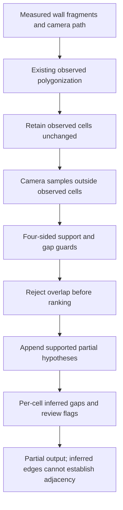

# Partial-cell completeness without promoting inferred geometry

Subsequent audit and producer results: [batch 013](013_floor_sample_wall_audit.md).
Figures below retain this batch's original producer.

Implementation batch . This is a local software correction under
Phase 1 of the [assessment roadmap](../../limitations.md), not an
assessment-qualified measured Fix Loop. No commits or pushes are part of it.

## Failure and selection

Baseline: `demo/phase3_sync_boundary/exact_geometry_current`. All supplied
sensor frames tracked, but camera-in-cell coverage is 34.78% single, 5.11% floor
and 29.00% ceiling. These are internal consistency proxies, not footprint errors.

`floorplan/layout.py::extract_layout` invoked `propose_supported_cells` only
when no observed polygon existed. Finding one small closed cell therefore
suppressed separately visited, supported partial cells elsewhere. Frozen floor
evidence contains a nonoverlapping 3.084 m2 hypothesis with mean edge support
0.915 and 16 additional covered camera samples. Frozen ceiling evidence also
contains a nonoverlapping supported hypothesis. These are hypotheses, not room
annotations or independent ground truth.

Two new regressions failed on the original implementation: a generated capture
with one closed room and a separate occluded-wall cell produced one room instead
of two; the solver had no exclusion interface to prevent an overlapping high-rank
candidate from suppressing a valid separate candidate. Existing relevant baseline:
**17 passed in 63.06 s**. Reproduced failures: **2 failed in 5.60 s**.

A separate frozen-network investigation attached a disconnected ceiling bridge
to its local jamb. Observed cells and coverage remained 3 and 29%; that change was
not selected or shipped. The unoptimized all-candidate diagnostic exposed costly
repeated per-camera polygon buffering; candidate occupancy is now vectorized and
evaluated only after the unchanged edge-support guards.

## Selected approach

- Preserve observed cells, ordering, coordinates and existing IDs.
- `supported_cells.propose_supported_cells(..., occupied_cells=...)` rejects
  overlap above the existing 0.01 m2 tolerance **before** greedy selection.
- Only camera samples outside observed cells' existing 10 cm coverage buffer
  support additional hypotheses. Each still requires two samples, all four
  measured wall groups, >=60% support per edge and <=1.20 m unsupported gap.
- Cache repeated edge calculations and use Shapely's vectorized `covers` with
  the same rounded 5 cm candidate buffer. No dependency or tolerance is added.
- Append inferred cells after observed cells; align evidence to each cell.
  Only inferred cells receive `requires_boundary_review` and gap evidence.
- Inferred boundary edges cannot establish adjacency or traversed openings.
  Even complete camera coverage leaves inferred plans partial and unvalidated.



## Alternatives evaluated

The evaluated height-band reconstruction approach (`d5105858440bdb549626845948bc51da8a8b9f02`),
`scanplan/geometry/rooms.py::split_rooms`, segments floor coverage using erosion
and watershed. It addresses a different occupancy-based reconstruction path and
would introduce room-boundary inference and a wider redesign. It was inspected,
not implemented or benchmarked in this batch.

The evaluated projection-based reconstruction approach (`c9dfacbed60ddb6554a7c9b6721696dfb748013a`),
`cozmoscan/geometry/manhattan_room.py::_pick_bounding_pair`, can fall back to raw
point extents when bounding walls are absent. That would weaken our existing
missing-wall safeguard and does not resolve mixed observed/partial selection.
Neither reference supplied code for this correction.

The existing Shapely 2 vectorized predicate is the practical public component:
[official covers documentation](https://shapely.readthedocs.io/en/stable/reference/shapely.covers.html).
Boundary-inclusive and rounded-buffer behavior is regression-tested. No new
external code, model, asset or dependency is incorporated.

## Validation and reproducibility

Targeted result after the fix: **21 passed in 71.01 s**. Tests cover mixed
observed/partial cells, overlap selection, missing walls, rounded buffer semantics,
existing local-support constraints and finite corner/plane behavior.

The fresh integration inventory is
[`phase3_partial_cells_reproduction.json`](../../../benchmarks/manifests/partial_cells_reproduction.json).
It reconstructs the three audited supplied cases, denser single and generated
two-room control serially, then compares unchanged input hashes/configuration,
observed walls/cells/connections and partial-status guards. Each new artifact is
also exactly replayed with its current producer and original checksums.

```powershell
& .\.venv\Scripts\python.exe scripts/evaluation/reproduce_artifacts.py benchmarks/manifests/partial_cells_reproduction.json --out demo/phase3_partial_cells/current
```

The command requires the retained baseline/intake artifacts and generated fixture
already identified by the earlier ledger; it is a workstation reproduction, not a
portable clean-machine proof. `compare_boundary_runs.py` records before/after
camera coverage, source/code identities, artifact integrity and limitations.
Historical baseline producers are deliberately different from the candidate;
each must have remained frozen during its original execution. Physical accuracy
improvement remains null.

## Executed integration results

Fresh output: `demo/phase3_partial_cells/current`. All five reconstructions kept
unchanged input hashes/configuration and frozen producers. The four supplied
cases exit 1 because their assignment contracts remain incomplete; the generated
benchmark exits 0 with its topology gate passing, while its contract is also
incomplete. These are successful execution checks, not full assessment passes.

| Case | Observed cells before/after | Inferred cells before/after | Camera coverage before/after | Runtime before/after (s) |
|---|---|---|---|---|
| Single, 115 frames | 0 / 0 | 1 / 1 | 34.78% / 34.78% | 19.92 / 25.40 |
| Floor, 176 frames | 1 / 1 | 0 / 1 | 5.11% / 14.20% | 15.75 / 36.56 |
| Ceiling, 300 frames | 3 / 3 | 0 / 3 | 29.00% / 49.33% | 30.68 / 111.63 |
| Dense single, 286 frames | 0 / 0 | 1 / 1 | 36.71% / 36.71% | 54.56 / 47.72 |
| Generated two-room control | 2 / 2 | 0 / 0 | 100% / 100% | 11.28 / 25.25 |

Floor adds 16 covered camera samples (9 -> 25); ceiling adds 61 (87 -> 148).
These improve a development coverage proxy by **9.09 and 20.33 percentage
points**, not measured footprint or dimensional error. All supplied plans remain
partial, with zero adjacency. The generated control retains one adjacency.
Ceiling hypotheses have mean side support 1.000, 0.9315 and 0.9570; they remain
unvalidated semantic cells. Runtime increased in several raw trials as additional
cells receive downstream surface processing. Timings are actual run observations,
not a controlled performance benchmark or a claim of pipeline acceleration.

The combined inventory verifies **11/15 cases and 41/45 execution claims**:
five raw reconstructions, five exact saved-artifact checks and the generated
control's strict raw comparison pass. **Four strict raw comparisons fail** because
native pose/fusion results are not bit-identical across fresh runs. Camera-path
maximum changes are 1.6875e-14 m single, 1.2434e-14 m floor, 7.0166e-14 m ceiling
and 3.5971e-14 m dense single. Wall-location maximum changes are 2.0872e-14,
1.1546e-14, 5.9064e-14 and 3.2863e-14 m respectively. Support counts and observed
cell coordinates match. No numeric tolerance was introduced to turn these exact
comparison failures into passes; the failed inventory is retained unchanged.

To isolate the layout change, `scripts/evaluation/compare_frozen_partial_cells.py` replays
the **unchanged baseline cloud, fitted planes and poses** through the candidate
layout code. It preserves the original strict raw-comparison results alongside
separate controlled checks. Output: `demo/phase3_partial_cells/frozen_controlled`.
**5/5 controlled cases and 20/20 claims pass**, including exactly unchanged
observed walls, cells, camera path and connections. Inferred counts and coverage
match the new raw runs. This demonstrates the layout improvement independently
of fresh native numerical variation; it does not prove native bitwise stability.

```powershell
& .\.venv\Scripts\python.exe scripts/evaluation/reproduce_artifacts.py benchmarks/manifests/partial_cells_controlled.json --out demo/phase3_partial_cells/fresh_frozen_controlled
```

All five current-source saved geometry artifacts also replay exactly with their
full measurement producer and checksums. Five additional comparator regressions
pass in **1.25 s**, covering changed inputs, tampered artifacts, false inference
promotion, and the fact that even a 1e-14 numerical delta remains an exact-check
failure. The earlier **161-test full suite passed in 119.80 s**; the final expanded
serial suite passes **166 tests in 115.70 s**. No native workload was overlapped
with that full suite. Final output checks confirm **zero pairwise cell overlap**
on all five cases, per-cell review flags retained, and every contract incomplete.
Only `layout.py` and `supported_cells.py` differ between baseline and candidate
production code hashes; the reconstruction/pose/fusion modules are unchanged.

## Acceptance boundaries

This addresses a local completeness/evidence omission under REQ-07/10/42, with
REQ-04/17/35 integration/reproducibility checks. It does not close those whole
assessment requirements. Semantic room identities, complete observed boundary
closure, original-photo/video reconstruction, physical dimensions, calibration,
damage/opening precision and the required surveyed benchmark remain open.

The specific next local task is a wall-support audit of the **151 uncovered
floor-scan camera samples**, using the saved cloud and polygonization dangles to
distinguish absent observations from finite-junction failures. Independent survey
and original photo/video capture evidence are still required for field acceptance.

## Files changed in this batch

Production: `floorplan/layout.py::extract_layout` and
`floorplan/supported_cells.py::propose_supported_cells`. Tests:
`test_wall_completion.py`, `test_supported_cells.py`, `test_boundary_comparison.py`.
Evidence tooling: `scripts/evaluation/compare_boundary_runs.py`,
`scripts/evaluation/compare_frozen_partial_cells.py`, and the two partial-cell manifests under
`benchmarks/manifests/`. Documentation: this record, README, Phase 3 architecture/status/
operations, assessment roadmap, preceding ledger link and open-source decisions.
Other pre-existing dirty files are preserved and are not attributed to this batch.

The compact [machine-readable checkpoint](../../../benchmarks/results/partial_cells_summary.json)
retains actual before/after metrics, failed raw checks, controlled results,
producer/evidence hashes and the separate acceptance limitations. Original
captures, full ledgers and geometry artifacts remain necessary for reproduction.
