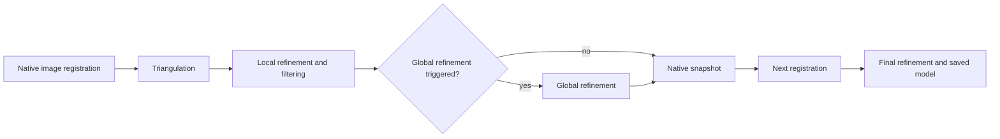

# Native registration snapshots: when the late pose error appears

Continue [batch024](024_late_landmark_support_audit.md) and
[batch023](023_mapping_only_fixed_intrinsics.md), using the existing
[component research](../alternative_approaches.md). This answers a new
stage-history question. No matcher comparison, correspondence filtering,
re-verification or reconstruction-policy experiment is repeated.

## Completed backlog commits first

Inspect 34 modified tracked files and inventory all 135 untracked files, including
module imports/symbols. Review diffs and select three dependency-closed production
milestones. Do not stage the entire backlog or failed/temporary experiments.
Build an ignored isolated copy from `a8c51b0`, overlay each selected milestone
in sequence, and run its complete available regression suite before committing.

| Commit | Reviewed scope | Isolated cumulative regression |
|---|---|---:|
| `9d75ab612261a70663e29a8cfa7536a2032ac931` | COLMAP/OpenCV half-pixel rectification and its two-scale test | 67 passed, 13.55s |
| `061625b10ef8f71811aa42b0fc4cbde46aeeb2f4` | Observed wall proposal/seed support, finite corner joins, per-room floor/ceiling support, nonoverlapping partial hypotheses and tests | 96 passed, 37.39s |
| `8aaca9ff8e8d431911a0d1f453c350243bb39473` | Registered-view damage projection, shared-wall face handling, crack extent and independent annotation scoring/tests | 102 passed, 37.43s |

Index-only selection excludes unrelated dense support changes, RGB experimental
tests and the ceiling-to-assessment integration test whose dependencies remain
in the backlog. All existing working-file bytes are unchanged. Verify each
commit's exact path set against its reviewed scope, and verify an empty index.
There are no history rewrites, amendments or pushes. Retained failed alternatives,
generated artifacts, caches, large data and personal planning files are excluded.
These commits package already completed software work; they do not establish
physical accuracy or close the floor/ceiling evidence holds.

The initial validation command referenced two nonexistent test filenames and ran
no tests. The first two full isolated attempts each exposed a missing historical
fixture: the pre-existing test needs both `demo/v3_verified/photos/plan.json`
and `datasets/controlled_multimodal_v3/reference.json`. Copy those unchanged local
fixtures into the ignored validation tree; the final suites pass. They are not
committed. Clean-clone regeneration of these historical fixtures remains a
reproducibility dependency; these local suite results are not a clean-machine test.

## Controlled replay

Use all 32 retained RGB inputs and batch023's fixed-calibration feature database.
Copy every original keypoint, descriptor, match and verified-inlier row, including
F/E/H and zero-inlier rows. No cached sensor/relative pose, rig extrinsic or pose
prior enters mapping. Rebuild batch023's exact options from the frozen recipe.

Only these native output fields change:

- `mapping.snapshot_path`: fresh trial-specific output directory.
- `mapping.snapshot_frames_freq`: 0 to 1.

The runner rejects any other option change. It calls the same native PyCOLMAP
4.2.1 `incremental_mapping`, without callbacks, a prior reconstruction, matching,
verification, depth, IMU, odometry poses or sensor-assisted optimization. Fixed
intrinsics, all numerical guards, source images, input order and production SIFT
are preserved. Copy the calibrated database by table rows, then require all six
camera/frontend table digests to remain exact before and after mapping.

Both fresh runs produce **30 native snapshots**, covering 3 through 32 registered
views. The initial two-view pair has no snapshot at this call site. All 30
corresponding snapshot models repeat exactly by their five binary hashes.
Registration order, saved camera parameters, stage metrics and log associations
also repeat exactly. All **800 prior pinned evidence entries** remain unchanged.

Before interpreting any snapshot, require the final model to reproduce the
baseline's registered names, model count, point count, runtime-reported mean
residual and all five binaries exactly. The separate evaluator repeats the
saved-model equality check before opening odometry. Both controls pass.

## Establish native snapshot timing

The new question requires checking the pinned official
[COLMAP 4.2.1 incremental pipeline](https://github.com/colmap/colmap/blob/4.2.1/src/colmap/controllers/incremental_pipeline.cc).
Retain its source URL, SHA-256 and call-site lines under ignored diagnostics.
The source SHA-256 is
`7ac7783c6accaaf941d470c02fb8eefb9054d6b7ecd3701d828259fda0e00351`.

The source sequence is native image registration, triangulation, iterative local
refinement, any triggered global refinement, color extraction, then snapshot
write. Relevant original-source lines are 640, 671, 682 and 704. Snapshots are
**not immediate accepted-PnP states**. Final global refinements/finalization can
occur after the last snapshot; read the final saved model separately.



Associate writes with native log intervals and the last registration attempt,
checking the resulting registered image identity. Keep failed attempts and solver
warnings as distinct events. Do not infer PnP feature identities from visibility
counts or call these states pre-local-BA.

## Independent post-hoc audit

Reuse batch021's exact RGB pixel witnesses and playback-index +1 sensor alignment;
do not redo decoding or timing experiments. Frame31 is sensor705 at source
15.116667s; frame34 is sensor773 at16.633333s. Their sensor interval is
1.516899917s. Read supplied odometry only after saved-model reproduction succeeds.
No trajectory correction, alignment, scale fitting or reconstruction optimization
uses the sensor reference.

Compare camera-to-world relative rotation and translation in frame31's local
optical coordinates. Normalize relative length by the same model and sensor
19->24 spans at each stage. These scale-free ratios are not metric calibration.
Retain full camera poses and audited earlier/later control spans per snapshot.

There is no supplied independent pose covariance or assessment-backed angular
acceptance tolerance. Report measured disagreements, without inventing a pass
band. Existing verification and mapping thresholds are unchanged.

## Stage results

| Native state | Views / points | 31->34 rotation disagreement | Direction disagreement | Relative-length ratio | Shared landmarks |
|---|---:|---:|---:|---:|---:|
| First joint state: snapshot28, frame34 newly registered | 31 / 6,151 | **6.590696deg** | 9.327262deg | 1.054063 | 127 |
| Snapshot29, frame37 newly registered | 32 / 6,163 | 6.272886deg | 8.854755deg | 1.055530 | 99 |
| Final saved model | 32 / 6,187 | **6.520814deg** | 9.184819deg | 1.052609 | 97 |

Indices are zero-based positions in the ordered snapshot list, not RGB indices.
Frame31 registers at snapshot27, with a global refinement in that interval.
Frame34's first joint state is snapshot28 after its registration and local
refinement, with **zero global refinement and zero solver warnings** in that
interval. Frame37's snapshot also follows local refinement without a global
refinement. Two global-refinement log entries follow the last snapshot before
the final model is written.

Recomputed per-observation residual means are1.596623px at the first joint state,
1.596272px after frame37 and1.595739px in the final model. All have zero
nonpositive-depth observations. These are a different aggregation from native
final **per-point** mean residual1.480503px; do not compare the two as a quality
change. Native snapshot point-error fields may be stale until finalization, so
the evaluator recomputes projections without modifying any saved model.

## Exact baseline reproduction and validation

| Quantity | Retained batch023 | Both snapshot replays |
|---|---:|---:|
| Positive verified pairs | 236 | 236, original rows exact |
| Pair-graph components / isolated views | 1 / 0 | 1 / 0 |
| Final registered views | 32 | 32 |
| Final sparse points | 6,187 | 6,187 |
| Runtime-reported native mean residual | 1.4805034435378603px | exact |
| 31->34 rotation / direction disagreement | 6.5208137553 /9.1848187403deg | exact |
| 31->34 relative-length ratio | 1.0526089631 | exact |
| Final model binaries | five retained hashes | all five exact |
| Retained database tables | six table digests | all six exact |
| Native linear-solver warnings | 52 | 52 each |

The52 warnings remain upstream, not evidence of a new late registration solver
failure. Mapping runtimes43.040/42.836s, total replay47.814/47.620s; initial
post-hoc audit8.467/8.801s. These exclude frontend inference and are not end-to-end
assessment runtime claims.

- Initial targeted diagnostic/control suite: **49 passed in2.29s**.
- Final complete relevant targeted suite: **99 passed in2.56s**, including11
  new diagnostic cases.
- Full current-worktree regression: **281 passed in44.35s**, zero failing tests.
- Both native replays and authoritative read-only audits exit0.

An initial post-hoc audit stopped at its invariance gate: runtime-reported mean
1.4805034435378603 differs from read-back mean1.4805034435378592 by floating-point
summation order. Reading both identical saved models gives the exact same latter
value. Correct the diagnostic to require runtime-vs-runtime and readback-vs-
readback equality separately. No numeric tolerance or reconstruction guard is
relaxed. Preserve the failed preflight log; no sensor audit output was produced
by it. Final audits use the same completed native replays, not additional mapping.

## Conclusion and next step

**The discrepancy already exists by frame34's first post-registration/local-
refinement snapshot.** Later registration and final global adjustment change
it but do not originate it. The current evidence cannot separate the native
registration solve from its immediate triangulation/local refinement, nor identify
a unique faulty track or mapper defect. It narrows the missing stage history;
it does not justify a reconstruction fix. Keep XFeat experimental, retain
production SIFT, the successful seed-selection behavior and all existing guards.

No production reconstruction change or additional experiment commit is made.
New diagnostic scripts/tests and this evidence record remain uncommitted. The
initial three commits only consolidate previously completed production work.
No restricted code/assets/models are incorporated; A/B and matcher research is
reused. Checking the native snapshot timing is the only new source investigation.

REQ-03/05/10/27/29 remain partial. Floor completeness remains25/176 camera samples;
the0.702677m ceiling-boundary shift remains unvalidated. Physical three-tier
benchmark/repeats/survey, calibrated uncertainty, opening/damage evidence,
consumer comparison, official schema/gates, full Fix Loop and cold walk-in
acceptance remain outstanding. No centimetre-level or assessment-acceptance claim.

**ONE next technical step:** replay frame34's native registration from the
30-view snapshot27, capture its pose immediately after `register_next_image`
and before triangulation/local refinement, then require the unchanged subsequent
refinement to reproduce snapshot28 before interpreting the pre-refinement pose.
The installed pinned native API exposes `begin_reconstruction`,
`register_next_image` and `iterative_local_refinement`. This is an isolated stage
diagnostic, with sensor poses withheld; if mapper state cannot be reproduced,
report that limit instead of attributing the error to PnP or BA.

## Reproduction

Use fresh output names; never overwrite retained evidence:

```powershell
.\.venv\Scripts\python.exe scripts/experiments/experimental_registration_snapshots.py --out demo/phase3_registration_snapshots/trial1
.\.venv\Scripts\python.exe scripts/experiments/experimental_registration_snapshots.py --out demo/phase3_registration_snapshots/trial2
.\.venv\Scripts\python.exe scripts/diagnostics/audit_registration_snapshots.py --trial demo/phase3_registration_snapshots/trial1 --log demo/phase3_registration_snapshots/trial1_native.log --out demo/phase3_registration_snapshots/audit1_final
.\.venv\Scripts\python.exe scripts/diagnostics/audit_registration_snapshots.py --trial demo/phase3_registration_snapshots/trial2 --log demo/phase3_registration_snapshots/trial2_native.log --out demo/phase3_registration_snapshots/audit2_final
.\.venv\Scripts\python.exe -m pytest -q tests/test_registration_snapshots.py tests/test_late_landmarks.py tests/test_mapping_only.py tests/test_fixed_intrinsics.py tests/test_transition_odometry.py tests/test_xfeat_context.py tests/test_transition_context.py tests/test_transition_tracks.py tests/test_transition_matchers.py
.\.venv\Scripts\python.exe -m pytest -q
```

Capture native UTF-8 output using Python `subprocess.run(...,stdout=log,
stderr=STDOUT)`, as in earlier controls. The pinned source/provenance and retained
prior experiments are local dependencies. Large snapshot models, RGBs, databases
and logs remain ignored. The compact hashed manifest is
[phase3_registration_snapshots_summary.json](../../../benchmarks/results/registration_snapshots_summary.json).
