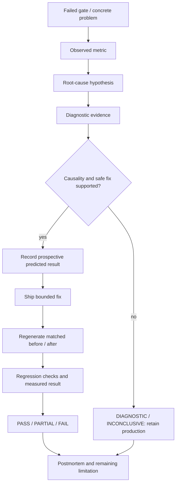

# Engineering fix loops and the scored assessment distinction

Development is frozen. Existing commits and records are retained; no new
algorithm fix is claimed by documentation work. Evidence: [manifest](../benchmarks/manifests/final_state.json),
[validation](../benchmarks/report.md), portable records in the handoff; original-byte provenance retained locally.

## Fix-loop evidence flow

This is the assessment/evidence process, not an autonomous repair service.
The scored Fix Loop requires selecting the worst gate in a qualifying measured
benchmark and declaring a predicted number **before** shipping. That evidence
does not exist. Predictions missing from earlier work are marked **not recorded**,
not retrospectively invented. Diagnostic-only work earns no shipped-fix claim.

## Shipped engineering fixes

The short numerical ledger below is the entry point; the sections that follow
explain causality, implementation, regression evidence and remaining limits.

| Shipped change | Before | After | Evidence / outcome |
|---|---|---|---|
| Pixel-centre convention, `9d75ab6` | Analytic source-address offset of 0.5 px | Identity/resized pinhole regression invariants satisfied | `tests/test_rgb_camera_consistency.py`; software correctness, no field error delta |
| Finite wall support, `061625b` | 28 proposals, 67 fragments, 25/176 containment | 29 proposals, 69 fragments, 25/176 containment | [Matched comparison](../benchmarks/results/exterior_strip_summary.json); prior accepted corners/connections retained |
| Registered damage evidence, `8aaca9f` | Unsupported/unregistered observations needed explicit exclusion | Registered-view, camera-facing and surface-support guards tested | `tests/test_damage_validation.py`; no measured damage-class/extent improvement claimed |

The [validation summary](validation.md) gives the controlled matching, mapping,
LiDAR sampling and sensor-audit comparisons. Unchanged completeness is shown
alongside improved intermediate metrics so the result is not overstated.

### Pixel-coordinate convention — production correctness

- **Problem:** COLMAP image coordinates and OpenCV array sampling have different
  pixel-centre origins in the dense rectification path.
- **Observed metric:** source mapping addresses were analytically offset by
  0.5 px; a centered pinhole image should reproduce the identity/resized image.
- **Root cause/evidence:** `dense._undistort` used `camera.img_from_cam(rays)`
  directly for `cv2.remap`. The saved commit diff identifies the convention.
- **Predicted result:** no prospective numerical declaration retained; expected
  identity is the regression invariant, not a claimed predeclared field prediction.
- **Shipped fix:** subtract 0.5 from source samples; retain target calibration.
  Commit `9d75ab6`, `fix(dense): align COLMAP pixel centers`.
- **Before/after:** source sampling formula changes from unadjusted coordinates
  to OpenCV centres; current pinhole tests require byte-identical expected
  pixels at both full and reduced resolution. No field wall-error delta exists.
- **Validation:** `tests/test_rgb_camera_consistency.py`; covered by retained
  390-test final regression. Current source has further existing research changes;
  the commit's scope and current-worktree validation are distinguished.
- **Final status:** PASS for the software invariant; physical accuracy
  NOT DEMONSTRATED. This is not the scored worst physical gate Fix Loop.

### Finite wall/seed support — production improvement, incomplete acceptance

- **Problem/metric:** eligible finite wall evidence was omitted by proposal
  quota and explained-point masking; floor segments 63→67→69 in successive
  bounded recorded increments.
- **Hypothesis/evidence:** raw sensor returns and exact fusion retained the
  strip, but residual seed bins were diluted despite a valid fitted consensus.
  Detailed sensor/seed traces isolate the omission.
- **Predicted result:** no qualifying prospective scored declaration retained.
- **Shipped fix:** retain prior supported proposals and allow bounded residual/
  original-seed recovery outside represented wall-family spans. The implemented
  geometry milestone is included in commit `061625b` and current layout source.
- **Before/after:** the final bounded recovery adds two finite fragments
  (67→69 segments); floor camera containment stays **25/176** and every previously
  accepted cell/connection is preserved in the controlled comparison.
- **Regression:** wall-completion/plane/supported-cell tests and recorded exact
  replay controls; current full suite passes. No continuous missing connecting
  wall is fabricated.
- **Final status:** PARTIAL assessment outcome. Earlier ceiling-scan containment
  increased148/300→295/300 but one footprint moved0.702677 m; accuracy remains
  unvalidated. Coverage improvement is not a centimetre-accuracy result.

### Registered surface damage evidence — production guard improvement

- **Problem:** image budget/support processing must not treat unregistered
  or geometrically inconsistent image observations as valid surface evidence.
- **Evidence/fix:** registered-view filtering, camera-facing/shared-surface
  checks and independent measured extent handling are explicit in `damage.py`
  and `damage_evaluation.py`. Commit `8aaca9f`, `fix(damage): validate registered
  surface evidence`, includes the necessary regression tests.
- **Before/after metric/prediction:** no qualifying field class/extent delta or
  prospective number retained; do not fabricate either.
- **Validation:** `tests/test_damage_validation.py`, current final suite.
- **Final status:** PASS for tested guards; PARTIAL damage capability and
  NOT DEMONSTRATED physical two-class validation.

## Diagnostic and rejected investigations

| Investigation | Evidence /observed result | Decision and final status |
|---|---|---|
| Denser SIFT bridge frames | 139 → 169 / 222 verified pairs at 8 / 16 Hz; zero target-group connections | No forced model union; DIAGNOSTIC /insufficient transition support |
| DISK/LightGlue context | SIFT 68 → DISK 167 verified pairs on 32 views; separate sparse models, no joint target model | Rejected for production; experimental adoption criterion FAIL |
| XFeat/fixed-intrinsics controls | 29 → 32 registered views; 24→27 rotation disagreement 24.7720° → 4.3191° in mapping-only control; later ~6.520814° persists | Experimental only; native registration causality INCONCLUSIVE |
| Final frame31 replay | Trusted target snapshot not reproduced | Registration investigation CLOSED; no solver defect or production fix claimed |
| Global stride-4 LiDAR | 25 → 79/176 containment, but accepted boundary changed | Rejected; no production density change |
| 0.703 m footprint notch | Area 10.4774 → 9.9457 m²; ceiling height unavailable both times; extraction/fusion exact | DIAGNOSTIC /INCONCLUSIVE physical boundary validation |
| room_2 floor support, batch032 | Dense selected29.2154% vsnative14.1246%; full-source raw44.0880%; zero fusion cell loss | DIAGNOSTIC: reproduced sampling/frame-selection limitation; production and25% guard unchanged |

The floor audit demonstrates available evidence lost before fusion; it does not
prove dense native acceptance, physical floor identity or height accuracy.
No floor-support production fix shipped. Ceiling remains unavailable. The
previously suggested dense control is **not run and not part of this frozen handoff**.

## Assessment implication

Engineering fixes are defensible on their software scope. The mandatory
measured worst-gate declaration, predicted score, independently surveyed
before/after and complete regenerable raw bundle remain **NOT DEMONSTRATED**.
Negative results explain preserved guards and rejected adoption; they do not
substitute for the assessment's 25% shipped-fix deliverable.
