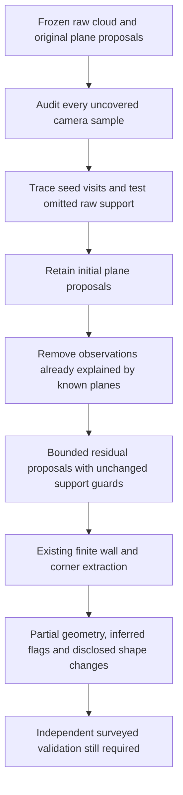

# Audit of 151 uncovered floor-scan camera samples

Subsequent per-frame trace and source revision: [batch 014](014_EXTERIOR_STRIP_SENSOR_TRACE.md).
Figures below retain this batch's original producer.

Continuation of [batch 012](012_PARTIAL_CELL_COMPLETENESS.md) .
The user required audit evidence before reconstruction edits. That order was
followed: the saved audit verifies the unchanged baseline layout SHA-256
`8f9bdf67e55ca593ed484038a6ecfa51c21cd15f37d25010a2985b0855ab8a6b`,
all four geometry-artifact hashes and the original proposal replay. No commits
or pushes. This is local development evidence, not a qualified physical Fix Loop.

## Audit result before any reconstruction changes

Source: `demo/phase3_partial_cells/current/floor`. Output:
`demo/phase3_floor_audit/unchanged_baseline_verified/audit.json`, with an indexed
plot and source frame IDs for **every** uncovered sample. The scene contains
116,480 fused points, 176 camera samples, 25 covered and **151 uncovered**.
Initial diagnostic plots are under `demo/phase3_floor_audit/initial_network`.

| Classification | Samples | Meaning |
|---|---:|---|
| Incomplete extracted directional support | 95 | At least one audit ray has no finite extracted wall hit; this does **not** prove raw observations are absent |
| Finite extents do not support a bounded enclosure | 52 | Four hits exist, but their proposed corners require extensions beyond the existing 15 cm join limit |
| Degenerate directional hits | 2 | Repeated/parallel wall hits do not establish four distinct enclosing walls |
| Bounded enclosure below existing area guard | 2 | A small supported cell is correctly rejected by the unchanged 1 m2 guard |
| Supported bounded enclosure needing junction investigation | 0 | This audit did not identify a lost junction inside the existing finite-support bound |

These direction queries can cross different rooms; they are diagnostic, not room
annotations. Do not classify the 95 samples as missing physical observations or
the 52 samples as software junction defects without additional evidence.

Actual baseline seed tracing finds 29 eligible modes on the x family and 39 on
z, but only 13 and 12 visited seed modes before the **12 accepted proposals per
axis** quota terminates each search. Forty unvisited seed fits satisfy the current
raw-point, height, residual, orientation and occupied-cell guards. They are **not
forty distinct walls**: many reuse already explained observations or fit related
surfaces. Concrete raw strips missing from the network include supported upper
and outer surfaces; their omission cannot universally be blamed on missing data.

Representative locally fitted raw strips have residuals 0.0138-0.0149 m and
robust vertical spans 1.02-1.69 m. These describe sensor-plane support, not survey
errors. A separately queried lower-left strip contains no points in the current
wall slab; absence there is limited to this cloud/query, not an independently
established physical wall. No missing surface is filled from an assumed rectangle.

## Alternatives actually evaluated

All alternatives used the **same frozen cloud, planes and poses**. Reconstruction
source stayed unchanged during the trials. The original source package is retained
locally under `demo/phase3_floor_audit/baseline_source/floorplan` so audit and
baseline experiments can be rerun without changing working-tree reconstruction.

| Alternative | Floor coverage | Ceiling coverage | Observation / decision |
|---|---:|---:|---|
| Current baseline | 14.20% | 49.33% | One observed floor cell plus one inferred cell |
| Accept up to 48 modes | 5.68% | Not run | Floor z groups reach 22, exceeding the existing fallback's 20-group guard; more clutter and loss of fallback. Rejected |
| Accept up to 20 modes directly | 18.18% | 81.00% | Existing observed floor cell loses 28.2% of its area. Rejected despite coverage increase |
| Preserve initial modes, then fit unexplained points | 14.20% | 98.33% | Floor cells preserved exactly; four additional finite floor wall segments. Selected with partial-status and shape-change disclosures |
| Residual by wall family only | 17.05% | 80.67% | Retains observations intersecting unrelated planes, but again loses 28.2% of the existing floor cell. Rejected |

The selected ceiling trial has eight observed cells and four inferred hypotheses,
not twelve independently verified rooms. Two of three prior observed cells remain
exact; the third changes from **10.4774 to 9.9457 m2**, with **0.7027 m** maximum
boundary Hausdorff change. This is a significant unresolved physical-accuracy
risk, not a demonstrated correction. No room identity or centimetre gate is passed.
The generated control retains exactly two rooms and one adjacency. Single-room
coverage remains 34.78%. Other variants and failures remain in their trial folders.

## Justified implementation

Only `floorplan/layout.py` changes reconstruction behavior. The original bounded
projection routine becomes `_projection_wall_proposals`. The public internal
`_supported_wall_proposals` retains all initial proposals, then conditionally
searches residual points when an initial axis quota is exhausted.

- Residual points must lie outside the existing **35 mm support band** of known
  planes and initial proposals. This prevents repeatedly explaining the same
  observations with near-duplicate plane fits. Already explained intersections
  are withheld conservatively; this can still limit recovery of sparse walls.
- A second bounded stage admits at most eight further proposals per axis. Initial
  quota stays twelve; maximum total is twenty. Each stage retains the existing
  48 candidate-bin limit. Budget metadata discloses both stages and bounds.
- Every original point/residual/height/length/orientation/cell guard remains.
  Newly ranked support counts use the original cloud's sampling fraction.
- The historical global-equivalent policy remains unchanged. `residual_search=False`
  supplies an exact initial-only control for validation; it is not a new CLI path.
- Corner extension, inferred-cell guards, adjacency policy and acceptance criteria
  stay unchanged. No model, dependency or reference implementation code is added.

This uses the progressive removal of explained observations already present in
our `rgbd.py::_fit_planes`. Reference A's height-histogram plane method was inspected
but addresses floor/ceiling estimation rather than this wall-mode truncation. The
selected change follows measured behavior in our pipeline; no architecture rewrite.



## Tests and validation

- Relevant unchanged-source baseline: **21 passed in 69.76 s**.
- New fifteen-wall quota regression: **1 failed in 3.69 s** before implementation.
- After the fix: **22 relevant tests passed in 73.88 s**.
- Audit classification tests: **3 passed in 2.14 s**.
- Full serial regression including initial-plane preservation and residual-stage
  furniture rejection: **171 passed in 145.59 s**.
- Final audit-compatibility and two new wall-regression check after fresh validation:
  **5 passed in 2.05 s**. No reconstruction changes followed the full suite.
- The first audit serialization attempt failed on NumPy scalar types. Only the
  diagnostic serialization was corrected; the verified audit ran successfully
  before reconstruction was edited. No acceptance threshold or assertion waived.

Fresh validation inventory:
[`phase3_residual_wall_reproduction.json`](../benchmark/phase3_residual_wall_reproduction.json).
It runs five raw reconstructions, five frozen initial-only/control comparisons,
and five exact current-producer artifact checks serially. The completed inventory
at `demo/phase3_floor_audit/current_residual/reproduction.json` verifies **15/15
cases and 45/45 declared software claims**. The comparator reproduces the baseline's walls, proposals,
camera path, polygonization, connections and corners **exactly** with residual
search disabled. It separately discloses candidate shape changes and raw-native
numeric differences; neither is rounded into an accuracy pass.

```powershell
& .\.venv\Scripts\python.exe scripts/reproduce_artifacts.py docs/benchmark/phase3_residual_wall_reproduction.json --out demo/phase3_floor_audit/fresh_residual
& .\.venv\Scripts\python.exe scripts/audit_floor_boundary.py demo/phase3_floor_audit/fresh_residual/floor --out demo/phase3_floor_audit/fresh_postfix_audit
```

The four supplied raw reconstructions return **exit 1** because their assignment
contracts remain incomplete. This expected failure state is reproduced, not turned
into an acceptance pass. The generated control returns exit 0 for its development
benchmark, but its assignment contract is also incomplete. Frozen comparisons
pass 5/5; exact current-producer artifact replays pass 5/5. Producer fingerprints
remain fixed during every run; only `layout.py` differs from the preceding producer.

| Case | Wall segments before / after | Observed / inferred cells before / after | Camera coverage before / after | Adjacency before / after |
|---|---:|---|---|---|
| Single | 37 / 37 | 0/1 → 0/1 | 34.78% / 34.78% | 0 / 0 |
| Floor | 63 / 67 | 1/1 → 1/1 | 14.20% / 14.20% | 0 / 0 |
| Ceiling | 59 / 81 | 3/3 → 8/4 | 49.33% / 98.33% | 0 / 0 |
| Dense single | 43 / 44 | 0/1 → 0/1 | 36.71% / 36.71% | 0 / 0 |
| Generated control | 8 / 8 | 2/0 → 2/0 | 100% / 100% | 1 / 1 |

All cell polygons are valid and have zero pairwise area overlap in these saved
outputs. Floor cells retain their exact frozen-input corners. Ceiling coverage
adds **147/300** camera centres, a **49 percentage-point** increase, but remains
partial: four cells are inferred and the prior observed-cell boundary change
of 0.7027 m remains unvalidated. Cell counts do not establish semantic room counts.
The control retains its exact two-room geometry and one adjacency.

Fresh raw camera paths are not bitwise identical: maximum numerical differences
range from 5.33e-15 to 6.84e-14 m for the supplied cases. These are separately
reported, with no tolerance introduced or field repeatability inferred. Recorded
runtimes differ from the preceding runs, but this was not a controlled performance
experiment; no speed improvement is attributed to the change.

## Post-fix audit and remaining bottleneck

The verified post-fix audit is
`demo/phase3_floor_audit/postfix_verified/audit.json`. It verifies current source
SHA-256 `588782263e0c1cf7f8f796ace20a16654998dc0d45e7aed4395e74da397edf3b`,
artifact integrity and proposal replay. The diagnostic was extended to trace the
new initial-stage helper; the original pre-edit audit and its source hash remain
retained. Both audits include all uncovered sample indices and frame IDs.

| Classification | Before | After |
|---|---:|---:|
| Incomplete extracted directional support | 95 | 94 |
| Finite extents do not support bounded enclosure | 52 | 53 |
| Degenerate directional hits | 2 | 2 |
| Below existing area guard | 2 | 2 |
| Supported enclosure needing junction investigation | 0 | 0 |
| Total uncovered | **151** | **151** |

One sample gains directional support without an enclosure inside the existing
finite bounds. The post-fix omitted-seed audit finds 37 fits passing the unchanged
guards, down from 40; these are overlapping candidate fits, not distinct walls.
The floor completeness gap is **not closed**. No justified change to corner
extension or inferred boundaries was found in this audit.

The next technical task is to trace per-frame depth/confidence and residual
histogram support for the unclosed left exterior strip at x≈−2.73 m, z≈4–5.9 m
in the saved aligned frame. Quantify whether the plane-support mask or histogram
seeding loses its existing raw consensus, and identify which adjoining finite
surfaces remain unsupported before changing extraction. The family-specific mask
was tested and rejected; it must not be adopted solely to retain more points.

## Changed files and retained evidence

- Reconstruction: `floorplan/layout.py`, helpers `_projection_wall_proposals`,
  `_supported_wall_proposals`, and proposal-budget evidence in `extract_layout`.
- Diagnostics: `scripts/audit_floor_boundary.py`,
  `scripts/experimental_wall_seed_budget.py`, `scripts/compare_residual_wall_search.py`.
- Tests: `tests/test_wall_completion.py`, `tests/test_floor_boundary_audit.py`.
- Validation inventory: `docs/benchmark/phase3_residual_wall_reproduction.json`.
- Compact hashed results: [phase3_floor_wall_audit_summary.json](../results/phase3_floor_wall_audit_summary.json).
- Current README, design, operations, implementation status, roadmap and alternative
  decisions link this batch; previous numerical results retain their historical producers.

Budget alternatives depend on the retained original source package. To rerun them
after the production change, preload that package before executing the diagnostic:

```powershell
@'
import runpy, sys
sys.path.insert(0, 'demo/phase3_floor_audit/baseline_source')
import floorplan.layout
sys.argv = ['scripts/experimental_wall_seed_budget.py',
            'demo/phase3_partial_cells/current/floor', '--accepted-cap', '20',
            '--residual', '--out', 'demo/phase3_floor_audit/fresh_residual_trial']
runpy.run_path(sys.argv[0], run_name='__main__')
'@ | .\.venv\Scripts\python.exe -
```

Raw paths and previous baseline artifacts are workstation continuation dependencies,
not a portable final assessment bundle. The supplied captures have no independent
room annotations or measured dimensions. REQ-07/10/42 support/evidence improves;
REQ-04/17/35 remain integration/reproducibility checks. No whole requirement is
closed by this batch. Physical survey, native RGB reconstruction, calibrated
measurement intervals, openings/damage and measured property adjacency remain open.
