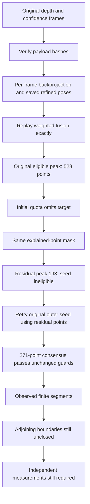

# Exterior-strip sensor trace and original-seed recovery

2026-10-07. Continues [batch 013](013_FLOOR_SAMPLE_WALL_AUDIT.md) under Phase 1
of the assessment roadmap. No commits or pushes. The prior baseline remains
`demo/phase3_floor_audit/current_residual`; a copy of its reconstruction source
is retained at `demo/phase3_strip_trace/baseline_source/floorplan`.

The inspected strip is **x=-2.73 +/-0.12 m, z=4-5.9 m** in the saved aligned
frame, within the existing above-floor sampling slab. These are diagnostic query
bounds, not measured wall coordinates or hardcoded reconstruction priors. The
user's abbreviated coordinate range is interpreted using the preceding audit.

## Trace completed before reconstruction changes

`demo/phase3_strip_trace/unchanged_baseline/trace.json` retains frame-level counts,
original sensor payload hashes, exact input/artifact hashes, seed visits, mask
removals and diagnostic fits. All reconstruction source matched the frozen
producer, including `layout.py` SHA-256
`588782263e0c1cf7f8f796ace20a16654998dc0d45e7aed4395e74da397edf3b`.

| Stage | Actual observation |
|---|---|
| Selected input | 176 frames; 14 provide confident strip observations |
| Positive/range-valid strip depth | 143,486 pixels across frames |
| Confidence >=1 | 140,087 pixels; 130,022 confidence-2, 10,065 confidence-1 |
| Confidence-0 rejected | 3,399 pixels |
| Production stride-8 samples | 2,251 points, across the same 14 frames |
| Weighted 2 cm fusion | 2,056 strip points; whole saved cloud replay **exact**, maximum difference 0 |
| Residual mask | 716 strip points remain; 1,340 removed, including 1,153 first removed by horizontal planes |
| Original target histogram peak | 528 points, eligible mode rank 16, not visited after initial accepted quota |
| Residual target peak | 193 points, below the existing 250-point seed threshold |
| Diagnostic residual fit | 271 points, RMS 0.01060 m, height span 0.9862 m, length span 1.4682 m, 94 occupied 10 cm cells |

Every selected raw depth/confidence PNG is byte-identical to the provided dataset.
Replaying calibrated backprojection, confidence/range filtering, stride sampling,
saved refined poses and weighted fusion reproduces the full cloud exactly. No
frame rejection or extraction-copy loss explains the omission. Counts before
voxel fusion are repeated observations, not independent measurement evidence.
This trace does not evaluate every unsampled sensor frame.

The contributing frame IDs are 630, 660, 690, 720, 750, 780, 810, 840, 870, 900,
930, 960, 4740 and 4770. The largest sampled contribution is frame 900 (592 points).
Supplied poses and refined poses produce different query memberships; the trace
records both. This does not prove their registration is accurate against a survey.

An additional detailed replay on the retained pre-fix source package is stored at
`demo/phase3_strip_trace/unchanged_baseline_detailed/trace.json`. It was executed
after implementation using the frozen producer, without changing the original
trace or geometry. Exact voxel grouping attributes support to each contributing
frame: **13 frames** contribute to the final residual plane's 25 mm band. That band
contains **273** voxels; it is separately defined from the last iterative fit's
271-point consensus. Largest contributions are frame 930 (127 voxels) and frame
900 (82). Contributions overlap across frames and must not be summed as independent
support. The stored per-frame table also includes fused and residual strip counts.

## Root-cause classification

1. **Missing sensor evidence:** not the cause of this particular proposal omission;
   sufficient residual consensus exists. Complete enclosure evidence is a separate,
   unresolved question.
2. **Depth/confidence extraction loss:** ruled out for selected inputs and replayed
   fusion. Stride sampling reduces observations but retains sufficient consensus.
3. **Residual seed/support logic:** confirmed. The original search truncates an
   eligible mode; explained-plane masking then dilutes its individual histogram
   bin below the seed threshold, while the wider fit consensus still passes every
   existing raw-point, orientation, height, length, residual and spatial-cell guard.
4. **Boundary/junction logic:** does not cause the missing plane proposal. Recovery
   still leaves disconnected finite support and incomplete adjoining surfaces.
   There is no evidence here to relax the 15 cm junction limit.
5. **Other issue:** replay did not reveal a payload or fusion mismatch. Extrapolated
   horizontal-plane masks account for most strip loss, but broadly changing that
   mask was already tested and rejected in batch 013 for geometry regressions.

Plane residuals describe internal sensor support, not real-world dimensional errors.
The software-addressable omission is distinct from semantic wall identification
and physical completeness, which remain unverified.

## Alternatives evaluated on unchanged source

| Candidate | Frozen floor result | Decision |
|---|---|---|
| Replay original seeds with residual fits | 40 proposals / 96 segments, 17.05% coverage; prior cell retains 71.52% of its area, boundary moves 0.7010 m | Rejected |
| Replay only seeds actually unvisited initially | Same adverse geometry | Rejected; quota trace alone is insufficient to identify correct new boundaries |
| Replay only original modes outside represented axis-family span | 29 proposals / 69 segments, 14.20% coverage; prior cells retained | Selected for this exterior omission |
| Exterior replay without seed-history tracing | Same recovery and exact prior observed corners | Selected simpler implementation |

Trial folders are under `demo/phase3_strip_trace`. The first two rejected trials
and their source snapshots are retained. An initial diagnostic compared tuple
corners to JSON lists and reported `exact=false` even when Hausdorff change was
zero; later trials normalize the representation, rather than introducing numeric
tolerances. The normalized selected floor trial verifies exact observed corners.
Frozen trials on single, dense single, ceiling and the generated control add zero
proposals and preserve existing geometry/coverage. No reference or public component
was required: the identified failure lies in our current seed-selection path.
There is no claim that reference alternatives were newly benchmarked in this pass.

## Smallest selected change

Only `floorplan/layout.py` changes reconstruction behavior.

- `_projection_wall_proposals` optionally obtains seeds from the original supported
  histogram while fitting **only the same unexplained residual points**.
- The retry only considers seed positions beyond the represented axis-family
  centroid span plus the existing 5 cm seed-spacing guard. This limits recovery to
  outer missing modes; it does not assume a rectangle or establish a physical
  exterior. Interior reseeding is withheld after the measured regression.
- `_supported_wall_proposals` retains the prior initial/residual proposal prefix.
  Retry consumes only unused residual quota: total remains **20 per axis**.
  Each of up to three stages still inspects at most 48 candidate bins per axis;
  metadata discloses the resulting maximum of 144 candidate bins.
- All plane acceptance, original-cloud ranking, wall-fragment, corner, inferred
  cell, opening and adjacency guards remain. No threshold is lowered, no wall gap
  is filled, no sensor sidecar enters an RGB tier, and no dependency is added.
- `original_seed_search=False` provides the exact prior residual policy for
  validation. Existing `residual_search=False` still supplies initial-only controls.

The span restriction is deliberately conservative; it will not repair unsupported
interior partitions. Recovering a mode is not proof of room identity or floor area.



## Validation and remaining risk

The sparse-mode unit fixture initially passed because its residual peak still
exceeded 250; it was refined to isolate bin dilution. The final fixture **fails
before the fix: 1 failed in 2.40 s**. After the fix, relevant wall/boundary/audit
tests pass **28/28 in 32.53 s**. Initial full regression passes **173/173 in
63.13 s**. An additional test verifies that a strong original seed cannot create
a plane when no unexplained support remains; the final full suite passes
**174/174 in 58.08 s**. No reconstruction changes followed these runs.

Fresh validation inventory:
[`phase3_exterior_seed_reproduction.json`](../benchmark/phase3_exterior_seed_reproduction.json).
It reruns the same five raw cases, five controlled comparisons, five exact current
producer artifact checks, and a repeatable sensor trace. Controls require the prior
residual-policy replay and **all prior cell corners and connections** to remain
exact on frozen inputs. Raw-native differences remain separately reported.

Completed inventory: `demo/phase3_strip_trace/current_exterior/reproduction.json`,
**16/16 cases, 60/60 software claims**, overall exit 0. All five controlled
comparisons and all five exact artifact replays pass. Every supplied raw run
returns expected assignment exit 1; the generated control returns development
benchmark exit 0 but also has an incomplete assignment contract. Producer source
stays fixed during each run; only `layout.py` differs from the preceding producer.

| Case | Wall proposals before / after | Finite wall segments before / after | Covered camera centres before / after | Observed / inferred cells before / after |
|---|---:|---:|---:|---|
| Single | Unchanged | 37 / 37 | 40/115 / 40/115 | 0/1 / 0/1 |
| Floor | 28 / 29 | 67 / 69 | 25/176 / 25/176 | 1/1 / 1/1 |
| Ceiling | Unchanged | 81 / 81 | 295/300 / 295/300 | 8/4 / 8/4 |
| Dense single | Unchanged | 44 / 44 | 105/286 / 105/286 | 0/1 / 0/1 |
| Generated control | Unchanged | 8 / 8 | 97/97 / 97/97 | 2/0 / 2/0 |

All prior cell corners and connections remain exact on frozen inputs. Each
supplied case still has zero adjacency; the control retains one adjacency. Saved
cell polygons remain valid with zero pairwise area overlap. Exact current-producer
artifact replay is distinct from raw-native stability: supplied raw corner values
are **not** bitwise identical. Largest matched-cell Hausdorff difference is
7.87e-14 m and largest camera-path difference is 1.15e-13 m. Neither is rounded
into an equality or field-repeatability pass. A summary extraction initially
failed by stacking unlike-length polygon arrays; per-cell extraction corrected
the diagnostic, with no reconstruction change. Runtimes are recorded without a
controlled performance claim.

The repeated detailed trace is `demo/phase3_strip_trace/postfix_detailed/trace.json`.
It again verifies identical raw payloads and exact fusion; all reported observation
counts are unchanged. The audited proposal is now present with 271 residual
consensus points. The enhanced diagnostic records overlapping frame contributions;
its version/hash is retained separately from the trace inside the completed inventory.

| Uncovered classification | Before | After |
|---|---:|---:|
| Incomplete extracted directional support | 94 | 82 |
| Finite extents cannot establish enclosure | 53 | 65 |
| Degenerate directional hits | 2 | 2 |
| Below unchanged area guard | 2 | 2 |
| Bounded enclosure needing junction investigation | 0 | 0 |
| Uncovered total | **151** | **151** |

Post-fix audit: `demo/phase3_strip_trace/postfix_uncovered_audit/audit.json`.
Twelve more samples acquire directional support, but no new bounded enclosure.
The remaining completeness bottleneck is not solved by the recovered plane.

Hashed observations, per-frame contributions, alternatives, controls and results:
[phase3_exterior_strip_summary.json](../results/phase3_exterior_strip_summary.json).

```powershell
.\.venv\Scripts\python.exe scripts/reproduce_artifacts.py docs/benchmark/phase3_exterior_seed_reproduction.json --out demo/phase3_strip_trace/fresh_validation
.\.venv\Scripts\python.exe scripts/audit_floor_boundary.py demo/phase3_strip_trace/fresh_validation/floor --out demo/phase3_strip_trace/fresh_uncovered_audit
```

The recovered strip consists of finite fragments around z=3.944-4.278 and
4.662-5.778 m. A supported upper horizontal line reaches x=-2.739 near z=5.654.
Lower nearby horizontal runs around z=4.436/4.768 start at x=-0.439/-0.372,
leaving a large unsupported span toward the exterior strip. These line locations
describe the frozen diagnostic trial, not measured physical corners. No missing
boundary is fabricated to connect them.

The previous ceiling result remains **295/300** covered camera centres with the
previous **0.7027 m** change relative to batch 012. This batch must preserve the
batch-013 ceiling geometry; it does not justify or erase that earlier change.
Independent surveyed geometry, wall/opening identities, metric calibration,
native RGB acceptance, damage annotations and physical repeatability remain open.
No whole assessment requirement or physical acceptance gate closes here.

The batch improves the locally addressable observed-wall/support path for
REQ-07 and its provenance under REQ-42. REQ-10 property closure/adjacency remains
incomplete; REQ-04/17/35 have additional raw replay/reproducibility evidence,
not final physical or official-schema acceptance.

## Files changed and replay boundaries

- `floorplan/layout.py`: optional seed-source/exterior restriction, bounded retry,
  exact prior-policy control flag, truthful proposal-budget metadata.
- `scripts/trace_exterior_strip.py`: raw sensor-to-voxel/mask/seed audit and plots.
- `scripts/experimental_seed_replay.py`: isolated alternative trials; refuses an
  already enhanced producer to avoid mixing baseline and candidate behavior.
- `scripts/compare_residual_wall_search.py`: prior residual-policy controls and
  strict preservation of every prior cell/connection.
- `scripts/audit_floor_boundary.py`: distinguish original initial proposals from
  both residual/retry sources in initial-stage seed accounting.
- `tests/test_wall_completion.py`: diluted-seed recovery, prefix/interior preservation,
  and refusal to create a plane without unexplained observations.
- New reproduction inventory, hashed results and this ledger; README, design,
  status, operations, roadmap and alternative-decision documents link the evidence.

To rerun a baseline trial, preload the retained producer rather than mutating the
working tree. The same method replays an old detailed trace with its frozen source:

```powershell
@'
import runpy, sys
sys.path.insert(0, 'demo/phase3_strip_trace/baseline_source')
import floorplan.layout
sys.argv = ['scripts/experimental_seed_replay.py',
            'demo/phase3_floor_audit/current_residual/floor', '--exterior-only',
            '--out', 'demo/phase3_strip_trace/fresh_exterior_trial']
runpy.run_path(sys.argv[0], run_name='__main__')
'@ | .\.venv\Scripts\python.exe -
```

Retained local source/intake paths are continuation dependencies. Final assessment
packaging must include or regenerate every dependency and must supply independent
physical truth; this local inventory does not meet that requirement by itself.

## Next technical step

Trace per-frame support for the unclosed lower adjoining span between x=-2.73
and x=-0.44 near z=4.44, distinguishing observed wall support, traversal/opening
evidence and absent returns before proposing any connecting boundary. Keep the
observed upper junction and the existing finite extension bound unchanged.
