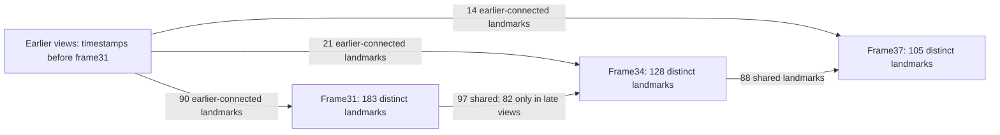

# Saved 31->34 landmark identity and geometry audit

Read-only audit of the saved
[batch023 mapping-only result](023_MAPPING_ONLY_FIXED_INTRINSICS.md), guided by
the existing [component research](../ASSESSMENT_COMPONENT_RESEARCH.md). No
matching, filtering, verification, mapping, optimization or acceptance policy
changes. No reconstruction rerun or production commit.

## Inputs and scope

Use `demo/phase3_mapping_only/trial1/features.db` and `sparse/0`: same32 RGBs,
original XFeat correspondences and all496 verified-geometry records, supplied
fixed intrinsics, and sensor poses withheld from inference. All **735 prior
pinned hash entries** pass before/after the audit. Saved keypoint coordinates
match the database exactly; point-to-image inverse associations are checked.
All32 saved intrinsic vectors remain exact.

Frame31 is image/camera28 and sensor705 at source15.116667s. Frame34 is
image/camera31 and sensor773 at16.633333s. Reuse the completed post-hoc audit's
pixel/timing identities, sensor poses and relative-motion metrics. No camera is
re-estimated, corrected, globally aligned or scaled to odometry. Sensor epipolar
diagnostics assume the supplied calibration/poses, without asserting covariance
or physical truth. The measured **6.520814deg** rotation disagreement remains.

Six declared spans are inspected:19->22,22->23,19->24,28->31,31->34,34->37.
Earlier spans are sensor-consistent controls, not independently surveyed truth.
Full evidence includes926 selected landmarks, all214 distinct landmarks seen
in either target frame, exact feature indices/pixels, full saved tracks,
retained candidate/inlier membership, raw component IDs, local triangle
witnesses, depths and reprojection residuals. See the ignored `landmarks.json`
and [compact evidence manifest](../results/phase3_late_landmarks_summary.json).

## Exact support and inlier membership

Frame31 has183 saved 3D observations; frame34 has128. They share **97 distinct
landmarks**, of which **96** are associated by direct retained verified inliers.
The remaining landmark, **9356**, is shared through indirect associations, not
the direct verified pair. This does not make it an outlier by itself.

| Retained 31->34 correspondence category | Count |
|---|---:|
| Stored raw candidates | 383 |
| Verified inliers | 319 |
| Candidates excluded by retained verification | 64 |
| Verified pairs associated to the same saved point | 96 |
| Verified pairs with no saved point at either endpoint | 179 |
| Verified pairs with only frame31 saved | 20 |
| Verified pairs with only frame34 saved | 23 |
| Verified pair associated to different saved points | 1 |

The223 verified pairs that are not associated to a common final point are
**not a recovered PnP outlier set**. Their rejection stage/reason is not saved.
Likewise, raw verification rejection is not a ground-truth false-match label.

## Identity conflicts and exact witnesses

None of the97 shared native tracks contains multiple feature identities from
the same image. There is no saved inverse-association or coordinate-index bug.
However,47/96 direct shared correspondences touch a conflicting transitive raw
component, and7/96 have locally testable triangle contradictions. For all319
verified rows,10 local paths conflict versus16 agreeing paths; many rows have
no independently testable triangle and must not be labeled clean on that basis.

Seven conflicting direct associations retained as common native landmarks:

| Saved point ID | Feature31 -> feature34 | Via frame | Composed alternative feature34 | Pixel separation in frame34 |
|---|---|---|---:|---:|
| 9334 | 0 -> 103 | 27 | 376 | 96.284px |
| 9161 | 69 -> 36 | 37 | 273 | 9.375px |
| 9173 | 156 -> 191 | 37 | 324 | 7.731px |
| 9177 | 218 -> 237 | 37 | 124 | 5.625px |
| 9244 | 221 -> 69 | 37 | 131 | 13.258px |
| 9253 | 427 -> 129 | 37 | 192 | 8.385px |
| 9220 | 453 -> 299 | 37 | 175 | 13.125px |

The triangle identifies incompatible feature identities, not which edge is
wrong. A false alternate edge can coexist with a correct direct saved track.
Do not automatically drop an entire raw component: **459/497** direct shared
correspondences in the very sensor-consistent22->23 control also touch raw
conflicts. Raw transitive contamination differs from a native track collision.

Sensor epipolar residuals do not localize the error to those seven associations:

| Direct saved subset | Count | Sensor Sampson median / p95 | Saved-pose Sampson median / p95 |
|---|---:|---:|---:|
| Local triangle conflict | 7 | 2.006 / 4.238px | 1.160 / 2.670px |
| No local triangle conflict detected | 89 | 1.954 / 5.696px | 1.238 / 2.894px |

The unflagged subset also disagrees. Its lack of a detected cycle conflict is
not physical validation. No causal per-track removal experiment is justified.

## Triangulation and saved geometry

Angles are the acute angle between camera-center-to-saved-point rays. Full
track maximum angles are also recorded. These are diagnostics of the saved
shape, not independent reconstruction accuracy or a new gate.

| Diagnostic | Earlier22->23 control | Target31->34 |
|---|---:|---:|
| Shared native landmarks | 562 | 97 |
| Direct verified shared associations | 497 | 96 |
| Unique views per shared track, median | 7 | 3 |
| Pair triangulation angle, min / median | 5.802 / 7.618deg | 7.195 / 8.476deg |
| Shared reprojection median / p95 | 1.423 / 3.105px | 1.376 / 2.905px |
| Shared shape smallest/middle SVD ratio | 0.840060 | 0.083951 |
| Shared support image hull fractions | 50.43% / 55.06% | 12.09% / 19.21% |
| Sensor relative rotation disagreement | 0.026454deg | 6.520814deg |

Target angles range7.194822..14.316822deg; the median maximum full-track angle
is17.515724deg. All194 target shared observations have positive depth, with
maximum reprojection3.793967px under the existing4px sparse filter. Median
depths are30.999385 and22.682061 **model units**; no metric scale is inferred.

The target is therefore **not explained by near-zero parallax or cheirality**.
It fits its own shape at least as well in pixels as the earlier control while
disagreeing in orientation. Its saved points occupy a thin structure and its
tracks are shorter. Visual inspection shows predominantly cabinet/door and
tile surfaces; this supports a structural ambiguity hypothesis but supplies no
new physical annotation or dimensional ground truth.

A normalized fixed-landmark pose Jacobian has condition numbers38.04/22.12
for31/34, versus21.58/23.35 for22/23. It does **not** show a uniquely singular
target pose block. It fixes uncertain landmarks, omits joint-BA correlations
and noise, and is not an uncertainty interval or acceptance threshold. Do not
conclude that planarity alone proves a solver defect.

For all319 verified target rows, stored-F / final-pose / sensor-pose Sampson
p95 is3.197 /16.072 /13.210px. Restricting to96 direct saved associations gives
2.796 /2.864 /5.565px. This distinguishes pair verification from support retained
by final mapping. No F/E/H or inlier row is changed to obtain these diagnostics.

## Temporal attachment to earlier views

Define earlier views by source timestamp strictly before frame31. Of97 shared
target landmarks, **82 have no earlier observation**:27 are seen only in31/34,
and55 only in31/34/37. Only **15** extend into the earlier reconstruction.
The complete membership of every point is retained; three-view support entirely
inside the late group is not equivalent to strong earlier anchoring.



These counts overlap; they are final co-observations, not independent pose
constraints or registration inlier counts. Frame37 has106 observations of105
distinct points. This does not change the zero-collision result for the97
target shared points.

Frame34's21 earlier-connected landmarks cover **3.352610%** of the image and
four8x8 cells; only three are shared with frame28, while19 share frame27.
Its fixed-landmark condition number rises to74.07 for this subset. The earlier
22->23 control's frame23 has318 landmarks connected before frame22, covering
22.474543% and15 cells, condition58.40. This supports **weak temporal anchoring
of a locally planar late chain**, not an isolated index collision or calibrated
focal drift, as the strongest current hypothesis.

## Registration and solver evidence limits

The original native log reports frame31 seeing107/479 points and frame34
83/458. These are visibility/support counts, **not exact PnP inliers**. The
saved final observation sets183/128 differ after triangulation/filtering/BA.
The initial accepted feature IDs and pre/post-adjustment poses were not retained.

All52 logged linear-solver warnings occur after registration of **frame27**,
before the late31/34 registrations. They cannot be directly assigned to the
31->34 solve from this log; upstream effects remain possible. No late solver
failure, coordinate corruption or changing camera intrinsic vector is established.

**Root-cause conclusion:** localize the weakness to short, spatially concentrated
late tracks with limited earlier attachment. Persistent correspondence ambiguity
and thin structural support are plausible contributors. The evidence does not
uniquely distinguish registration ambiguity, later adjustment, incorrect
landmark depth, or unquantified optical/sensor error. The fixed-landmark Jacobian
and adequate parallax specifically prevent a stronger singularity claim.

This is **evidence-limited for selecting an algorithm fix**, but the next
diagnostic is locally implementable. No external measurement is required just
to locate the responsible stage. Physical accuracy still needs independent truth.
**No isolated intervention is tested** because a concrete software defect or
causal set of wrong tracks is not established. The baseline remains32 views,
6,187 points,1.480503px mean residual and6.520814deg target disagreement.

## Reproducibility, validation and decision

Two read-only audits produce exact `landmarks.json` bytes and identical audit
metrics excluding runtime. Attachment witnesses/subsets also repeat exactly
excluding runtime. No reconstruction experiment is repeated. Main audits take
6.085/5.561s; attachment diagnostics3.381/3.610s, including integrity checks.

- Initial targeted check: **43 passed in2.18s**.
- Final targeted check: **88 passed in2.44s**, including seven new mathematical
  and identity diagnostic cases.
- Full regression: **270 passed in44.67s**, zero failing tests.
- Both complete main and attachment audits exit0. An initial API inspection
  called the image's integer `num_points3D` property as a method; corrected
  before auditing. No reconstruction or test failed as a result.

Reproduce with fresh paths; retained outputs must not be overwritten:

```powershell
.\.venv\Scripts\python.exe scripts/audit_late_landmarks.py --out demo/phase3_late_landmarks/audit1
.\.venv\Scripts\python.exe scripts/audit_late_attachment.py --audit demo/phase3_late_landmarks/audit1 --out demo/phase3_late_landmarks/attachment1
.\.venv\Scripts\python.exe scripts/audit_late_landmarks.py --out demo/phase3_late_landmarks/audit2
.\.venv\Scripts\python.exe scripts/audit_late_attachment.py --audit demo/phase3_late_landmarks/audit1 --out demo/phase3_late_landmarks/attachment2
.\.venv\Scripts\python.exe -m pytest -q tests/test_late_landmarks.py tests/test_mapping_only.py tests/test_fixed_intrinsics.py tests/test_transition_odometry.py tests/test_xfeat_context.py tests/test_transition_context.py tests/test_transition_tracks.py tests/test_transition_matchers.py
.\.venv\Scripts\python.exe -m pytest -q
```

`audit1/attachment_witnesses.json` and `anchored_geometry.json` are preliminary
read-only extracts; the reproducible `attachment1/attachment.json` and matching
repeat are authoritative for attachment. `subgroups.json` derives the residual
subset comparison directly from the complete indexed correspondence payload.
Large point/track tables and logs remain ignored. New scripts are diagnostic
only; no production dependency or restricted reference code/assets are added.
Consolidated A/B and open-source research is sufficient and is not repeated.

**Keep XFeat experimental; retain production SIFT and all guards.** No production
fix, commit or push. Existing uncommitted work and all prior evidence are preserved.
REQ-03/05/10/27/29 remain partial. No measured gate, metric property, drift
footprint ablation or full Fix Loop acceptance is closed. Floor remains25/176;
the **0.702677m ceiling boundary shift remains unvalidated**. Independent survey,
same-property three-tier captures/repeats, openings/damage labels, calibrated
intervals, consumer comparison, official schema/gates and cold walk-in remain.

**Single next technical step:** capture **per-registration native reconstruction
snapshots** in an otherwise identical mapping-only replay, then audit the first
saved joint31/34 pose versus the final pose to locate when the6.520814deg error
appears. The installed4.2.1 API exposes `snapshot_path` and `snapshot_frames_freq`.
Change only these diagnostic-output fields; preserve correspondences, intrinsic
policy, all numeric guards and withheld poses. Verify the final model still
reproduces baseline bytes/metrics. Snapshot timing must be established before
calling a state pre/post-BA; snapshots alone are not guaranteed to expose exact
PnP inliers. This answers the stage-history question absent from saved final
models, rather than repeating matching/calibration alternatives.
