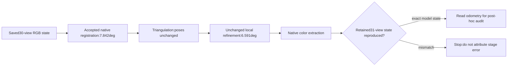

# Frame34 registration before local refinement

Continue [batch025](025_NATIVE_REGISTRATION_SNAPSHOTS.md)
and its saved30-view snapshot27. Read the existing
[component research](../ASSESSMENT_COMPONENT_RESEARCH.md) first. Reuse the
completed matcher, mapping-ablation and late-landmark evidence; do not rerun
those investigations.

**The31->34 disagreement already exists at accepted native registration.**
It is7.842073deg before triangulation/local refinement; unchanged local refinement
reduces it to6.590696deg and reproduces the retained31-view snapshot28 exactly
in model state. The later retained32-view result ends6.520814deg. This isolates
the earliest observed error stage, not a unique defective correspondence or a
software bug. Keep XFeat experimental and production SIFT unchanged.

## Controlled resume

Use pinned PyCOLMAP4.2.1, the same32 RGBs, original XFeat keypoints/descriptors,
matches and verified inliers, and the fixed supplied per-frame intrinsics. Copy
the complete database by retained table rows into each fresh ignored trial.
All six camera/frontend table digests stay exact. No extraction, matching,
re-verification, new pose seed or threshold change occurs.

Load snapshot27's RGB-only reconstruction, then call native
`IncrementalMapper.begin_reconstruction`. Resuming previously estimated RGB
poses is explicitly part of this diagnostic. Supplied sensor poses remain
withheld. Use the native effective mapper, triangulator and local-BA options
derived from the exact batch023 recipe. Batch025's output-only snapshot settings
are replaced by explicit diagnostic writes; no numerical mapper settings change.

The native next-view order is image IDs31,34: RGB frame34 then RGB frame37.
Frame34 has83 visible triangulated-support candidates and458 observations,
matching the original registration log. RGB frame31 is image ID28; RGB frame34
is image ID31. These native IDs are not RGB frame numbers.

Capture the complete model at each of these stages, in order:



`register_next_image` includes the native absolute-pose solve/refinement.
The captured state is immediately after its successful return, before
triangulation or iterative local refinement. It is not an internal pre-refinement
RANSAC hypothesis. The existing guards still apply:15-match cache minimum,
30 absolute-pose inliers,0.25 minimum inlier ratio,12px absolute-pose error,
4px point filtering,1.5deg triangulation filtering, fixed camera parameters,
one native thread and retained seed7. No global refinement is called in this
single-registration interval; none occurred there in the retained native log.

## Reproduction gate and serialization evidence

Both fresh controls reproduce all6151 retained point identities, coordinates,
errors, colors and tracks; all31 camera poses, intrinsics, image identities,
feature coordinates and point associations are exact. Four binaries
(`cameras`, `frames`, `points3D`, `rigs`) reproduce by raw SHA-256.
`images.bin` has different image-record ordering after resume, but **every byte
of every complete record matches**, keyed by image ID. Its file size remains
1,526,468bytes. No payload is rewritten and no numeric tolerance is used.

The pinned official [COLMAP4.2.1 binary writer](https://github.com/colmap/colmap/blob/4.2.1/src/colmap/scene/reconstruction_io_binary.cc)
emits images in registered-image iteration order, whereas other native model
records use sorted identities. Checking this newly encountered serialization
question is the only new source investigation. Retain the unmodified official
source, URL and hash under ignored diagnostics; source SHA-256 is
`b220d04376068fba4af1cbbbacbcb6f08529bc21f6f03c34aba5ba42f7f5b657`.
No external implementation code is incorporated. The new comparison rejects
changed poses/features/identities, missing binaries, truncated records, duplicate
IDs and trailing bytes. It permits only whole-record reordering.

Native post-refinement color extraction is required to reproduce the original
snapshot: the initial API probe omitted it and showed98 differing colors, with
geometry already exact. Including the original color step resolves those
differences. Preserve the initial probe; it is not an authoritative trial.

All five stage binaries repeat byte-for-byte between fresh controls, including
their resumed image ordering. Camera poses, all relative metrics and recomputed
residual distributions also repeat exactly. All1147 prior pinned evidence
entries stay unchanged. The retained final32-view model remains unchanged;
this bounded diagnostic ends at31 views and does not replay frame37/finalization.

## Post-hoc sensor comparison

The runner opens no odometry/IMU/depth or sensor pose file. The separate auditor
checks all captured hashes and the reproduction gate before opening odometry.
Reuse the established RGB pixel witnesses and playback-index+1 alignment:
frame31 maps to sensor705, frame34 to773; interval1.516899917s. Compare relative
camera-to-world rotation and translation in frame31's optical coordinates.
Normalize displacement by19->24 separately for model and sensor, without any
odometry transform fitting or correction.

| State | Registered views / points | Rotation disagreement | Direction disagreement | Relative-length ratio | Shared31/34 points | Recomputed observation mean |
|---|---:|---:|---:|---:|---:|---:|
| Before frame34 registration |30 /6055|not defined|not defined|not defined|not defined|1.600499px|
| Accepted native registration |31 /6055|**7.842073deg**|10.039021deg|0.938172|37|1.608351px|
| After triangulation |31 /6159|7.842073deg|10.039021deg|0.938172|144|1.647007px|
| After local refinement |31 /6151|**6.590696deg**|9.327262deg|1.054063|127|1.596623px|
| After colors / retained snapshot28 |31 /6151|6.590696deg|9.327262deg|1.054063|127|1.596623px|
| Retained final model, unchanged |32 /6187|6.520814deg|9.184819deg|1.052609|97|1.595739px|

Triangulation adds211 observations and leaves every camera pose exact. Local
refinement changes frame31 orientation by0.284875deg and frame34 by1.787778deg;
the resulting relative sensor disagreement falls1.251376deg. Direction error
falls0.711760deg. The length ratio changes from0.938172 to1.054063.
These are stage differences, not a shipped production accuracy improvement.

Accepted registration has37 associated frame34 observations, versus83 visible
candidate-support observations before solving. This saved association set is
not claimed to be the full internal RANSAC candidate/inlier mask. Subsequent
triangulation/local adjustment expands and filters the support. Reprojection
means are recomputed read-only over changing observation sets, not the native
per-point error fields, which can be stale in intermediate snapshots. All stages
have zero nonpositive-depth observations. The unchanged final native per-point
mean remains1.4805034435378603px at runtime,1.4805034435378592px on readback.

No supplied independent pose covariance or assessment-backed angular tolerance
exists. Report discrepancies without inventing a pass band or metric accuracy
claim. Odometry is an independent withheld sensor reference, not physical survey
ground truth. Frame31/landmark bias inherited from the30-view state can contribute
to relative error; this replay does not uniquely separate that contribution from
frame34 correspondences or native absolute-pose ambiguity.

## Decision and requirement impact

Earliest observed disagreement: **accepted native absolute-pose registration**.
Triangulation does not change it; local refinement reduces it. Later/global
adjustment does not originate it. There is no reproducible software defect or
unique faulty feature identified. Weak/ambiguous temporal support and inherited
RGB landmark geometry remain hypotheses from batch024, not proven causes.
No filtering/solver intervention, sensor correction or production adoption is
justified. Preserve the architecture, production SIFT and all guards.

REQ-03/05/10/27/29 remain partial; this improves diagnostic localization and
reproducibility evidence without closing reconstruction/accuracy gates. Floor
coverage remains25/176;151 samples remain uncovered. The0.702677m ceiling-boundary
shift remains unvalidated. Same-property measured three-tier benchmark, repeats,
calibrated intervals, opening/damage truth, drift/Fix Loop evidence, consumer
comparison, official schema/gates and cold/walk-in acceptance remain outstanding.

No substantive production fix is made, so no commit is created. HEAD stays
`8aaca9ff8e8d431911a0d1f453c350243bb39473`; no push. Preserve all existing
uncommitted work, with current-status notices added separately to six personal
engineering documents. Large models/RGBs/databases/logs/source probes remain
ignored; scripts/tests and compact evidence docs remain uncommitted.

## Validation and reproduction

- Initial focused tests:58 passed in2.34s.
- Complete relevant targeted suite:116 passed in2.86s, including17 new cases.
- Full current-worktree regression:298 passed in45.25s; zero failures.
- Two native controls and two post-hoc audits exit0; zero native solver warnings
  in these single-registration controls. Earlier52 warnings remain upstream.
- Native stage runtimes0.540/0.484s; replay totals4.783/4.418s; audits4.544/4.628s.
  These are not end-to-end assessment or clean-machine timing claims.

Use fresh output names, retaining UTF-8 stdout/stderr with Python
`subprocess.run(...,stdout=log,stderr=STDOUT)`:

```powershell
.\.venv\Scripts\python.exe scripts/experimental_registration_stage.py --out demo/phase3_preregistration/trial3
.\.venv\Scripts\python.exe scripts/audit_registration_stage.py --trial demo/phase3_preregistration/trial3 --out demo/phase3_preregistration/audit3
.\.venv\Scripts\python.exe -m pytest -q tests/test_registration_stage.py tests/test_registration_snapshots.py tests/test_late_landmarks.py tests/test_mapping_only.py tests/test_fixed_intrinsics.py tests/test_transition_odometry.py tests/test_xfeat_context.py tests/test_transition_context.py tests/test_transition_tracks.py tests/test_transition_matchers.py
.\.venv\Scripts\python.exe -m pytest -q
```

These commands require the retained local experiments and ignored regression
fixtures; clean-clone regeneration remains a separate dependency. Evidence:
[phase3_registration_stage_summary.json](../results/phase3_registration_stage_summary.json),
`demo/phase3_preregistration/trial1` and `trial2`, `audit1` and `audit2`, native/test
logs and exact `repeat_comparison.json`. The two new isolated scripts are
[experimental_registration_stage.py](../../scripts/experimental_registration_stage.py)
and [audit_registration_stage.py](../../scripts/audit_registration_stage.py);
new tests are [test_registration_stage.py](../../tests/test_registration_stage.py).

**ONE next technical step:** audit the83 visible frame34 registration candidates
and37 accepted observations against the saved30-view landmark geometry, to
distinguish ambiguous/conflicting2D->3D support from inherited landmark/pose bias.
Keep the native solver and guards unchanged; use sensors only post-hoc.
