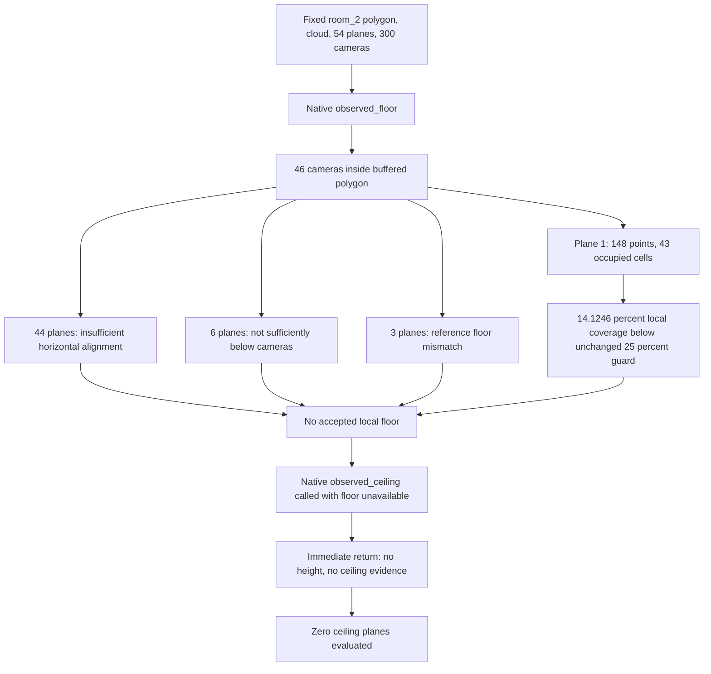

# room_2: native observed-ceiling decision trace

This read-only diagnostic uses the current retained ceiling-scan
cloud, planes, camera positions and `room_2` footprint. Production reconstruction,
geometry and every threshold remain fixed. The prior [boundary audit](030_CEILING_BOUNDARY_SENSOR_AUDIT.md)
and [component research](../ASSESSMENT_COMPONENT_RESEARCH.md) are the primary
references. The RGB registration chain remains CLOSED; XFeat remains experimental.

**Finding:** `_observed_ceiling` returns `(None, None)` at its initial
**missing local floor** guard. It visits **zero ceiling planes**. The upstream
`_observed_floor` rejects the relevant plane because its local occupied-cell
support covers **14.1246%**, below the unchanged **25%** guard. Above-camera
surfaces are present in the same cloud, including one with **89.8986%** coverage;
their presence does not establish a measured local floor-to-ceiling height.

**Classification:** correct rejection under the existing observation policy,
with physically ambiguous/insufficient local floor evidence. No reproducible
production logic defect or independently justified parameter change is demonstrated.
No production fix, geometry edit, commit or push is made.

## Actual execution path

Source functions in [layout.py](../../floorplan/layout.py):
`extract_layout`, `_observed_floor`, `_observed_ceiling` and
`_horizontal_support`.

1. `extract_layout` supplies the exact room polygon, aligned cloud, combined
   plane list and camera positions to `_observed_floor`. The reference
   projection/storey datum is **1.479748246 m**.
2. The local floor function finds **46 camera positions inside the 5 cm buffered
   room**, from the same 300 retained cameras. Their median aligned y is
   **0.140136715 m**. Missing cameras are not the upstream failure.
3. All **54 existing planes** are considered. None is accepted as a local floor
   after the native guards described below.
4. `room_floor` and `floor_evidence` therefore return `None`.
5. `extract_layout` passes that actual unavailable `room_floor` to
   `_observed_ceiling`. It does not pass the global projection datum instead.
6. `_observed_ceiling` executes line 387, `if floor is None or not camera_path`,
   then line 388, `return None, None`. The camera path contains 300 positions;
   **`floor is None` is the satisfied condition**.

The ceiling's inside-camera filter, orientation/RMS screening, height range,
above-camera clearance, local coverage, candidate ranking and resolved-slope
scalar guard are **not reached**. No surface is accepted or individually rejected
by those downstream ceiling checks in this call. Reporting a slope or ceiling
coverage failure as the actual reason would be incorrect.



## Exact upstream floor rejection reasons

Plane indices refer to the saved combined list: 14 global fitted planes, zero
secondary seeds and 40 existing wall proposals. No plane fitting or proposal
generation is run by the trace.

| Native floor rejection | Count | Plane indices | Evidence |
|---|---:|---|---|
| Horizontal alignment/RMS guard | 44 | 4, 8, 9, 11, 14–53 | All 44 fail `abs(normal[1]) >= 0.97`; none fails the 0.03 m RMS condition. |
| Not at least 0.3 m below the local camera median | 6 | 0, 2, 3, 7, 10, 13 | Native `level <= camera_y + 0.3` branch taken. This is a floor check; overhead surfaces are not floor candidates. |
| More than 0.04 m from the existing reference floor | 3 | 5, 6, 12 | Local centroid levels 1.575019414, 0.768002969 and 0.729617770 m differ from reference 1.479748246 m. |
| Insufficient clipped occupied-cell coverage | 1 | 1 | 148 local points, 43 occupied 20 cm cells; 14.1246% coverage versus required 25%. |

The relevant plane 1 passes horizontal alignment and RMS: aligned normal
approximately `(0, -1, 0)`, original RMS **0.012258441 m**. Its centroid level
**1.441541902 m** is sufficiently below the cameras and only **0.038206344 m**
from the reference, so neither of those guards rejects it.

`_horizontal_support` finds 13,175 near-plane cloud points before the room
filter, then only **148 within the room's 5 cm buffer**. The minimum 100-point
condition passes. Coverage sums **1.404795563 m² of occupied 20 cm cells clipped
to the actual 9.945719535 m² polygon**, producing **0.14124624752511566**.
The native line transition from the coverage guard at line 376 back to the plane
loop at line 366 confirms this rejection. Points elsewhere on that plane are
not borrowed to establish this room's floor.

These cell/plane/RMS thresholds are development observation guards, not the
assessment's centimetre-accuracy tolerances. The trace provides no evidence
that lowering the 25% guard would preserve accuracy or identify a valid floor.

## Horizontal surfaces already present

A supplementary inventory calls the existing `_horizontal_support` helper on
the same polygon/cloud and planes rejected by the floor camera-height condition.
It changes no input or threshold. These are descriptive support measurements,
**not executed ceiling decisions or inferred heights**. The global floor datum
is never substituted into a second ceiling inference.

| Plane | Centroid level in retained floor frame | Above camera median? | Local fused points | Clipped-cell coverage |
|---|---:|---|---:|---:|
| 0 | -0.916190442 m | Yes | 347 | 6.8387% |
| 2 | -0.937878529 m | Yes | 334 | 7.3706% |
| 3 | 0.432655373 m | No | 853 | 17.2721% |
| 7 | 0.319055946 m | No | 875 | 18.7796% |
| 10 | 0.282689414 m | No | 921 | 17.9538% |
| 13 | -1.536102411 m | Yes | 3,178 | 89.8986% |

Plane 13 is a broadly supported above-camera surface with aligned normal
`(0.019129918, 0.999803304, 0.005234366)` and original RMS **0.006694412 m**.
This rules out a claim that all overhead geometry is missing from the retained
cloud. It does not establish a complete physical ceiling, its semantic identity,
or the floor-relative scalar height/accuracy. Fixing the local-floor observation
would permit ceiling evaluation; it would not guarantee that every later ceiling
guard or the measured assessment gate passes.


The figure uses the unchanged polygon and actual cloud observations. Clipped-cell
areas and plotted point counts reproduce the native helper results exactly.
This is sensor-conditional evidence, not independently measured coverage.

## Root cause, alternatives and preservation decision

The immediate cause is an unavailable **per-room floor reference**, itself caused
by inadequate spatial support under the existing local floor policy. It is not
a ceiling-loop indexing bug, missing camera path, untested replacement matcher,
or disappearance of all overhead surfaces. Missing observations, occlusion,
confidence/range selection, sampling and plane-model bias cannot be distinguished
from this retained-cloud trace alone. It does not prove the real floor is absent.

Classification 1 applies to native guard execution: the code correctly withholds
a ceiling-height measurement without an accepted local floor. Classification 4
applies to physical interpretation and the cause of sparse floor support.
Classification 2 is not demonstrated. Classification 3 is not established merely
because a guard rejects a candidate; no threshold is lowered to manufacture output.

The prior research's A height-histogram proposals, B projection-mode ideas and
PolyLayout joint constraints remain design references. The current list already
contains a relevant floor plane and broadly supported overhead geometry; a new
model/dependency or constant ceiling fallback would not resolve the evidence gap.
No alternative implementation is newly researched, executed or adopted.

## Baseline and boundary warning

| Measurement | Before this diagnostic | After |
|---|---:|---:|
| room_2 area | 9.945719535 m² | Identical |
| Local floor accepted | No | No |
| Ceiling scalar/evidence | Both unavailable | Both unavailable |
| Ceiling-scan covered camera positions | 295/300 | Identical |
| Historical footprint Hausdorff change | 0.702677028 m, unvalidated | Same warning |
| Production layout source/guards | Retained producer | Identical |

The historical original footprint is 10.477367266 m²; the notch removes
0.531647731 m². This diagnostic does not edit either polygon or validate the
0.702677 m change. Strong prior crossing-ray evidence does not independently
identify the physical perimeter. That still requires capture-linked perimeter
annotations and independent wall/partition/opening measurements. No centimetre,
completeness or assessment-acceptance claim is made.

## Trace integrity, tests and reproduction

[trace_observed_ceiling.py](../../scripts/trace_observed_ceiling.py) calls the
**unmodified native functions** using their saved inputs and captures actual
line/return events. Continue-to-loop transitions distinguish evaluated conditions
from taken rejection branches, including one-line `if ...: continue` statements.
No function monkeypatch or copied reconstruction implementation is used.

Two authoritative traces repeat **byte-for-byte**, including every native event
and support measurement. Each passes six exact checks for saved floor/ceiling
values/evidence and unchanged function/source inputs. A fresh full geometry replay
passes **15/15 exact baseline checks**, including every accepted room corner,
segment, connection and producer. This is repeat execution of one saved capture,
not an independent physical repeat.

New [diagnostic tests](../../tests/test_observed_ceiling_trace.py) cover 14 cases:
taken versus merely evaluated inline guards, native floor/ceiling rejection paths,
early exit before any ceiling plane, accepted-result parity, immutable inputs,
trace-hook restoration and supplementary inventory isolation. Initial focused
checks: **22 passed in 4.24 s**. Final focused suite: **74 passed in 30.92 s**.
Full regression: **374 passed in 50.22 s**, zero failures.

The first two branch-labeling attempts are retained as preliminary/superseded
diagnostics: line-only labeling confused condition evaluation with a taken branch,
and the opcode attempt did not capture branch events. Neither's per-plane labels
are used as evidence. Their native unavailable floor/ceiling values were unchanged.
Source snapshots match their recorded hashes. The corrected line-transition
tracer is independently covered by tests and the exact repeated authoritative run.
These diagnostic corrections do not establish a production defect or fix milestone.

```powershell
.\.venv\Scripts\python.exe scripts/trace_observed_ceiling.py --out demo/room2_ceiling_trace_fresh
.\.venv\Scripts\python.exe scripts/verify_layout_artifact.py demo/phase3_strip_trace/current_exterior/ceiling --out demo/room2_ceiling_baseline_fresh
.\.venv\Scripts\python.exe -m pytest -q tests/test_observed_ceiling_trace.py tests/test_ceiling.py tests/test_layout_artifact.py tests/test_ceiling_boundary_shift.py tests/test_wall_completion.py tests/test_wall_planes.py tests/test_adjoining_span_trace.py tests/test_boundary_comparison.py
.\.venv\Scripts\python.exe -m pytest -q
```

Use fresh output directories and retain stdout/stderr/exit codes. The trace needs
the saved local run/artifacts; this is not yet clean-clone acceptance evidence.
Native trace runtimes are 9.224 and 8.976 s, not end-to-end submission timing.
Full evidence is in `demo/phase3_ceiling_decision/native_trace4/trace.json`,
`native_trace4_repeat/trace.json`, `trace_repeat_comparison.json`, geometry
verification and test logs. [Compact summary](../results/phase3_observed_ceiling_summary.json)
indexes hashes and requirement impact. Existing unrelated work, old evidence and
production code are preserved. No commit or push is made.

## Assessment impact and single next step

REQ-07/08/25 remain **partial**: a local floor and scored room ceiling are
unavailable, while physical accuracy/repeatability remains unverified.
REQ-42 gains a reproducible decision-path explanation. No whole requirement is
closed by diagnostic parity or software tests. Floor completeness stays 25/176;
surveyed three-tier benchmark/repeats, openings/damage truth, calibration, measured
Fix Loop/drift, consumer comparison, official schema/gates and cold/walk-in
evidence remain open. The RGB registration chain remains CLOSED.

**Single next technical step:** trace the original selected per-frame
depth/confidence returns for plane 1 inside `room_2`, comparing the retained
stride-8 lattice with other accepted pixels under the same calibrated poses and
35 mm band. Determine whether the 14.1246% local floor support is observation-
limited or lost through sampling/selection before considering any change. Do not
rerun the rejected global stride-4 experiment or alter the 0.702677 m notch.
